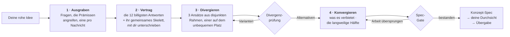

<div align="center">

# Imagination Brainstorming

**Ideenentwicklung, die sich weigert, aufs Naheliegende zuzulaufen.**

Ein Agenten-Skill, der die Form guten Brainstormings behält — eine Frage nach der anderen, echte Alternativen,<br>eine geschriebene Spezifikation — und die Teile ersetzt, die alles still zur sicheren Antwort zurücklenken.

[](https://github.com/djfksjd/imagination-brainstorming-skill/actions/workflows/tests.yml)
[](#installation)
[](#installation)
[](#unter-der-haube)
[](LICENSE)

[English](README.md) · [한국어](README.ko.md) · [日本語](README.ja.md) · [简体中文](README.zh-CN.md) · [Español](README.es.md) · [Français](README.fr.md) · **Deutsch** · [Português](README.pt-BR.md)

</div>

---

> Brainstorming konvergiert zu früh — und nicht, weil zu wenig gefragt wurde. Der Fehler ist, dass die Fragen aus derselben Verteilung stammen wie die Antworten: *wer ist die Nutzerin, was sind die Einschränkungen, wie sieht Erfolg aus* verfeinern nur die Idee, die man ohnehin schon hat. Keine davon rührt an das, was der Auftrag voraussetzt.
>
> Dann kommen drei Optionen — zwei davon existieren nur, damit die dritte vernünftig aussieht.

## Funktionsweise



|  | Was passiert | Warum es wirkt |
|---|---|---|
| **1** | **Fragen, die Prämissen angreifen.** Ausgeteilt aus zwölf Frage-Familien — die unausgesprochene Prämisse, die Fassung, die du hassen würdest, für wen das *nicht* ist, wie es endet, bei welcher Größenordnung es bricht, die administrative Hälfte. Jede Familie nennt, worauf zu hören ist, und welche prämissenerhaltende Frage zu vermeiden ist. | Anforderungen sitzen auf Prämissen. Nach Anforderungen zu fragen bestätigt die Idee; nach Prämissen zu fragen prüft sie. Mindestens eine Prämisse muss gestrichen oder umgedreht werden — fällt nur eine, muss die Spec sagen, warum die anderen hielten. Eine zweite Umkehrung zu erfinden, um eine Quote zu erfüllen, ist schlimmer als ein ehrliches „sie hat gehalten". |
| **2** | **Ein Verbotsvertrag, den auch du unterschreibst.** Das Modell schreibt die zwölf Antworten auf, die es am wahrscheinlichsten gäbe, benennt das *Skelett*, das sie teilen, und zeigt dir eine gekürzte Fassung — als Ausschlüsse, nie als Vorschläge. Du ergänzt dein eigenes „nicht schon wieder ein X". | Deine Ausschlüsse sind die wertvollste Einschränkung im Raum, und das benannte Skelett verhindert, dass die dreizehnte Fassung derselben Form durchrutscht. |
| **3** | **Alternativen, die keine Varianten sein können.** Drei Ansätze aus disjunkten Umdeutungs-Kategorien, einer davon auf dem **unbequemen Platz** — die Option, die du vermutlich ablehnst, mit voller Kraft vertreten. | Ein Skript prüft es: gleiche Kategorie, identische oder sich wiederholende Zusammenfassungen, zwei mit derselben Todesursache, oder einer deutlich dünner beschrieben — alles scheitert mit Exit 3. Es prüft Struktur, nicht Bedeutung — aber genau diese Formen muss eine Attrappe annehmen. |
| **4** | **Ein Gate, bevor du überhaupt etwas lesen sollst.** Das Konzept muss sagen, was es verbietet, seine nächsten existierenden Nachbarn benennen und mindestens zwei echte offene Fragen tragen. | Eine Spec ohne offene Fragen hat ihre Unbekannten versteckt. Ein Entwurf, der nichts verbietet, ist ein Wunschzettel. Das Gate kann kein Konzept beurteilen — es beweist, dass die Arbeit nicht übersprungen wurde. |

> [!IMPORTANT]
> **Es implementiert nie.** Kein Code, kein Gerüst, kein „soll ich anfangen zu bauen?". Der Endzustand ist eine von dir freigegebene Spec plus eine Übergabe.

## Installation

Läuft in **Claude Code** und **Codex**. Nur Python-3-Standardbibliothek: nichts zu installieren, kein API-Schlüssel, kein Netzzugriff.

```bash
curl -fsSL https://raw.githubusercontent.com/djfksjd/imagination-brainstorming-skill/main/install.sh | bash
```

<details>
<summary><b>Manuelle Installation</b></summary>

```bash
# Claude Code
claude plugin marketplace add djfksjd/imagination-brainstorming-skill
claude plugin install imagination-brainstorming@djfksjd

# Codex
codex plugin marketplace add djfksjd/imagination-brainstorming-skill
codex plugin add imagination-brainstorming@djfksjd
```

Ein Baum bedient beide Hosts: der Skill-Körper liegt unter `skills/imagination-brainstorming/`, und `AGENTS.md` wird als gemeinsamer Kontext geladen.
</details>

## Verwendung

Sag einfach, was dir im Kopf herumgeht. Der Skill greift bei Brainstorming-Anfragen und bei der Klage, alle bisherigen Optionen fühlten sich gleich an. Funktioniert in jeder Sprache; die Spec wird in deiner geschrieben.

```text
Denk das mit mir durch: wie die Station die Schichtübergabe macht.
```

```text
Ich habe drei Ideen für das Onboarding und alle fühlen sich wie dieselbe an.
Bohr richtig nach, bevor ich mich festlege.
```

> [!TIP]
> Bring deine eigenen Ausschlüsse mit. „Nicht noch ein Formular" wiegt mehr als jeder Zuspruch — und wenn du keine lieferst, fragt der Skill danach.

### Was eine Sitzung tatsächlich tut

| Phase | Was du siehst | Wodurch erzwungen |
|---|---|---|
| Erkundung | „Hier gibt es eine konventionelle Antwort, und sie könnte die richtige sein — willst du die, oder prüfen wir erst die ganze Form?" | Harte Regel: keine fabrizierte Fremdheit |
| Ausgrabung | Eine Frage pro Nachricht, formuliert für deinen Auftrag | 12 Frage-Familien, jede mit ihrem Antipattern |
| Vertrag | Sechs Ausschlüsse + das gemeinsame Skelett, zum Bestätigen und Ergänzen | `banlist.py`, Exit 2 wenn vorgetäuscht |
| Divergenz | Drei Ansätze in gleicher Ausführlichkeit, einer, den du wahrscheinlich hasst | `divergence_check.py`, Exit 3 bei Varianten |
| Konvergenz | Abschnittsweiser Entwurf, jeder freigegeben vor dem nächsten | Was es verbietet, wird zuerst geschrieben |
| Spec | `docs/concepts/JJJJ-MM-TT-<thema>-concept.md` + ein maschinenlesbares Sidecar | `spec_gate.py`, Exit 2 bei übersprungener Arbeit |
| Übergabe | Was diese Spec *nicht* abdeckt und was als Nächstes kommt | Niemals ein Implementierungs-Skill |

### Die Decks

| Deck | Inhalt |
|---|---|
| **Frage-Familien** (12) | unausgesprochene Prämisse · die Fassung, die du hasst · neu definierter Erfolg · umgedrehte Einschränkung · für wen es nicht ist · was unmöglich bleiben muss · der Friedhof · wozu es verpflichtet · benachbarte Welten · wie es endet · die Skala, bei der es bricht · die administrative Hälfte |
| **Rahmen** (40 in 10 Kategorien) | Subtraktion · Umkehrung · Akteurswechsel · Maßstabswechsel · Zeitwechsel · Ökonomie · Instandhaltung · Medienwechsel · Ritual · Scheitern zuerst |
| **Klischees** | Pitch-Reflexe, hohle Adjektive und die Satzmuster, die eine Positionierung statt eines Konzepts verraten |

## Was er nicht tut

> [!IMPORTANT]
> - **Irgendetwas bauen.** Zwei harte Gates: nie implementieren; und nichts erreicht dich ungeprüft — Ansätze warten auf die Divergenzprüfung, die Spec auf ihr Gate.
> - **Behaupten, das habe noch nie jemand gedacht.** Unüberprüfbar, also untersagt. Stattdessen werden die nächstliegenden existierenden Dinge benannt und der Unterschied gesagt.
> - **Fremdheit fabrizieren.** Wenn die konventionelle Antwort die richtige ist, muss der Skill das in einem Satz sagen, sich selbst verlassen und die gewöhnliche Arbeit außerhalb erledigen.
> - **Deine Anfrage verkleinern, damit sie leichter zu spezifizieren ist.** Umfang wird offen zerlegt, nie still verengt.
> - **So tun, als hieße ein bestandenes Gate, die Idee sei gut.** Es beweist, dass die Arbeit getan wurde, nicht dass das Konzept stimmt. Der Skill sagt das in seiner eigenen Ausgabe.

## Unter der Haube

| Skript | Aufgabe | Exit ≠ 0 |
|---|---|---|
| `deal.py` | Teilt Frage-Familien und drei unvereinbare Rahmen aus, einer als unbequem markiert | `1` Nutzungs- oder Deckfehler |
| `banlist.py` | Baut den Verbotsvertrag: Reflexe + Skelett + deine Ausschlüsse | `2` zu wenige Reflexe oder kein Skelett |
| `divergence_check.py` | Beweist, dass die Ansätze Alternativen sind und nicht ein Vorschlag mit zwei Attrappen | `3` divergiert nicht |
| `spec_gate.py` | Prüft geschriebene Spec, Sidecar und Vertrag zusammen, fail-closed | `2` Gate nicht bestanden |
| `cliche_lint.py` | Lintet mitten in der Sitzung jeden Entwurf | `3` verbotenes Material |

**Alles ist reproduzierbar.** Das Austeilen wird aus einem Hash des Auftrags gesetzt: derselbe Auftrag ergibt dieselbe Hand, und jede Sitzung lässt sich wiederholen. `--run 2` teilt frische Rahmen aus — weiterhin aus disjunkten Kategorien — wenn eine Divergenzrunde erschöpft ist, und der unbequeme Platz rotiert, damit ihn nicht immer dieselbe Kategorie trägt.

```text
skills/imagination-brainstorming/
├── SKILL.md                    # der maßgebliche Ablauf
├── references/
│   ├── concept-template.md     # Aufbau der Spec und ihre Abschnittsmarken
│   ├── worked-example.md       # eine komplette Sitzung, samt Verworfenem
│   ├── example-concept.md      # die Spec, die diese Sitzung ergab
│   ├── example-concept.json    # ihr Sidecar — beide bestehen die Gates und dienen als Fixtures
│   └── decks/                  # Frage-Familien · Rahmen · Klischees · Spec-Schema
└── scripts/                    # deal · banlist · divergence_check · spec_gate · cliche_lint
```

### Begleiter

Unabhängig von [**imagination-engine**](https://github.com/djfksjd/imagination-engine-skill), aber als Nachbar gedacht: jener ist der Einmal-Generator für ein einzelnes fremdartiges Objekt. Dieser Skill übergibt dorthin, wenn ein Wesen, ein Mechanismus oder eine Welt im Konzept weit über das hinausgetrieben werden muss, was eine Spec fassen kann. Keiner setzt den anderen voraus.

## Tests

```bash
python3 -m pytest tests/ -q
```

Offline: Deck-Integrität, Determinismus des Austeilens und Disjunktheit der Kategorien, sämtliche Fehlpfade der drei Gates, und das mitgelieferte Beispiel, das sie besteht.

## Mitwirken

Am einfachsten hilft man bei den Decks — eine Frage-Familie mit einem wirklich anderen Angriffswinkel oder ein Rahmen, den keine bestehende Kategorie abdeckt. Jeder Eintrag muss benutzbar sein: eine Familie braucht, worauf zu hören ist, *und* die prämissenerhaltende Frage, die sie ersetzt; ein Rahmen braucht einen Zug, eine Anforderung und sein charakteristisches Scheitern. Vor dem PR bitte die Tests laufen lassen.

<div align="center">
<sub>MIT-Lizenz · gebaut für <a href="https://claude.com/claude-code">Claude Code</a> und Codex</sub>
</div>
