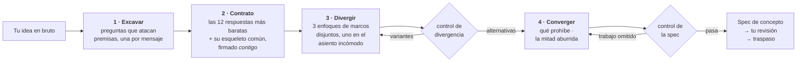

<div align="center">

# Imagination Brainstorming

**Desarrollo de ideas que se niega a converger en lo obvio.**

Una skill de agente que conserva la forma de una buena lluvia de ideas — una pregunta cada vez, alternativas reales,<br>una especificación escrita — y sustituye las partes que devuelven todo, en silencio, a la respuesta segura.

[](https://github.com/djfksjd/imagination-brainstorming-skill/actions/workflows/tests.yml)
[](#instalación)
[](#instalación)
[](#por-dentro)
[](LICENSE)

[English](README.md) · [한국어](README.ko.md) · [日本語](README.ja.md) · [简体中文](README.zh-CN.md) · **Español** · [Français](README.fr.md) · [Deutsch](README.de.md) · [Português](README.pt-BR.md)

</div>

---

> La lluvia de ideas converge demasiado pronto, y no por falta de preguntas. El fallo es que las preguntas salen de la misma distribución que las respuestas: *quién es el usuario, cuáles son las restricciones, cómo se ve el éxito* solo pulen la idea que ya tienes. Ninguna toca lo que el encargo da por sentado.
>
> Y entonces aparecen tres opciones — dos de las cuales existen para que la tercera parezca razonable.

## Cómo funciona



|  | Qué ocurre | Por qué funciona |
|---|---|---|
| **1** | **Preguntas que atacan premisas.** Repartidas de un mazo de doce familias — la premisa no dicha, la versión que odiarías, para quién *no* es esto, cómo termina, a qué escala se rompe, la mitad administrativa. Cada familia dice qué escuchar y qué pregunta conservadora de premisas evitar. | Los requisitos se apoyan sobre premisas. Preguntar requisitos confirma la idea; preguntar premisas la pone a prueba. Al menos una premisa debe acabar eliminada o invertida — y si solo cae una, la spec debe decir por qué las demás aguantaron. Inventar una segunda inversión para cumplir una cuota es peor que un honesto "sobrevivió". |
| **2** | **Un contrato de vetos que también firmas tú.** El modelo escribe las doce respuestas que daría con más probabilidad, nombra el *esqueleto* que comparten y te enseña una versión comprimida — como exclusiones, nunca como sugerencias. Tú añades tu propio "otro X no". |Tus exclusiones son la restricción más valiosa de la sala, y nombrar el esqueleto impide que se cuele la decimotercera versión de la misma forma. |
| **3** | **Alternativas que no pueden ser variantes.** Tres enfoques repartidos desde categorías de reencuadre disjuntas, uno de ellos en el **asiento incómodo** — la opción que probablemente rechaces, defendida con todas sus fuerzas. | Un script lo comprueba: misma categoría, resúmenes idénticos o que se repiten, dos que mueren de la misma causa, o uno descrito con mucho menos detalle: todo falla con exit 3. Comprueba estructura, no significado — pero las formas que un señuelo debe adoptar son justo esas. |
| **4** | **Un control antes de pedirte que leas nada.** El concepto debe decir qué prohíbe, nombrar sus vecinos existentes más cercanos y llevar al menos dos preguntas abiertas reales. | Una spec sin preguntas abiertas escondió sus incógnitas. Un diseño que no prohíbe nada es una carta a los reyes. El control no puede juzgar un concepto — demuestra que el trabajo no se saltó. |

> [!IMPORTANT]
> **Nunca implementa.** Ni código, ni andamiaje, ni "¿empiezo a construirlo?". El estado final es una spec que aprobaste, más un traspaso.

## Instalación

Funciona en **Claude Code** y **Codex**. Solo biblioteca estándar de Python 3: nada que instalar, sin clave de API y sin acceso a red.

```bash
curl -fsSL https://raw.githubusercontent.com/djfksjd/imagination-brainstorming-skill/main/install.sh | bash
```

<details>
<summary><b>Instalación manual</b></summary>

```bash
# Claude Code
claude plugin marketplace add djfksjd/imagination-brainstorming-skill
claude plugin install imagination-brainstorming@djfksjd

# Codex
codex plugin marketplace add djfksjd/imagination-brainstorming-skill
codex plugin add imagination-brainstorming@djfksjd
```

Un mismo árbol sirve a ambos hosts: el cuerpo de la skill vive en `skills/imagination-brainstorming/`, y `AGENTS.md` se carga como contexto compartido.
</details>

## Cómo usarla

Di lo que tienes entre manos. Se activa con peticiones de lluvia de ideas y con la queja de que todas las opciones se parecen. Funciona en cualquier idioma; la spec se escribe en el tuyo.

```text
Piensa esto conmigo: una forma de hacer el relevo de turno en la planta.
```

```text
Tengo tres ideas para el onboarding y todas me parecen la misma idea.
Aprieta de verdad antes de que me decida.
```

### Qué hace realmente una sesión

| Etapa | Lo que ves | Qué lo impone |
|---|---|---|
| Reconocimiento | "Aquí hay una respuesta convencional y puede que sea la correcta: ¿la quieres, o probamos primero la forma entera?" | Regla dura: nada de rareza fabricada |
| Excavación | Una pregunta por mensaje, formulada para tu encargo | 12 familias de preguntas, cada una con su antipatrón |
| Contrato | Seis exclusiones + el esqueleto común, para que confirmes y amplíes | `banlist.py`, exit 2 si se finge |
| Divergencia | Tres enfoques con el mismo detalle, uno que probablemente odies | `divergence_check.py`, exit 3 si son variantes |
| Convergencia | Diseño sección a sección, cada una aprobada antes de la siguiente | Lo que prohíbe se escribe primero |
| Spec | `docs/concepts/YYYY-MM-DD-<tema>-concept.md` + un sidecar legible por máquina | `spec_gate.py`, exit 2 si se omitió trabajo |
| Traspaso | Lo que esta spec *no* cubre y qué viene después | Nunca una skill de implementación |

### Los mazos

| Mazo | Contenido |
|---|---|
| **Familias de preguntas** (12) | premisa no dicha · la versión que odiarías · el éxito redefinido · la restricción invertida · para quién no es · qué debe seguir siendo imposible · el cementerio · a qué obliga · mundos vecinos · cómo termina · la escala donde se rompe · la mitad administrativa |
| **Marcos** (40, en 10 categorías) | sustracción · inversión · cambio de actor · cambio de escala · cambio temporal · economía · mantenimiento · cambio de medio · ritual · el fallo primero |
| **Clichés** | reflejos de presentación, adjetivos huecos y los patrones estructurales que delatan un posicionamiento en lugar de un concepto |

### Tu parte en esto

Esta habilidad es una conversación, no un comando. Cuatro momentos deciden si la sesión vale algo, y los cuatro son tuyos.

**1 · Responder a las preguntas de premisa.** No van a parecer una toma de requisitos, porque no lo son. *"¿A quién afecta esto sin haber elegido nunca usarlo?"* no es una pregunta sobre stakeholders. Las respuestas útiles son las que te obligan a pensar; las que empiezan con *"bueno, obviamente…"* son exactamente la premisa que la sesión intenta encontrar. Di igualmente esa frase obvia — ese es el material.

**2 · Firmar el contrato de prohibiciones.** Tras unas tres preguntas verás unas seis respuestas y el **esqueleto** que comparten: la estructura de debajo, no la redacción — *un aparato, un feed, un marketplace, un panel*. Se te preguntará:

> "Estas son las respuestas más baratas aquí, así que las retiro de la mesa. ¿Cuáles de ellas ya estabas imaginando, y qué añadirías?"

Responde a las dos mitades. Nombrar la que ya tenías en la cabeza no cuesta nada y suele ser la frase más útil de la sesión. Añade tus exclusiones en la forma en que te salgan — *"nada que aumente el tiempo de pantalla junto a la cama"* vale, aunque ningún script pueda cotejarlo: la verja lo anota como comprobación manual y no dejará pasar la especificación hasta que tenga una respuesta escrita.

**3 · El asiento incómodo.** Uno de los tres enfoques es deliberadamente el que se espera que rechaces, y se defiende con el mismo detalle que los otros. Recházalo si está mal — pero di *por qué*, en una frase. Esa frase suele mover el concepto más que elegir al ganador.

**4 · La verja de revisión.** La especificación se escribe en un archivo y vuelve con un *"léela y dime qué cambiar"*. No es un trámite. Las verjas comprueban que el trabajo se hizo, no que el concepto sea correcto — ver abajo.

### Las tres cosas que hay que decir

**Cuando todas las opciones se parecen:**

```text
Siguen siendo una idea con tres disfraces. Regenera.
```

Reparte desde una tirada nueva, añade *todos los elementos de la ronda anterior* al contrato y borra una premisa más de la excavación — y te dice cuál era. Esa última línea es el punto.

**Cuando la respuesta convencional es de verdad la correcta:** dilo. La habilidad está obligada a estar de acuerdo en una frase, salir de sí misma y hacer el trabajo normal fuera. Un formulario de acceso no necesita una excavación de premisas, y a la habilidad se le prohíbe fingir lo contrario.

**Cuando el encargo es demasiado grande:** debería detectarlo en el reconocimiento, pero si no — *"esto son tres sistemas, sepáralos"* — cada pieza tiene su propia sesión y su propia especificación.

### Ejecutar los scripts a mano

Python 3.11, biblioteca estándar, nada que instalar. La habilidad vive en `skills/imagination-brainstorming/`, y todos los comandos siguientes están escritos para ejecutarse desde dentro de ese directorio. Escribe los archivos de trabajo en un directorio temporal, nunca dentro de la carpeta de la habilidad.

```bash
cd skills/imagination-brainstorming
SKELETON="A capture tool that turns a spoken conversation into a structured record, with completeness enforced by a form and a signature at the end."

# 1 · reparte las familias de preguntas y tres marcos incompatibles
python3 scripts/deal.py --brief "a way for our ward to hand over shifts" --run 1 --out /tmp/work

# 2 · construye el contrato — dos veces, y el orden importa. --instincts es un
#     archivo que escribes tú: una respuesta probable por línea, doce en total.
python3 scripts/banlist.py --brief "a way for our ward to hand over shifts" \
    --instincts references/example-instincts.txt --skeleton "$SKELETON" --out /tmp/work
#    …enséñaselo al usuario como exclusiones, recoge su respuesta, y solo entonces:
python3 scripts/banlist.py --brief "a way for our ward to hand over shifts" \
    --instincts references/example-instincts.txt --user references/example-exclusions.txt \
    --skeleton "$SKELETON" --confirmed --out /tmp/work

# 3 · demuestra que los tres enfoques son realmente tres
python3 scripts/divergence_check.py --approaches references/example-approaches.json \
    --banlist references/example-banlist.json

# 4 · pasa por la verja la especificación, su sidecar y el contrato juntos — los tres son obligatorios
python3 scripts/spec_gate.py --concept references/example-concept.json \
    --markdown references/example-concept.md --banlist references/example-banlist.json
```

Todos los archivos que aparecen ahí vienen en el repositorio, así que el bloque se ejecuta tal cual y los cuatro pasos terminan en `0`; el paso 2 reproduce `references/example-banlist.json` exactamente. Ve sustituyéndolos por los de tu propia sesión a medida que avances.

**`approaches.json` se escribe a mano.** `deal.py` reparte los marcos; tú escribes un enfoque por marco repartido dentro de un objeto con una clave `approaches` — un `id`, un `frame_id` del mazo de marcos, un `summary` de al menos 96 unidades, un `failure_mode` de al menos 48 que diga cómo falla *este* enfoque en *este* encargo, un `frame_fit` de al menos 40 que diga qué cosa de este encargo ocupa el lugar que el marco exige, y `unsafe_seat` en true en exactamente uno de ellos. `references/decks/approaches-schema.json` documenta cada campo y cada suelo que aplica la comprobación; `references/example-approaches.json` es un archivo que pasa y del que copiar la forma.

`frame_fit` es donde se hace visible un marco que el encargo no puede sostener. A `designed-for-repair` — *supón que se rompe a menudo; incluye el procedimiento de reparación y los repuestos* — le tocó una vez el asiento incómodo de un rito de cierre que ocurre una sola vez y no tiene fabricante ni repuestos, y el conjunto pasó igual. Si nada en el encargo puede ocupar el lugar que el marco nombra, dilo y vuelve a repartir con `--run 2` en vez de argumentarlo. La comprobación exige la afirmación; no puede comprobar que sea cierta.

`--confirmed` registra un consentimiento que ya ocurrió. Activarlo antes de que el usuario haya visto la lista es una mentira de la que depende todo el resto de la tubería, y la verja no tiene forma de detectarla — por eso son dos llamadas y no un flag.

Sustituir el contrato no sale gratis, aunque tampoco es imposible: aquí nada establece procedencia. La verja lo reconstruye a partir de lo que declara `concept.json` y rechaza cualquier archivo al que le falte uno de los instintos quemados, una de las exclusiones del propio usuario o una entrada del mazo de clichés incluido; los dos archivos deben registrar el mismo esqueleto y el mismo encargo, carácter por carácter, y el encargo de la lista de vetos tiene que nombrar un asunto y no una palabra. Ese mazo se aplica a la especificación llegue el contrato que llegue, así que entregar un archivo más corto nunca significa un lint más corto. Lo que todo eso establece es la coherencia entre dos archivos escritos por la misma mano: sustituir un contrato exige reescribirlo, no rebautizarlo.

`cliche_lint.py` es para **borradores a mitad de sesión**. Pásalo sobre una especificación terminada y señalará la propia sección de prohibiciones del documento; quien revisa una especificación terminada es `spec_gate.py`, que recorta ese tramo antes.

### Códigos de salida, y qué hacer con cada uno

| Código | Significado | El arreglo |
|---|---|---|
| `0` | pasó | — |
| `1` | uso, archivo ausente o mazo mal formado | una errata, no un juicio |
| `2` | **el contrato o la especificación están incompletos** — pocos impulsos, sin esqueleto, contrato sin firmar, sección ausente, comprobación manual sin respuesta escrita, o una especificación que no contiene de verdad su propio sidecar | haz el trabajo que falta |
| `3` | **los enfoques son variantes**, o hay material prohibido | reescribe, o reparte con `--run 2` y vuelve a construir |

### Lo que las verjas no pueden comprobar

> [!IMPORTANT]
> Son suelos. Comprueban que el trabajo exigido **está**, no que fuera **correcto**. Tres cosas pasan todas las verjas de este repositorio:
>
> - **una justificación que invierte su propia evidencia** — un argumento cuya premisa, leída con cuidado, sostiene la conclusión contraria;
> - **un mecanismo atacable en sus propios términos** — por ejemplo, un número que cambia según el orden en que se calculó, presentado como la prueba de transparencia del concepto;
> - **tres enfoques que son de verdad una sola idea** en tres vocabularios. La comprobación detecta la reformulación y las causas de muerte compartidas; no sabe leer.
>
> Hay dos cosas más que la verja exige ahora, sin pretender juzgar ninguna: el modo de fallo que el propio enfoque elegido dejó escrito tiene que quedar **respondido** en `chosen.answers_failure_mode` — un concepto que declaraba su propio derrumbe y seguía adelante pasaba antes a la primera —, y cada enfoque tiene que decir qué cosa del encargo ocupa su marco. En ambos casos la verja comprueba que se escribió algo y te lo pone delante; no puede decirte si la respuesta vale.
>
> Una cuarta pasaba y ya no: las mismas palabras citadas dentro de una frase que las rechaza. La prohibición, lo que se vuelve imposible, la escena de primer uso y cada pregunta abierta se marcan ahora con `<!-- bind: … -->` y se comparan con el sidecar **exactamente**: una vez cada una, dentro de su propia sección, como prosa llana. La puntuación de similitud que sustituyen no distinguía *"prohibimos X"* de *"consideramos prohibir X pero lo permitimos"*. Y ni esta verja ni la comprobación de divergencia aceptan ya `--allow`: una excepción concedida en el momento del veredicto la concede la parte sobre la que trata el veredicto.
>
> Las tres ocurrieron durante la propia sesión de prueba de esta habilidad y las tres las cazó una persona, no un script. Así que: antes de que la especificación llegue a ti, haz que un segundo lector la ataque — otro modelo, un colega — y pídele que argumente que **pierde**, no que podría mejorarse. "Cómo lo harías mejor" te trae pulido. "Por qué pierde esto" te trae la premisa invertida.
>
> La habilidad también se aplica a sí misma una **auditoría de dirección de la evidencia**: para cada *porque* que sostiene algo, tiene que escribir la conclusión opuesta que la misma premisa sostendría, y nombrar qué puede observar realmente quien decide. Ese es el paso que caza *"el evaluador es una máquina, por tanto nuestro registro interno es el diferenciador"* — una máquina no puede observar el registro interno, así que esa premisa argumenta lo contrario.

### Encargos que no son productos

El proceso, las familias de preguntas, los marcos y el contrato de la especificación valen para cualquier asunto: un mundo narrativo, una mecánica de juego, un rito, una campaña, un formato. Dos piezas de la maquinaria son más estrechas que eso, y conviene saber cuáles:

- **La lista de frases cliché es vocabulario de pitch y de producto** — one-stop shop, panel de KPIs, el Uber de X, gamificación. En un encargo narrativo o ritual casi ninguna llegará a dispararse. Eso significa que la mitad comprobable por máquina del contrato hace poco y que el peso lo llevan los instintos y el esqueleto de esa misma sesión. Los adjetivos huecos y las jugadas prohibidas siguen valiendo en todas partes.
- **Un adjetivo vetado puede ser vocabulario corriente.** En ficción, *magical* y *delightful* designan en vez de afirmar, y *«la región no es magical»* llegó a ser rechazada por decirlo. Marca ese tramo en su sitio — `<!-- mention: hollow-magical -->la región no es magical<!-- /mention -->` — y la liberación cubre ese tramo y esa regla, nada más. No puede verificar que la palabra se mencione en vez de usarse; lo que hace es dejar la afirmación explícita y revisable en lugar de que la única salida sea levantar la regla entera.

Dos cosas que conviene esperar en vez de descubrir: más de tus primeros instintos serán cláusulas que sintagmas nominales, así que más de ellos acabarán en las comprobaciones manuales — que son una relectura, no notas que tengas que escribir, y solo *tus propias* exclusiones exigen respuesta escrita —, y es más probable que te toque un marco que el encargo no puede sostener, que es justo para lo que están `frame_fit` y volver a repartir.

`references/example-ritual-concept.md` es un ejemplo completo con esa forma exacta: el rito de cierre de una panadería que lleva noventa años en la misma calle, con su contrato, sus enfoques y su sidecar, controlado por los mismos dos comandos.

## Lo que no hará

> [!IMPORTANT]
> - **Construir algo.** Dos controles duros: nunca implementa; y nada te llega sin pasar por un control — los enfoques esperan al de divergencia, la spec al suyo.
> - **Afirmar que nadie ha pensado esto.** Inverificable, así que está prohibido. Nombra las cosas existentes más cercanas y explica la diferencia.
> - **Fabricar rareza.** Cuando la respuesta convencional es la correcta, la skill debe decirlo en una frase, salir de sí misma y hacer el trabajo normal fuera.
> - **Encoger tu petición para que sea más fácil de especificar.** El alcance se descompone abiertamente, nunca se estrecha en silencio.
> - **Fingir que pasar un control significa una buena idea.** Comprueba que están las afirmaciones y los artefactos exigidos, no que el concepto sea el correcto. La skill lo dice en su propia salida.

## Por dentro

| Script | Función | Salida distinta de cero |
|---|---|---|
| `deal.py` | Reparte familias de preguntas y tres marcos incompatibles, uno marcado como incómodo | `1` error de uso o de mazo |
| `banlist.py` | Construye el contrato de vetos: instintos + esqueleto + tus exclusiones | `2` pocos instintos, o sin esqueleto |
| `divergence_check.py` | Demuestra que los enfoques son alternativas, no una propuesta con dos señuelos | `3` no diverge |
| `spec_gate.py` | Valida la spec escrita, su sidecar y el contrato juntos, fail-closed | `2` control no superado |
| `cliche_lint.py` | Revisa cualquier borrador a mitad de sesión | `3` material prohibido |

**Todo es reproducible.** El reparto se siembra con un hash del encargo, así que el mismo encargo reparte la misma mano y cualquier sesión puede reproducirse. `--run 2` reparte marcos nuevos — todavía de categorías disjuntas — cuando se agota una ronda de divergencia, y el asiento incómodo rota para que no lo cargue siempre la misma categoría.

```text
skills/imagination-brainstorming/
├── SKILL.md                    # el flujo de trabajo autoritativo
├── references/
│   ├── concept-template.md     # la estructura de la spec y sus marcadores
│   ├── worked-example.md       # una sesión completa, incluido lo descartado
│   ├── example-concept.md      # la spec que produjo esa sesión
│   ├── example-concept.json    # su sidecar — ambos pasan los controles y sirven de fixture
│   ├── example-approaches.json # entrada de la etapa 3, tal como la lee divergence_check.py
│   ├── example-banlist.json    # el contrato con el que se controló todo lo anterior
│   ├── example-ritual-*.{md,json,txt}  # un segundo ejemplo completo que no es producto ni servicio
│   ├── example-instincts.txt   # los doce instintos con que se construyó
│   ├── example-exclusions.txt  # y las tres exclusiones del propio usuario
│   └── decks/                  # familias de preguntas · marcos · clichés · esquema de spec · esquema de enfoques
└── scripts/                    # deal · banlist · divergence_check · spec_gate · cliche_lint
```

### Compañera

Independiente de [**imagination-engine**](https://github.com/djfksjd/imagination-engine-skill), pero pensada para ir a su lado: aquella es el generador de un solo objeto extraño, de una sola pasada. Esta le pasa el testigo cuando una criatura, un mecanismo o un mundo dentro del concepto necesita ir mucho más lejos de lo que cabe en una spec. Ninguna requiere la otra.

## Pruebas

```bash
python3 -m pytest tests/ -q
```

Sin red: integridad de los mazos, determinismo del reparto y disyunción de categorías, todas las rutas de fallo de los tres controles, y el ejemplo incluido superándolos.

## Contribuir

Los mazos son el punto más fácil por donde ayudar: una familia de preguntas con un ángulo de ataque realmente distinto, o un marco que ninguna categoría existente cubre. Que cada entrada sea utilizable: una familia necesita qué escuchar *y* la pregunta conservadora que sustituye; un marco necesita un movimiento, un requisito y su fallo característico. Ejecuta las pruebas antes de abrir un PR.

<div align="center">
<sub>Licencia MIT · construido para <a href="https://claude.com/claude-code">Claude Code</a> y Codex</sub>
</div>
