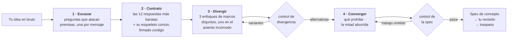

<div align="center">

# Imagination Brainstorming

**Desarrollo de ideas que se niega a converger en lo obvio.**

Una skill de agente que conserva la forma de una buena lluvia de ideas — una pregunta cada vez, alternativas reales,<br>una especificación escrita — y sustituye las partes que devuelven todo, en silencio, a la respuesta segura.

[](https://github.com/djfksjd/imagination-brainstorming-skill/actions/workflows/tests.yml)
[](#instalación)
[](#instalación)
[](#por-dentro)
[](LICENSE)

[English](README.md) · [한국어](README.ko.md) · [日本語](README.ja.md) · [简体中文](README.zh-CN.md) · **Español** · [Français](README.fr.md) · [Deutsch](README.de.md) · [Português](README.pt-BR.md)

</div>

---

> La lluvia de ideas converge demasiado pronto, y no por falta de preguntas. El fallo es que las preguntas salen de la misma distribución que las respuestas: *quién es el usuario, cuáles son las restricciones, cómo se ve el éxito* solo pulen la idea que ya tienes. Ninguna toca lo que el encargo da por sentado.
>
> Y entonces aparecen tres opciones — dos de las cuales existen para que la tercera parezca razonable.

## Cómo funciona



|  | Qué ocurre | Por qué funciona |
|---|---|---|
| **1** | **Preguntas que atacan premisas.** Repartidas de un mazo de doce familias — la premisa no dicha, la versión que odiarías, para quién *no* es esto, cómo termina, a qué escala se rompe, la mitad administrativa. Cada familia dice qué escuchar y qué pregunta conservadora de premisas evitar. | Los requisitos se apoyan sobre premisas. Preguntar requisitos confirma la idea; preguntar premisas la pone a prueba. Al menos una premisa debe acabar eliminada o invertida — y si solo cae una, la spec debe decir por qué las demás aguantaron. Inventar una segunda inversión para cumplir una cuota es peor que un honesto "sobrevivió". |
| **2** | **Un contrato de vetos que también firmas tú.** El modelo escribe las doce respuestas que daría con más probabilidad, nombra el *esqueleto* que comparten y te enseña una versión comprimida — como exclusiones, nunca como sugerencias. Tú añades tu propio "otro X no". |Tus exclusiones son la restricción más valiosa de la sala, y nombrar el esqueleto impide que se cuele la decimotercera versión de la misma forma. |
| **3** | **Alternativas que no pueden ser variantes.** Tres enfoques repartidos desde categorías de reencuadre disjuntas, uno de ellos en el **asiento incómodo** — la opción que probablemente rechaces, defendida con todas sus fuerzas. | Un script lo comprueba: misma categoría, resúmenes idénticos o que se repiten, dos que mueren de la misma causa, o uno descrito con mucho menos detalle: todo falla con exit 3. Comprueba estructura, no significado — pero las formas que un señuelo debe adoptar son justo esas. |
| **4** | **Un control antes de pedirte que leas nada.** El concepto debe decir qué prohíbe, nombrar sus vecinos existentes más cercanos y llevar al menos dos preguntas abiertas reales. | Una spec sin preguntas abiertas escondió sus incógnitas. Un diseño que no prohíbe nada es una carta a los reyes. El control no puede juzgar un concepto — demuestra que el trabajo no se saltó. |

> [!IMPORTANT]
> **Nunca implementa.** Ni código, ni andamiaje, ni "¿empiezo a construirlo?". El estado final es una spec que aprobaste, más un traspaso.

## Instalación

Funciona en **Claude Code** y **Codex**. Solo biblioteca estándar de Python 3: nada que instalar, sin clave de API y sin acceso a red.

```bash
curl -fsSL https://raw.githubusercontent.com/djfksjd/imagination-brainstorming-skill/main/install.sh | bash
```

<details>
<summary><b>Instalación manual</b></summary>

```bash
# Claude Code
claude plugin marketplace add djfksjd/imagination-brainstorming-skill
claude plugin install imagination-brainstorming@djfksjd

# Codex
codex plugin marketplace add djfksjd/imagination-brainstorming-skill
codex plugin add imagination-brainstorming@djfksjd
```

Un mismo árbol sirve a ambos hosts: el cuerpo de la skill vive en `skills/imagination-brainstorming/`, y `AGENTS.md` se carga como contexto compartido.
</details>

## Cómo usarla

Di lo que tienes entre manos. Se activa con peticiones de lluvia de ideas y con la queja de que todas las opciones se parecen. Funciona en cualquier idioma; la spec se escribe en el tuyo.

```text
Piensa esto conmigo: una forma de hacer el relevo de turno en la planta.
```

```text
Tengo tres ideas para el onboarding y todas me parecen la misma idea.
Aprieta de verdad antes de que me decida.
```

> [!TIP]
> Trae tus propias exclusiones. "Otro formulario no" vale más que cualquier ánimo — y si no las das, la skill te las pedirá.

### Qué hace realmente una sesión

| Etapa | Lo que ves | Qué lo impone |
|---|---|---|
| Reconocimiento | "Aquí hay una respuesta convencional y puede que sea la correcta: ¿la quieres, o probamos primero la forma entera?" | Regla dura: nada de rareza fabricada |
| Excavación | Una pregunta por mensaje, formulada para tu encargo | 12 familias de preguntas, cada una con su antipatrón |
| Contrato | Seis exclusiones + el esqueleto común, para que confirmes y amplíes | `banlist.py`, exit 2 si se finge |
| Divergencia | Tres enfoques con el mismo detalle, uno que probablemente odies | `divergence_check.py`, exit 3 si son variantes |
| Convergencia | Diseño sección a sección, cada una aprobada antes de la siguiente | Lo que prohíbe se escribe primero |
| Spec | `docs/concepts/YYYY-MM-DD-<tema>-concept.md` + un sidecar legible por máquina | `spec_gate.py`, exit 2 si se omitió trabajo |
| Traspaso | Lo que esta spec *no* cubre y qué viene después | Nunca una skill de implementación |

### Los mazos

| Mazo | Contenido |
|---|---|
| **Familias de preguntas** (12) | premisa no dicha · la versión que odiarías · el éxito redefinido · la restricción invertida · para quién no es · qué debe seguir siendo imposible · el cementerio · a qué obliga · mundos vecinos · cómo termina · la escala donde se rompe · la mitad administrativa |
| **Marcos** (40, en 10 categorías) | sustracción · inversión · cambio de actor · cambio de escala · cambio temporal · economía · mantenimiento · cambio de medio · ritual · el fallo primero |
| **Clichés** | reflejos de presentación, adjetivos huecos y los patrones estructurales que delatan un posicionamiento en lugar de un concepto |

## Lo que no hará

> [!IMPORTANT]
> - **Construir algo.** Dos controles duros: nunca implementa; y nada te llega sin pasar por un control — los enfoques esperan al de divergencia, la spec al suyo.
> - **Afirmar que nadie ha pensado esto.** Inverificable, así que está prohibido. Nombra las cosas existentes más cercanas y explica la diferencia.
> - **Fabricar rareza.** Cuando la respuesta convencional es la correcta, la skill debe decirlo en una frase, salir de sí misma y hacer el trabajo normal fuera.
> - **Encoger tu petición para que sea más fácil de especificar.** El alcance se descompone abiertamente, nunca se estrecha en silencio.
> - **Fingir que pasar un control significa una buena idea.** Demuestra que el trabajo se hizo, no que el concepto sea el correcto. La skill lo dice en su propia salida.

## Por dentro

| Script | Función | Salida distinta de cero |
|---|---|---|
| `deal.py` | Reparte familias de preguntas y tres marcos incompatibles, uno marcado como incómodo | `1` error de uso o de mazo |
| `banlist.py` | Construye el contrato de vetos: instintos + esqueleto + tus exclusiones | `2` pocos instintos, o sin esqueleto |
| `divergence_check.py` | Demuestra que los enfoques son alternativas, no una propuesta con dos señuelos | `3` no diverge |
| `spec_gate.py` | Valida la spec escrita, su sidecar y el contrato juntos, fail-closed | `2` control no superado |
| `cliche_lint.py` | Revisa cualquier borrador a mitad de sesión | `3` material prohibido |

**Todo es reproducible.** El reparto se siembra con un hash del encargo, así que el mismo encargo reparte la misma mano y cualquier sesión puede reproducirse. `--run 2` reparte marcos nuevos — todavía de categorías disjuntas — cuando se agota una ronda de divergencia, y el asiento incómodo rota para que no lo cargue siempre la misma categoría.

```text
skills/imagination-brainstorming/
├── SKILL.md                    # el flujo de trabajo autoritativo
├── references/
│   ├── concept-template.md     # la estructura de la spec y sus marcadores
│   ├── worked-example.md       # una sesión completa, incluido lo descartado
│   ├── example-concept.md      # la spec que produjo esa sesión
│   ├── example-concept.json    # su sidecar — ambos pasan los controles y sirven de fixture
│   └── decks/                  # familias de preguntas · marcos · clichés · esquema de spec
└── scripts/                    # deal · banlist · divergence_check · spec_gate · cliche_lint
```

### Compañera

Independiente de [**imagination-engine**](https://github.com/djfksjd/imagination-engine-skill), pero pensada para ir a su lado: aquella es el generador de un solo objeto extraño, de una sola pasada. Esta le pasa el testigo cuando una criatura, un mecanismo o un mundo dentro del concepto necesita ir mucho más lejos de lo que cabe en una spec. Ninguna requiere la otra.

## Pruebas

```bash
python3 -m pytest tests/ -q
```

Sin red: integridad de los mazos, determinismo del reparto y disyunción de categorías, todas las rutas de fallo de los tres controles, y el ejemplo incluido superándolos.

## Contribuir

Los mazos son el punto más fácil por donde ayudar: una familia de preguntas con un ángulo de ataque realmente distinto, o un marco que ninguna categoría existente cubre. Que cada entrada sea utilizable: una familia necesita qué escuchar *y* la pregunta conservadora que sustituye; un marco necesita un movimiento, un requisito y su fallo característico. Ejecuta las pruebas antes de abrir un PR.

<div align="center">
<sub>Licencia MIT · construido para <a href="https://claude.com/claude-code">Claude Code</a> y Codex</sub>
</div>
