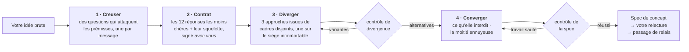

<div align="center">

# Imagination Brainstorming

**Un développement d'idées qui refuse de converger vers l'évidence.**

Une compétence d'agent qui garde la forme d'un bon brainstorming — une question à la fois, de vraies alternatives,<br>une spécification écrite — et remplace les parties qui ramènent tout, en silence, vers la réponse sûre.

[](https://github.com/djfksjd/imagination-brainstorming-skill/actions/workflows/tests.yml)
[](#installation)
[](#installation)
[](#sous-le-capot)
[](LICENSE)

[English](README.md) · [한국어](README.ko.md) · [日本語](README.ja.md) · [简体中文](README.zh-CN.md) · [Español](README.es.md) · **Français** · [Deutsch](README.de.md) · [Português](README.pt-BR.md)

</div>

---

> Le brainstorming converge trop tôt, et non par manque de questions. Le défaut est que les questions sortent de la même distribution que les réponses : *qui est l'utilisateur, quelles sont les contraintes, à quoi ressemble le succès* ne font qu'affiner l'idée déjà là. Aucune ne touche à ce que le brief tient pour acquis.
>
> Puis trois options arrivent — dont deux n'existent que pour rendre la troisième raisonnable.

## Comment ça marche



|  | Ce qui se passe | Pourquoi ça marche |
|---|---|---|
| **1** | **Des questions qui attaquent les prémisses.** Tirées d'un jeu de douze familles — la prémisse tue, la version que vous détesteriez, pour qui ce n'est *pas*, comment ça se termine, à quelle échelle ça casse, la moitié administrative. Chaque famille indique quoi écouter et quelle question conservatrice éviter. | Les exigences reposent sur des prémisses. Demander des exigences confirme l'idée ; interroger les prémisses la met à l'épreuve. Au moins une prémisse doit finir supprimée ou inversée — et si une seule tombe, la spec doit dire pourquoi les autres ont tenu. Inventer une seconde inversion pour remplir un quota est pire qu'un honnête « elle a survécu ». |
| **2** | **Un contrat d'interdits que vous signez aussi.** Le modèle écrit les douze réponses qu'il donnerait le plus probablement, nomme le *squelette* qu'elles partagent, et vous en montre une version compressée — comme des exclusions, jamais comme des suggestions. Vous ajoutez votre propre « pas encore un X ». | Vos exclusions sont la contrainte la plus précieuse de la pièce, et nommer le squelette empêche la treizième version de la même forme de passer. |
| **3** | **Des alternatives qui ne peuvent pas être des variantes.** Trois approches tirées de catégories de recadrage disjointes, dont une sur le **siège inconfortable** — l'option que vous rejetterez sans doute, défendue à pleine force. | Un script le vérifie : même catégorie, résumés identiques ou qui se répètent, deux qui meurent de la même cause, ou une décrite bien moins en détail — tout échoue avec exit 3. Il contrôle la structure, pas le sens — mais les formes qu'un leurre doit prendre sont exactement celles-là. |
| **4** | **Un contrôle avant qu'on vous demande de lire quoi que ce soit.** Le concept doit dire ce qu'il interdit, nommer ses voisins existants les plus proches et porter au moins deux vraies questions ouvertes. | Une spec sans questions ouvertes a caché ses inconnues. Un design qui n'interdit rien est une liste de vœux. Le contrôle ne juge pas un concept — il prouve que le travail n'a pas été sauté. |

> [!IMPORTANT]
> **Elle n'implémente jamais.** Pas de code, pas d'échafaudage, pas de « je commence à le construire ? ». L'état final est une spec que vous avez approuvée, plus un passage de relais.

## Installation

Fonctionne dans **Claude Code** et **Codex**. Bibliothèque standard Python 3 uniquement : rien à installer, pas de clé d'API, pas d'accès réseau.

```bash
curl -fsSL https://raw.githubusercontent.com/djfksjd/imagination-brainstorming-skill/main/install.sh | bash
```

<details>
<summary><b>Installation manuelle</b></summary>

```bash
# Claude Code
claude plugin marketplace add djfksjd/imagination-brainstorming-skill
claude plugin install imagination-brainstorming@djfksjd

# Codex
codex plugin marketplace add djfksjd/imagination-brainstorming-skill
codex plugin add imagination-brainstorming@djfksjd
```

Une seule arborescence sert les deux hôtes : le corps de la compétence est dans `skills/imagination-brainstorming/`, et `AGENTS.md` est chargé comme contexte partagé.
</details>

## Utilisation

Dites simplement ce que vous tournez et retournez. Elle se déclenche sur une demande de brainstorming, ou sur la plainte que toutes les options se ressemblent. Fonctionne dans toutes les langues ; la spec est écrite dans la vôtre.

```text
Réfléchis à ça avec moi : une façon de faire la relève d'équipe dans le service.
```

```text
J'ai trois idées pour l'onboarding et elles me semblent toutes identiques.
Pousse pour de vrai avant que je tranche.
```

> [!TIP]
> Apportez vos propres exclusions. « Pas encore un formulaire » vaut mieux que n'importe quel encouragement — et si vous n'en donnez pas, la compétence les demandera.

### Ce qu'une session fait vraiment

| Étape | Ce que vous voyez | Ce qui l'impose |
|---|---|---|
| Reconnaissance | « Il y a une réponse conventionnelle ici et c'est peut-être la bonne : vous la voulez, ou on teste d'abord la forme ? » | Règle dure : pas d'étrangeté fabriquée |
| Excavation | Une question par message, formulée pour votre brief | 12 familles de questions, chacune avec son antipattern |
| Contrat | Six exclusions + le squelette commun, à confirmer et compléter | `banlist.py`, exit 2 si c'est simulé |
| Divergence | Trois approches au même niveau de détail, dont une que vous détesterez | `divergence_check.py`, exit 3 si ce sont des variantes |
| Convergence | Conception section par section, chacune validée avant la suivante | Ce qu'elle interdit s'écrit en premier |
| Spec | `docs/concepts/AAAA-MM-JJ-<sujet>-concept.md` + un sidecar lisible par machine | `spec_gate.py`, exit 2 si du travail a été sauté |
| Relais | Ce que cette spec ne couvre *pas*, et la suite | Jamais une compétence d'implémentation |

### Les jeux

| Jeu | Contenu |
|---|---|
| **Familles de questions** (12) | prémisse tue · la version que vous détesteriez · le succès redéfini · la contrainte inversée · pour qui ce n'est pas · ce qui doit rester impossible · le cimetière · ce que ça engage · mondes voisins · comment ça finit · l'échelle où ça casse · la moitié administrative |
| **Cadres** (40, en 10 catégories) | soustraction · inversion · changement d'acteur · changement d'échelle · changement de temps · économie · maintenance · changement de médium · rituel · l'échec d'abord |
| **Clichés** | réflexes de pitch, adjectifs creux, et les motifs structurels qui trahissent un positionnement plutôt qu'un concept |

## Ce qu'elle ne fera pas

> [!IMPORTANT]
> - **Construire quoi que ce soit.** Deux contrôles durs : jamais d'implémentation ; et rien ne vous parvient sans contrôle — les approches attendent celui de divergence, la spec le sien.
> - **Prétendre que personne n'y a jamais pensé.** Invérifiable, donc interdit. Elle nomme les choses existantes les plus proches et énonce la différence.
> - **Fabriquer de l'étrangeté.** Quand la réponse conventionnelle est la bonne, la compétence doit le dire en une phrase, sortir d'elle-même et faire le travail normal en dehors.
> - **Rétrécir votre demande pour la rendre plus facile à spécifier.** Le périmètre est décomposé ouvertement, jamais rétréci en silence.
> - **Faire croire qu'un contrôle réussi signifie une bonne idée.** Il prouve que le travail a été fait, pas que le concept est juste. La compétence le dit dans sa propre sortie.

## Sous le capot

| Script | Rôle | Sortie non nulle |
|---|---|---|
| `deal.py` | Distribue les familles de questions et trois cadres incompatibles, dont un marqué inconfortable | `1` erreur d'usage ou de jeu |
| `banlist.py` | Construit le contrat d'interdits : réflexes + squelette + vos exclusions | `2` trop peu de réflexes, ou pas de squelette |
| `divergence_check.py` | Prouve que les approches sont des alternatives, pas une proposition et deux leurres | `3` ne diverge pas |
| `spec_gate.py` | Valide ensemble la spec écrite, son sidecar et le contrat, fail-closed | `2` contrôle échoué |
| `cliche_lint.py` | Passe n'importe quel brouillon au linter en cours de session | `3` matériel interdit |

**Tout est reproductible.** La distribution est amorcée par un hachage du brief : le même brief donne la même main, et toute session peut être rejouée. `--run 2` distribue de nouveaux cadres — toujours de catégories disjointes — quand une manche de divergence est épuisée, et le siège inconfortable tourne pour que la même catégorie ne le porte pas toujours.

```text
skills/imagination-brainstorming/
├── SKILL.md                    # le flux de travail faisant autorité
├── references/
│   ├── concept-template.md     # la structure de la spec et ses marqueurs
│   ├── worked-example.md       # une session complète, y compris ce qui a été coupé
│   ├── example-concept.md      # la spec produite par cette session
│   ├── example-concept.json    # son sidecar — les deux passent les contrôles et servent de fixtures
│   └── decks/                  # familles de questions · cadres · clichés · schéma de spec
└── scripts/                    # deal · banlist · divergence_check · spec_gate · cliche_lint
```

### Compagnon

Indépendante de [**imagination-engine**](https://github.com/djfksjd/imagination-engine-skill), mais conçue pour l'accompagner : celle-là est le générateur d'un seul objet étrange, en une passe. Celle-ci lui passe la main quand une créature, un mécanisme ou un monde du concept doit aller bien plus loin qu'une spec ne peut le contenir. Aucune n'exige l'autre.

## Tests

```bash
python3 -m pytest tests/ -q
```

Hors ligne : intégrité des jeux, déterminisme de la distribution et disjonction des catégories, tous les chemins d'échec des trois contrôles, et l'exemple livré qui les passe.

## Contribuer

Les jeux sont l'endroit le plus simple pour aider : une famille de questions avec un angle d'attaque vraiment différent, ou un cadre qu'aucune catégorie existante ne couvre. Chaque entrée doit être utilisable : une famille exige quoi écouter *et* la question conservatrice qu'elle remplace ; un cadre exige un mouvement, une exigence et son échec caractéristique. Lancez les tests avant d'ouvrir une PR.

<div align="center">
<sub>Licence MIT · conçu pour <a href="https://claude.com/claude-code">Claude Code</a> et Codex</sub>
</div>
