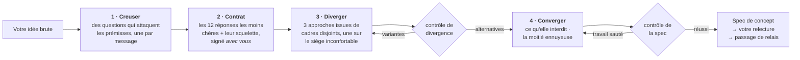

<div align="center">

# Imagination Brainstorming

**Un développement d'idées qui refuse de converger vers l'évidence.**

Une compétence d'agent qui garde la forme d'un bon brainstorming — une question à la fois, de vraies alternatives,<br>une spécification écrite — et remplace les parties qui ramènent tout, en silence, vers la réponse sûre.

[](https://github.com/djfksjd/imagination-brainstorming-skill/actions/workflows/tests.yml)
[](#installation)
[](#installation)
[](#sous-le-capot)
[](LICENSE)

[English](README.md) · [한국어](README.ko.md) · [日本語](README.ja.md) · [简体中文](README.zh-CN.md) · [Español](README.es.md) · **Français** · [Deutsch](README.de.md) · [Português](README.pt-BR.md)

</div>

---

> Le brainstorming converge trop tôt, et non par manque de questions. Le défaut est que les questions sortent de la même distribution que les réponses : *qui est l'utilisateur, quelles sont les contraintes, à quoi ressemble le succès* ne font qu'affiner l'idée déjà là. Aucune ne touche à ce que le brief tient pour acquis.
>
> Puis trois options arrivent — dont deux n'existent que pour rendre la troisième raisonnable.

## Comment ça marche



|  | Ce qui se passe | Pourquoi ça marche |
|---|---|---|
| **1** | **Des questions qui attaquent les prémisses.** Tirées d'un jeu de douze familles — la prémisse tue, la version que vous détesteriez, pour qui ce n'est *pas*, comment ça se termine, à quelle échelle ça casse, la moitié administrative. Chaque famille indique quoi écouter et quelle question conservatrice éviter. | Les exigences reposent sur des prémisses. Demander des exigences confirme l'idée ; interroger les prémisses la met à l'épreuve. Au moins une prémisse doit finir supprimée ou inversée — et si une seule tombe, la spec doit dire pourquoi les autres ont tenu. Inventer une seconde inversion pour remplir un quota est pire qu'un honnête « elle a survécu ». |
| **2** | **Un contrat d'interdits que vous signez aussi.** Le modèle écrit les douze réponses qu'il donnerait le plus probablement, nomme le *squelette* qu'elles partagent, et vous en montre une version compressée — comme des exclusions, jamais comme des suggestions. Vous ajoutez votre propre « pas encore un X ». | Vos exclusions sont la contrainte la plus précieuse de la pièce, et nommer le squelette empêche la treizième version de la même forme de passer. |
| **3** | **Des alternatives qui ne peuvent pas être des variantes.** Trois approches tirées de catégories de recadrage disjointes, dont une sur le **siège inconfortable** — l'option que vous rejetterez sans doute, défendue à pleine force. | Un script le vérifie : même catégorie, résumés identiques ou qui se répètent, deux qui meurent de la même cause, ou une décrite bien moins en détail — tout échoue avec exit 3. Il contrôle la structure, pas le sens — mais les formes qu'un leurre doit prendre sont exactement celles-là. |
| **4** | **Un contrôle avant qu'on vous demande de lire quoi que ce soit.** Le concept doit dire ce qu'il interdit, nommer ses voisins existants les plus proches et porter au moins deux vraies questions ouvertes. | Une spec sans questions ouvertes a caché ses inconnues. Un design qui n'interdit rien est une liste de vœux. Le contrôle ne juge pas un concept — il prouve que le travail n'a pas été sauté. |

> [!IMPORTANT]
> **Elle n'implémente jamais.** Pas de code, pas d'échafaudage, pas de « je commence à le construire ? ». L'état final est une spec que vous avez approuvée, plus un passage de relais.

## Installation

Fonctionne dans **Claude Code** et **Codex**. Bibliothèque standard Python 3 uniquement : rien à installer, pas de clé d'API, pas d'accès réseau.

```bash
curl -fsSL https://raw.githubusercontent.com/djfksjd/imagination-brainstorming-skill/main/install.sh | bash
```

<details>
<summary><b>Installation manuelle</b></summary>

```bash
# Claude Code
claude plugin marketplace add djfksjd/imagination-brainstorming-skill
claude plugin install imagination-brainstorming@djfksjd

# Codex
codex plugin marketplace add djfksjd/imagination-brainstorming-skill
codex plugin add imagination-brainstorming@djfksjd
```

Une seule arborescence sert les deux hôtes : le corps de la compétence est dans `skills/imagination-brainstorming/`, et `AGENTS.md` est chargé comme contexte partagé.
</details>

## Utilisation

Dites simplement ce que vous tournez et retournez. Elle se déclenche sur une demande de brainstorming, ou sur la plainte que toutes les options se ressemblent. Fonctionne dans toutes les langues ; la spec est écrite dans la vôtre.

```text
Réfléchis à ça avec moi : une façon de faire la relève d'équipe dans le service.
```

```text
J'ai trois idées pour l'onboarding et elles me semblent toutes identiques.
Pousse pour de vrai avant que je tranche.
```

### Ce qu'une session fait vraiment

| Étape | Ce que vous voyez | Ce qui l'impose |
|---|---|---|
| Reconnaissance | « Il y a une réponse conventionnelle ici et c'est peut-être la bonne : vous la voulez, ou on teste d'abord la forme ? » | Règle dure : pas d'étrangeté fabriquée |
| Excavation | Une question par message, formulée pour votre brief | 12 familles de questions, chacune avec son antipattern |
| Contrat | Six exclusions + le squelette commun, à confirmer et compléter | `banlist.py`, exit 2 si c'est simulé |
| Divergence | Trois approches au même niveau de détail, dont une que vous détesterez | `divergence_check.py`, exit 3 si ce sont des variantes |
| Convergence | Conception section par section, chacune validée avant la suivante | Ce qu'elle interdit s'écrit en premier |
| Spec | `docs/concepts/AAAA-MM-JJ-<sujet>-concept.md` + un sidecar lisible par machine | `spec_gate.py`, exit 2 si du travail a été sauté |
| Relais | Ce que cette spec ne couvre *pas*, et la suite | Jamais une compétence d'implémentation |

### Les jeux

| Jeu | Contenu |
|---|---|
| **Familles de questions** (12) | prémisse tue · la version que vous détesteriez · le succès redéfini · la contrainte inversée · pour qui ce n'est pas · ce qui doit rester impossible · le cimetière · ce que ça engage · mondes voisins · comment ça finit · l'échelle où ça casse · la moitié administrative |
| **Cadres** (40, en 10 catégories) | soustraction · inversion · changement d'acteur · changement d'échelle · changement de temps · économie · maintenance · changement de médium · rituel · l'échec d'abord |
| **Clichés** | réflexes de pitch, adjectifs creux, et les motifs structurels qui trahissent un positionnement plutôt qu'un concept |

### Votre part

Cette compétence est une conversation, pas une commande. Quatre moments décident si la séance vaut quelque chose, et les quatre vous appartiennent.

**1 · Répondre aux questions de prémisse.** Elles ne ressembleront pas à un recueil de besoins, parce qu'elles n'en sont pas. *« Qui subit ceci sans avoir jamais choisi de l'utiliser ? »* n'est pas une question sur les parties prenantes. Les réponses utiles sont celles qui vous obligent à réfléchir ; celles qui commencent par *« eh bien, évidemment… »* sont exactement la prémisse que la séance cherche. Dites quand même cette phrase évidente — c'est le matériau.

**2 · Signer le contrat d'interdits.** Après trois questions environ, on vous montre six réponses et le **squelette** qu'elles partagent : la structure en dessous, pas la formulation — *un appareil, un flux, une place de marché, un tableau de bord*. On vous demandera :

> « Voici les réponses les moins chères ici, je les retire de la table. Lesquelles aviez-vous déjà en tête, et qu'ajouteriez-vous ? »

Répondez aux deux moitiés. Nommer celle que vous aviez déjà en tête ne coûte rien et constitue souvent la phrase la plus utile de la séance. Ajoutez vos exclusions sous la forme qui vient — *« rien qui ajoute du temps d'écran au chevet »* convient parfaitement, même si aucun script ne peut la vérifier : la barrière l'enregistre comme contrôle manuel et ne laissera pas passer la spécification tant qu'elle n'aura pas de réponse écrite.

**3 · Le siège inconfortable.** L'une des trois approches est délibérément celle que vous êtes censé refuser, et elle est défendue avec le même soin que les autres. Refusez-la si elle est mauvaise — mais dites *pourquoi*, en une phrase. Cette phrase déplace en général le concept davantage que le choix du gagnant.

**4 · La barrière de relecture.** La spécification est écrite dans un fichier et vous revient avec un *« lisez-la et dites-moi quoi changer »*. Ce n'est pas une formalité. Les barrières vérifient que le travail a été fait, pas que le concept est juste — voir ci-dessous.

### Les trois choses à dire

**Quand toutes les options se ressemblent :**

```text
Ça reste une seule idée en trois costumes. Régénère.
```

Elle redistribue depuis un nouveau tirage, ajoute *tous les éléments du tour précédent* au contrat et supprime une prémisse de plus de l'excavation — puis vous dit laquelle. Cette dernière ligne est l'essentiel.

**Quand la réponse conventionnelle est effectivement la bonne :** dites-le. La compétence est tenue d'acquiescer en une phrase, de sortir d'elle-même et de faire le travail ordinaire à l'extérieur. Un formulaire de connexion n'a pas besoin d'excavation de prémisses, et il est interdit à la compétence de prétendre le contraire.

**Quand le brief est trop gros :** la reconnaissance devrait l'attraper, mais sinon — *« ce sont trois systèmes, sépare-les »* — chaque morceau reçoit sa propre séance et sa propre spécification.

### Exécuter les scripts à la main

Python 3.11, bibliothèque standard, rien à installer. La compétence se trouve dans `skills/imagination-brainstorming/`, et toutes les commandes ci-dessous sont écrites pour être lancées depuis ce répertoire. Écrivez les fichiers de travail dans un répertoire temporaire, jamais dans le dossier de la compétence.

```bash
cd skills/imagination-brainstorming
SKELETON="A capture tool that turns a spoken conversation into a structured record, with completeness enforced by a form and a signature at the end."

# 1 · distribuer les familles de questions et trois cadres incompatibles
python3 scripts/deal.py --brief "a way for our ward to hand over shifts" --run 1 --out /tmp/work

# 2 · construire le contrat — deux fois, et l'ordre compte. --instincts est un
#     fichier que vous écrivez : une réponse probable par ligne, douze en tout.
python3 scripts/banlist.py --brief "a way for our ward to hand over shifts" \
    --instincts references/example-instincts.txt --skeleton "$SKELETON" --out /tmp/work
#    …montrez-le à l'utilisateur comme une liste d'exclusions, recueillez sa réponse, et seulement ensuite :
python3 scripts/banlist.py --brief "a way for our ward to hand over shifts" \
    --instincts references/example-instincts.txt --user references/example-exclusions.txt \
    --skeleton "$SKELETON" --confirmed --out /tmp/work

# 3 · prouver que les trois approches en sont bien trois
python3 scripts/divergence_check.py --approaches references/example-approaches.json \
    --banlist references/example-banlist.json

# 4 · passer à la barrière la spécification, son sidecar et le contrat ensemble — les trois sont requis
python3 scripts/spec_gate.py --concept references/example-concept.json \
    --markdown references/example-concept.md --banlist references/example-banlist.json
```

Tous les fichiers cités là sont livrés avec le dépôt : le bloc s'exécute tel quel et les quatre étapes se terminent par `0` ; l'étape 2 reproduit `references/example-banlist.json` à l'identique. Remplacez-les au fur et à mesure par ceux de votre propre séance.

**`approaches.json` s'écrit à la main.** `deal.py` distribue les cadres ; vous écrivez une approche par cadre distribué dans un objet muni d'une clé `approaches` — un `id`, un `frame_id` pris dans le jeu de cadres, un `summary` d'au moins 86 unités, un `failure_mode` d'au moins 43 qui dit comment *celle-ci* échoue dans *ce* brief, un `frame_fit` d'au moins 36 qui dit ce qui, dans ce brief, occupe la place exigée par le cadre, et `unsafe_seat` à true sur exactement une d'entre elles. `references/decks/approaches-schema.json` documente chaque champ et chaque plancher appliqué par le contrôle ; `references/example-approaches.json` est un fichier qui passe et dont on peut copier la forme.

Ces planchers se comptent en unités, pas en caractères, et ils sont **mesurés, pas supposés**. Un même passage — la scène de première utilisation la plus mince qui vaille d'être acceptée — a été traduit en latin, coréen, japonais, chinois, thaï, devanagari, hébreu et arabe, puis mesuré avec la fonction qui tourne réellement, à côté du même sujet écrit comme une description plate. Les scènes tombent entre 186 et 283 unités, les descriptions entre 41 et 64 : un seul nombre les sépare partout, et le plancher est le plus haut qui admette encore la scène légitime la plus mince dans l'écriture la plus dense. Ce qu'un seul nombre ne peut pas faire, c'est être également strict partout : le même contenu vaut environ un tiers d'unités en moins en chinois qu'en latin, donc cette barre serre davantage la prose latine. Elle est posée ainsi parce que refuser l'écriture légitime de quelqu'un dans sa propre langue est le pire des deux échecs.

`frame_fit` est l'endroit où un cadre que le brief ne peut pas tenir devient visible. `designed-for-repair` — *supposez que cela casse souvent ; incluez la procédure de réparation et les pièces de rechange* — s'est retrouvé une fois au siège inconfortable pour un rite de fermeture qui n'a lieu qu'une seule fois, sans fabricant ni pièces de rechange, et l'ensemble est passé quand même. Si rien dans le brief ne peut occuper la place que le cadre nomme, dites-le et redistribuez avec `--run 2` plutôt que de l'argumenter. Le contrôle exige l'affirmation ; il ne peut pas vérifier qu'elle est vraie.

`--confirmed` enregistre un consentement qui a déjà eu lieu. Le poser avant que l'utilisateur ait vu la liste est un mensonge dont dépend tout le reste de la chaîne, et la barrière n'a aucun moyen de le détecter — d'où deux appels plutôt qu'un drapeau.

Substituer le contrat n'est pas gratuit — ce n'est pas impossible non plus : rien ici n'établit une provenance. La barrière le reconstruit à partir de ce que déclare `concept.json` et refuse tout fichier auquel manque l'un des réflexes brûlés, l'une des exclusions de l'utilisateur ou une entrée du jeu de clichés fourni ; les deux fichiers doivent porter le même squelette et le même brief, caractère pour caractère, et le brief de la liste d'interdits doit nommer un sujet, pas un mot. Ce jeu est appliqué à la spécification quel que soit le contrat qui arrive : remettre un fichier plus court ne donnera jamais un lint plus court. Ce que tout cela établit, c'est la cohérence entre deux fichiers écrits par la même main — substituer un contrat suppose de le réécrire, pas de le renommer.

`cliche_lint.py` sert aux **brouillons en cours de séance**. Lancé sur une spécification terminée, il signalera la propre section d'interdits du document ; celui qui relit une spécification terminée, c'est `spec_gate.py`, qui excise d'abord ce passage.

### Codes de sortie, et quoi faire de chacun

| Code | Signification | Le correctif |
|---|---|---|
| `0` | passé | — |
| `1` | usage, fichier manquant ou paquet mal formé | une coquille, pas un jugement |
| `2` | **le contrat ou la spécification est incomplet** — trop peu de réflexes, pas de squelette, contrat non signé, section absente, contrôle manuel sans réponse écrite, ou spécification qui ne contient pas réellement son propre sidecar | faites le travail manquant |
| `3` | **les approches sont des variantes**, ou du matériel interdit est présent | réécrivez, ou redistribuez avec `--run 2` et reconstruisez |

### Ce que les barrières ne peuvent pas vérifier

> [!IMPORTANT]
> Ce sont des planchers. Ils vérifient que le travail exigé **est là**, pas qu'il était **juste**. Trois choses passent toutes les barrières de ce dépôt :
>
> - **une justification qui retourne sa propre preuve** — un argument dont la prémisse, lue attentivement, soutient la conclusion inverse ;
> - **un mécanisme attaquable selon ses propres termes** — par exemple un nombre qui change selon l'ordre de calcul, présenté comme la preuve de transparence du concept ;
> - **trois approches qui n'en font qu'une** en trois vocabulaires. Le contrôle attrape la reformulation et les causes de mort communes ; il ne sait pas lire.
>
> La barrière en exige désormais deux de plus, sans prétendre juger ni l'une ni l'autre : le mode d'échec que l'approche retenue a elle-même écrit doit être **traité** dans `chosen.answers_failure_mode` — un concept qui déclarait son propre effondrement et passait outre franchissait la barrière du premier coup — et chaque approche doit dire ce qui, dans le brief, occupe son cadre. Dans les deux cas, la barrière vérifie que quelque chose a été écrit et vous le met sous les yeux ; elle ne peut pas vous dire si la réponse tient.
>
> Une quatrième passait et ne passe plus : les mêmes mots cités à l'intérieur d'une phrase qui les rejette. L'interdit, ce qui devient impossible, la scène de première utilisation et chaque question ouverte sont désormais marqués par `<!-- bind: … -->` et comparés au sidecar **à l'identique** — une fois chacun, dans leur propre section, en prose simple. Le score de similarité qu'ils remplacent ne distinguait pas *« nous interdisons X »* de *« nous avons envisagé d'interdire X mais l'autorisons »*. Et ni cette barrière ni le contrôle de divergence n'acceptent plus `--allow` : une exception accordée au moment du verdict est accordée par la partie que ce verdict concerne.
>
> Les trois se sont produites pendant la séance d'essai de cette compétence, et les trois ont été attrapées par une personne, pas par un script. Donc : avant que la spécification ne vous parvienne, faites-la attaquer par un second lecteur — un autre modèle, un collègue — en lui demandant d'argumenter qu'**elle perd**, pas qu'elle pourrait être améliorée. « Comment l'améliorer » vous rapporte du polissage. « Pourquoi perd-elle » vous rapporte la prémisse inversée.
>
> La compétence s'applique aussi à elle-même un **audit du sens de la preuve** : pour chaque *parce que* porteur, elle doit écrire la conclusion opposée que la même prémisse soutiendrait, et nommer ce que la partie décisionnaire peut réellement observer. C'est l'étape qui attrape *« le jury est une machine, donc notre registre interne est le différenciateur »* — une machine ne peut pas observer le registre interne, donc cette prémisse plaide pour l'inverse.
>
> Une liste d'exclusion éditée à la main peut ajouter son propre `structural_patterns[].regex`, et un motif de la forme `(a+)+` fait prendre à l'algorithme de correspondance de Python un temps exponentiel sur certaines entrées — une barrière qui ne répond jamais est, pour qui l'attend, indiscernable d'une barrière qui a laissé passer. Un tel motif est désormais refusé par son id avant même d'être exécuté. Le contrôle est un balayage déterministe qui repère la forme classique de répétition imbriquée, donc il réduit ce risque sans l'éliminer — une forme catastrophique qu'il ne reconnaît pas peut encore être lente — et sur macOS et Linux, un second filet de sécurité fondé sur le temps réel rattrape ce que le balayage manque ; ce filet est indisponible sous Windows.

### Des briefs qui ne sont pas des produits

Le processus, les familles de questions, les cadres et le contrat de spécification valent pour n'importe quel sujet — un monde narratif, une mécanique de jeu, un rite, une campagne, un format. Deux pièces de la mécanique sont plus étroites que cela, et mieux vaut savoir lesquelles :

- **La liste de clichés est du vocabulaire de pitch et de produit** — one-stop shop, tableau de bord de KPI, l'Uber de X, gamification. Sur un brief narratif ou rituel, presque aucune ne se déclenchera. Autrement dit, la moitié vérifiable par machine du contrat ne fait pas grand-chose, et ce sont les réflexes et le squelette de la séance elle-même qui portent le poids. Les adjectifs creux et les gestes interdits, eux, valent partout.
- **Un adjectif interdit peut être du vocabulaire ordinaire.** En fiction, *magical* et *delightful* désignent au lieu d'affirmer, et *« la région n'est pas magical »* a été refusée pour l'avoir écrit. Marquez ce passage sur place — `<!-- mention: hollow-magical -->la région n'est pas magical<!-- /mention -->` — la levée ne couvre que ce passage et cette règle. Elle ne peut pas vérifier que le mot est mentionné plutôt qu'employé ; elle rend l'affirmation explicite et relisible au lieu de laisser la levée en bloc comme seule issue. Le marqueur est borné : un identifiant de règle par marqueur, un paragraphe par passage (200 unités), à l'intérieur une négation ou le mot entre guillemets doubles, et cinq au maximum par document — et un premier réflexe ou l'une de vos propres exclusions ne peut jamais être levé ainsi, ni par cette voie ni par une autre. Un seul marqueur nommant tous les identifiants a un jour levé le contrat entier.

Deux choses à prévoir plutôt qu'à découvrir : vos premiers réflexes seront plus souvent des propositions que des syntagmes nominaux, donc davantage d'entre eux atterriront dans les vérifications manuelles — ce sont des relectures, pas des notes à rédiger, et seules *vos propres* exclusions appellent une réponse écrite — et il est plus probable qu'un cadre distribué soit un cadre que le brief ne peut pas tenir, ce à quoi servent `frame_fit` et une redistribution.

`references/example-ritual-concept.md` est un exemple complet exactement de cette forme : le rite de fermeture d'une boulangerie qui tient la même rue depuis quatre-vingt-dix ans, livré avec son contrat, ses approches et son sidecar, contrôlé par les deux mêmes commandes.

## Ce qu'elle ne fera pas

> [!IMPORTANT]
> - **Construire quoi que ce soit.** Deux contrôles durs : jamais d'implémentation ; et rien ne vous parvient sans contrôle — les approches attendent celui de divergence, la spec le sien.
> - **Prétendre que personne n'y a jamais pensé.** Invérifiable, donc interdit. Elle nomme les choses existantes les plus proches et énonce la différence.
> - **Fabriquer de l'étrangeté.** Quand la réponse conventionnelle est la bonne, la compétence doit le dire en une phrase, sortir d'elle-même et faire le travail normal en dehors.
> - **Rétrécir votre demande pour la rendre plus facile à spécifier.** Le périmètre est décomposé ouvertement, jamais rétréci en silence.
> - **Faire croire qu'un contrôle réussi signifie une bonne idée.** Il vérifie que les affirmations et les artefacts exigés sont présents, pas que le concept est juste. La compétence le dit dans sa propre sortie.

## Sous le capot

| Script | Rôle | Sortie non nulle |
|---|---|---|
| `deal.py` | Distribue les familles de questions et trois cadres incompatibles, dont un marqué inconfortable | `1` erreur d'usage ou de jeu |
| `banlist.py` | Construit le contrat d'interdits : réflexes + squelette + vos exclusions | `2` trop peu de réflexes, ou pas de squelette |
| `divergence_check.py` | Prouve que les approches sont des alternatives, pas une proposition et deux leurres | `3` ne diverge pas |
| `spec_gate.py` | Valide ensemble la spec écrite, son sidecar et le contrat, fail-closed | `2` contrôle échoué |
| `cliche_lint.py` | Passe n'importe quel brouillon au linter en cours de session | `3` matériel interdit |

**Tout est reproductible.** La distribution est amorcée par un hachage du brief : le même brief donne la même main, et toute session peut être rejouée. `--run 2` distribue de nouveaux cadres — toujours de catégories disjointes — quand une manche de divergence est épuisée, et le siège inconfortable tourne pour que la même catégorie ne le porte pas toujours.

```text
skills/imagination-brainstorming/
├── SKILL.md                    # le flux de travail faisant autorité
├── references/
│   ├── concept-template.md     # la structure de la spec et ses marqueurs
│   ├── worked-example.md       # une session complète, y compris ce qui a été coupé
│   ├── example-concept.md      # la spec produite par cette session
│   ├── example-concept.json    # son sidecar — les deux passent les contrôles et servent de fixtures
│   ├── example-approaches.json # entrée de l'étape 3, dans la forme que lit divergence_check.py
│   ├── example-banlist.json    # le contrat qui a servi à contrôler tout ce qui précède
│   ├── example-ritual-*.{md,json,txt}  # un second exemple complet qui n'est ni un produit ni un service
│   ├── example-instincts.txt   # les douze instincts dont il est issu
│   ├── example-exclusions.txt  # et les trois exclusions de l'utilisateur
│   └── decks/                  # familles de questions · cadres · clichés · schéma de spec · schéma d'approches
└── scripts/                    # deal · banlist · divergence_check · spec_gate · cliche_lint
```

### Compagnon

Indépendante de [**imagination-engine**](https://github.com/djfksjd/imagination-engine-skill), mais conçue pour l'accompagner : celle-là est le générateur d'un seul objet étrange, en une passe. Celle-ci lui passe la main quand une créature, un mécanisme ou un monde du concept doit aller bien plus loin qu'une spec ne peut le contenir. Aucune n'exige l'autre.

## Tests

```bash
python3 -m pytest tests/ -q
```

Hors ligne : intégrité des jeux, déterminisme de la distribution et disjonction des catégories, tous les chemins d'échec des trois contrôles, et l'exemple livré qui les passe.

## Contribuer

Les jeux sont l'endroit le plus simple pour aider : une famille de questions avec un angle d'attaque vraiment différent, ou un cadre qu'aucune catégorie existante ne couvre. Chaque entrée doit être utilisable : une famille exige quoi écouter *et* la question conservatrice qu'elle remplace ; un cadre exige un mouvement, une exigence et son échec caractéristique. Lancez les tests avant d'ouvrir une PR.

<div align="center">
<sub>Licence MIT · conçu pour <a href="https://claude.com/claude-code">Claude Code</a> et Codex</sub>
</div>
