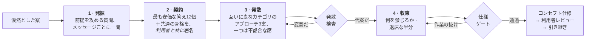

<div align="center">

# Imagination Brainstorming

**ありふれた答えへの収束を拒むアイデア開発スキル。**

よいブレインストーミングの形——一度に一問、本物の代案、文書として残る仕様——はそのままに、<br>すべてを静かに安全な答えへ引き戻す部分だけを差し替えたエージェントスキル。

[](https://github.com/djfksjd/imagination-brainstorming-skill/actions/workflows/tests.yml)
[](#インストール)
[](#インストール)
[](#内部構造)
[](LICENSE)

[English](README.md) · [한국어](README.ko.md) · **日本語** · [简体中文](README.zh-CN.md) · [Español](README.es.md) · [Français](README.fr.md) · [Deutsch](README.de.md) · [Português](README.pt-BR.md)

</div>

---

> ブレインストーミングは早く収束しすぎる。質問が少なかったからではない。本当の問題は、**質問そのものが答えと同じ分布から出てくる**ことだ——*利用者は誰か、制約は何か、成功の基準は何か。* どれも既に持っているアイデアを整えるだけで、ブリーフが何を当然視しているかには触れない。
>
> そして選択肢が三つ提示される——うち二つは、三つ目をまともに見せるために存在する。

## 仕組み



|  | 何をするか | なぜ効くか |
|---|---|---|
| **1** | **前提を攻める質問。** 12の質問ファミリーから配る——語られない前提、あなたが嫌うであろう版、これは*誰のためでないか*、どう終わるか、どの規模で壊れるか、行政的な半分。各ファミリーは「何を聞き取るか」と「避けるべき前提保存型の質問」を併記する。 | 要件は前提の上に載っている。要件を訊けばアイデアは確認され、前提を訊けば試される。最低一つの前提は削除か反転に至らねばならず、一つだけなら他がなぜ持ちこたえたかを仕様に書く。数合わせで反転を捏造するのは、正直な「残った」より悪い。 |
| **2** | **利用者も署名する禁止契約。** モデルが自分の出しやすい答え12個を書き、それらが共有する*骨格*を名指しし、圧縮版を提示する——**提案ではなく除外宣言として。** 利用者は自分の「またそれは要らない」を足す。 | 利用者の除外項目はその場で最も価値ある制約であり、骨格に名前をつければ同じ形の十三番目が忍び込めない。 |
| **3** | **変奏になり得ない代案。** 互いに素な再構成カテゴリから配られた3案、うち一つは**不都合な席**——利用者が退けるであろう案を全力で弁護する。 | スクリプトが検査する：同一カテゴリ、互いの言い換え、同じ原因で死ぬ二つ、著しく記述が薄い一つ——すべて exit 3。意味ではなく構造の検査だが、当て馬が取りうる形はまさにそれらだ。 |
| **4** | **読ませる前にゲート。** コンセプトは何を禁じるかを述べ、最も近い既存物を名指しし、本物の未解決の問いを最低二つ持たねばならない。 | 未解決の問いがない仕様は、分からないことを隠している。何も禁じない設計は願望リストだ。ゲートは良し悪しを判定しない——作業が飛ばされていないことだけを証明する。 |

> [!IMPORTANT]
> **決して実装しない。** コードもスキャフォールドも「では作り始めましょうか」もない。終着点は、利用者が承認した仕様と引き継ぎだけだ。

## インストール

**Claude Code** と **Codex** で動作する。Python 3 標準ライブラリのみ——追加インストール・API キー・ネットワークは不要。

```bash
curl -fsSL https://raw.githubusercontent.com/djfksjd/imagination-brainstorming-skill/main/install.sh | bash
```

<details>
<summary><b>手動インストール</b></summary>

```bash
# Claude Code
claude plugin marketplace add djfksjd/imagination-brainstorming-skill
claude plugin install imagination-brainstorming@djfksjd

# Codex
codex plugin marketplace add djfksjd/imagination-brainstorming-skill
codex plugin add imagination-brainstorming@djfksjd
```

一つのツリーで両ホストに対応する。スキル本体は `skills/imagination-brainstorming/` にあり、`AGENTS.md` が共通コンテキストとして読み込まれる。
</details>

## 使い方

温めている考えをそのまま言えばよい。ブレインストーミングの依頼、あるいは「今の案がどれも同じに見える」という不満で起動する。どの言語でも動き、仕様もその言語で書かれる。

```text
これを一緒に考えて：病棟の勤務交代の引き継ぎのやり方。
```

```text
オンボーディングの案が三つあるけど、全部同じ案に見える。
一つに決める前にちゃんと詰めてほしい。
```

### セッションが実際にすること

| 段階 | 利用者が見るもの | 強制する仕組み |
|---|---|---|
| 偵察 | 「ここには定石の答えがあり、それが正解かもしれません——それを作りますか、それとも形から疑いますか？」 | ハードルール：無理な奇抜さの禁止 |
| 発掘 | メッセージごとに一問、このブリーフ用に言い換えて | 質問ファミリー12種、各々にアンチパターン |
| 契約 | 除外6項目＋共通の骨格、確認と追加の依頼 | `banlist.py`、偽装なら exit 2 |
| 発散 | 同等の密度の3案、うち一つはたぶん嫌いなもの | `divergence_check.py`、変奏なら exit 3 |
| 収束 | 節ごとの設計、各節を承認してから次へ | 何を禁じるかを最初に書く |
| 仕様 | `docs/concepts/YYYY-MM-DD-<主題>-concept.md` ＋機械可読サイドカー | `spec_gate.py`、作業の抜けは exit 2 |
| 引き継ぎ | この仕様が扱わ*ない*ことと次の一手 | 実装スキルは決して呼ばない |

### デッキ

| デッキ | 内容 |
|---|---|
| **質問ファミリー**（12） | 語られない前提 · あなたが嫌う版 · 定義し直した成功 · 反転した制約 · 誰のためでないか · 不可能なままであるべきもの · 墓場（先行事例の死因） · 何を義務づけるか · 隣接する世界 · どう終わるか · どの規模で壊れるか · 行政的な半分 |
| **フレーム**（10カテゴリ40枚） | 減算 · 反転 · 主体の移動 · 規模の移動 · 時間の移動 · 経済 · 保守 · 媒体の移動 · 儀礼 · 失敗優先 |
| **クリシェ** | ピッチの反射語、空疎な形容詞、そしてコンセプトではなくポジショニングであることを露呈する構造パターン |

### あなたの役割

これはコマンドではなく会話です。セッションの価値を決める場面が四つあり、四つともあなたの側にあります。

**1 · 前提の質問に答える。** 要件ヒアリングのようには感じられないはずです。実際そうではないからです。*「使うと選んだこともないのに、これに影響を受ける人は誰か」*はステークホルダーの質問ではありません。役に立つのは考え込んでから出てくる答えで、*「まあ、当然……」*で始まる答えこそ、このセッションが探している前提です。その当たり前の一文をそのまま言ってください — それが素材です。

**2 · 禁止契約に署名する。** 質問三つほどのあとで、六つほどの答えと、それらが共有する**骨格**が提示されます。言い回しではなく、その下の構造 — *装置、フィード、マーケットプレイス、ダッシュボード*。こう尋ねられます:

> 「ここで最も安く出てくる答えです。テーブルから下げます。この中にすでに思い描いていたものはありますか。付け加えるものは?」

両方に答えてください。すでに思い描いていたものを挙げるのに費用はかからず、それがセッションで最も有用な一文になることがよくあります。ご自身の除外項目はどんな形でも構いません — *「ベッドサイドの画面時間を増やすものは全部だめ」*のようなものも歓迎です。どんなスクリプトも機械的には照合できないので、ゲートはこれを手動チェック項目として記録し、書面の回答が埋まるまでスペックを通しません。

**3 · 不安な席。** 三案のうち一つは、あなたが却下すると想定されている案で、他と同じ密度で擁護されます。間違っていれば却下してください — ただし*なぜ*かを一文で。その一文は、勝ち案を選ぶことよりコンセプトを大きく動かすのが常です。

**4 · レビューのゲート。** スペックはファイルに書き出され、*「読んで、変えるべき点を教えてください」*とともに返ってきます。これは形式ではありません。ゲートは作業が行われたことを確かめるだけで、コンセプトが正しいかは確かめません — 下記参照。

### 言うべき三つのこと

**どの案も同じに感じるとき:**

```text
まだ一つのアイデアが三着の衣装を着ているだけに見える。再生成。
```

新しいランで配り直し、*前ラウンドの全要素*を契約に加え、前提発掘からもう一つ前提を削除したうえで、それがどれだったかを告げます。その最後の一行が要点です。

**通常の答えが実際に正しいとき:** そう言ってください。スキルは一文で同意し、スキルから抜けて、外で普通の作業をするよう定められています。ログインフォームに前提発掘は要らず、スキルはそうでないふりをすることを禁じられています。

**ブリーフが大きすぎるとき:** 偵察段階で捕まえるべきですが、漏れたら — *「これは三つのシステムだ、分けて」* — 各部分がそれぞれのセッションとスペックを持ちます。

### スクリプトを自分で回す

Python 3.11、標準ライブラリのみ、インストール不要。スキルは `skills/imagination-brainstorming/` にあり、以下のコマンドはすべてそのディレクトリの中で実行する前提で書かれています。作業ファイルは必ずスクラッチディレクトリへ — スキルフォルダの中には書かないでください。

```bash
cd skills/imagination-brainstorming
SKELETON="A capture tool that turns a spoken conversation into a structured record, with completeness enforced by a form and a signature at the end."

# 1 · 質問系統と、互いに両立しない三つのフレームを配る
python3 scripts/deal.py --brief "a way for our ward to hand over shifts" --run 1 --out /tmp/work

# 2 · 契約を作る — 二回呼び、順序が重要。--instincts は自分で書くファイルで、
#     まず思いつく答えを一行に一つ、十二個並べる。
python3 scripts/banlist.py --brief "a way for our ward to hand over shifts" \
    --instincts references/example-instincts.txt --skeleton "$SKELETON" --out /tmp/work
#    …排除リストとしてユーザーに見せ、回答を得てから、はじめて:
python3 scripts/banlist.py --brief "a way for our ward to hand over shifts" \
    --instincts references/example-instincts.txt --user references/example-exclusions.txt \
    --skeleton "$SKELETON" --confirmed --out /tmp/work

# 3 · 三案が本当に三つであることを証明する
python3 scripts/divergence_check.py --approaches references/example-approaches.json \
    --banlist references/example-banlist.json

# 4 · スペックとサイドカーと契約をまとめてゲートにかける — 三つとも必須
python3 scripts/spec_gate.py --concept references/example-concept.json \
    --markdown references/example-concept.md --banlist references/example-banlist.json
```

ここに出てくるファイルはすべてリポジトリに同梱されています。だからこのブロックは書かれたとおりに動き、四つの手順はいずれも `0` で終わります。手順 2 は `references/example-banlist.json` をそのまま再生成します。進めながら、自分のセッションのファイルに差し替えてください。

**`approaches.json` は手で書くファイルです。** フレームを配るのは `deal.py`、配られたフレームごとに一つずつ案を書き、`approaches` キーを持つオブジェクトにまとめます — `id`、フレームデッキから取った `frame_id`、86 単位以上の `summary`、このブリーフで*この*案がどう壊れるかを述べる 43 単位以上の `failure_mode`、そのフレームが要求する役割をこのブリーフの何が担うのかを書く 36 単位以上の `frame_fit`、そしてちょうど一つだけ真にする `unsafe_seat`。全フィールドと全下限は `references/decks/approaches-schema.json` に、`references/example-approaches.json` は形をそのまま写せる合格例です。

これらの下限は文字数ではなく単位で数え、**推定ではなく実測で**決めました。受け入れるに値する最も薄い初接触の場面を一つ、ラテン・韓国語・日本語・中国語・タイ語・デーヴァナーガリー・ヘブライ語・アラビア語に訳し、実際に動く関数で測り、同じ題材を場面ではなく説明として書いたものも並べて測りました。場面は 186〜283 単位、説明は 41〜64 単位。だから一つの数字が八つの文字体系すべてで両者を分けます。下限は、最も密度の高い文字体系で最も薄い正当な場面までを通す、最も高い値です。一つの数字にできないのは、すべての文字体系で等しく厳しくあることです。同じ内容は中国語ではラテン文字より約三分の一少ない単位で測られるため、この基準はラテン文字の散文により厳しく効きます。そう置いたのは、誰かの言語で書かれた正当な文章を拒むほうが悪い失敗だからです。

`frame_fit` は、ブリーフが支えられないフレームが表に出る場所です。`designed-for-repair` — *頻繁に壊れる前提で、修理手順と交換部品を含めよ* — が、一度きりで終わる閉店の儀のリスク席に配られたことがあります。一度きりの儀に作り手も交換部品もありませんが、検査はそのまま通しました。フレームが求める役割をこのブリーフの何も担えないなら、そう書いて `--run 2` で配り直してください。無理に論じないこと。検査はその主張を要求するだけで、主張が正しいかどうかは確かめられません。

`--confirmed` はすでに起きた同意の記録です。ユーザーがリストを見る前にこれを立てるのは、以降のパイプライン全体が依存することになる嘘であり、ゲートには検出する術がありません — だからフラグ一つではなく二回の呼び出しになっています。

契約の差し替えはただではありません。とはいえ不可能でもない — ここに出所を証明する仕組みはないからです。ゲートは `concept.json` が宣言した内容から契約を組み直し、焼いた直感、ユーザー自身の排除、同梱クリシェデッキの項目のいずれかを欠くファイルを拒みます。二つのファイルは同じ骨格と同じブリーフを一字一句そのまま持っていなければならず、禁止リストのブリーフは単語ではなく主題を名指していなければなりません。デッキはどんな契約が来てもスペックに適用されるので、短いファイルを渡しても lint が短くなることはありません。これらが示すのは、同じ書き手による二つのファイルが互いに食い違っていないことです — 差し替えるには名前を変えるのではなく書き直す必要がある、ということ。

`cliche_lint.py` は**セッション途中の草稿用**です。完成したスペックにかけると、そのスペック自身の禁止リスト節を指摘します。完成スペックを lint するのは `spec_gate.py` のほうで、そちらはその区間を先に切り落とします。

### 終了コードと対処

| コード | 意味 | 対処 |
|---|---|---|
| `0` | 通過 | — |
| `1` | 使い方の誤り、ファイルなし、デッキの破損 | 判定ではなく打ち間違い |
| `2` | **契約かスペックが不完全** — 直感が少ない、骨格がない、未署名の契約、節の欠落、書面回答のない手動チェック、あるいは自分のサイドカーを実際には含まないスペック | 抜けている作業をする |
| `3` | **三案が変奏**、または禁止された素材がある | 書き直すか、`--run 2` で配り直して作り直す |

### ゲートが確かめられないこと

> [!IMPORTANT]
> ゲートは床です。求められた作業が**そこにある**ことは確かめますが、それが**正しかった**ことは確かめません。このリポジトリのすべてのゲートを通過するものが三つあります:
>
> - **自らの根拠を裏返す正当化** — 前提を丁寧に読むと反対の結論を支持している論証;
> - **自らの論理で反駁できる仕組み** — たとえば計算順序で値が変わる数字を、そのコンセプトの透明性の証拠として掲げること;
> - **実は一つである三案**。チェックは言い換えと共通の失敗原因は捕まえますが、読むことはできません。
>
> ゲートが新たに要求するものが二つあります。どちらも良し悪しの判定はしません。選んだ案が自ら書いた失敗の仕方は `chosen.answers_failure_mode` で**答えられ**なければなりません — 自らの崩壊を書き記したまま一度で通っていたコンセプトがありました。そして各案は、このブリーフの何が自分のフレームを埋めるのかを述べなければなりません。いずれもゲートは「何かが書かれたか」を確かめて、それをあなたに見せるだけです。答えの出来までは判断できません。
>
> 四つ目は以前は通り、いまは通りません — 同じ文言を、それを退ける文の中に引用した場合です。禁止事項、不可能になること、初接触の場面、すべての未解決の問いは `<!-- bind: … -->` で印を付け、サイドカーと**完全一致**で照合されます。各一回だけ、自分の節の中で、引用ではなく仕様自身の声で。置き換えられた類似度スコアは*「Xを禁じる」*と*「Xの禁止を検討したが許容する」*を区別できませんでした。またこのゲートも発散チェックも `--allow` を受け付けません — 判定時に与えられた例外は、その判定の対象が与えたものです。
>
> 三つとも、このスキル自身の試行セッションで実際に起き、三つともスクリプトではなく人間が捕まえました。ですから: スペックがあなたに届く前に、二人目の読み手に攻撃させてください — 別のモデルでも同僚でも — そして**なぜこれが負けるのか**を論じさせてください。改善案ではなく。「どうすればもっと良くなるか」は磨きをもたらし、「なぜ負けるのか」は裏返った前提をもたらします。
>
> スキルは自分自身にも**根拠の向きの監査**をかけます。すべての中核的な「なぜなら」について、同じ前提が支持する反対の結論を書き出し、意思決定者が実際に観測できるものは何かを明示しなければなりません。*「審査するのは機械だ、ゆえに我々の内部記録が差別化点だ」*を捕まえるのがこの検査です — 機械の審査者は内部記録を観測できないので、その前提は正反対を論じています。
>
> 手編集された禁止リストは独自の `structural_patterns[].regex` を追加できますが、`(a+)+` のような形のパターンは、ある入力に対してPythonの照合エンジンを指数的に長くかかるようにします — 決して返ってこないゲートは、待っている側から見れば通過したゲートと区別がつきません。こうしたパターンは、実行される前にidを名指しして拒否されるようになりました。この検査は古典的な入れ子の繰り返しの形を探す決定的なスキャンなので、このリスクを狭めるだけで排除はしません — 認識されない破滅的な形は依然として遅くなり得ます — そしてmacOSとLinuxでは、スキャンが見逃したものを捕まえる時間制限のバックストップがもう一つあり、このバックストップはWindowsでは利用できません。

### 製品ではないブリーフ

進め方も、質問の系統も、フレームも、スペックの約束事も、主題を選びません — 物語世界、ゲームの機構、儀式、キャンペーン、フォーマット、どれにも当てはまります。ただし機械仕掛けのうち二か所はそれより狭く、知っておいたほうがいい部分です。

- **クリシェの語句リストはピッチと製品の語彙です** — one-stop shop、KPI ダッシュボード、Uber for X、ゲーミフィケーション。物語や儀式のブリーフではほとんど一つも発火しません。つまり契約の機械可読な半分はほとんど働かず、そのセッション自身の直感と骨格が重さを引き受けます。空虚な形容詞と禁じ手はどこでも有効です。
- **禁止された形容詞が普通の語彙であることもあります。** フィクションで *magical* や *delightful* は主張ではなく指示であり、実際 *「この地域は magical ではない」* がそう書いたという理由で拒まれました。その範囲をその場で印付けます — `<!-- mention: hollow-magical -->the region is not magical<!-- /mention -->` — 解除はその範囲とその規則だけに効きます。その語が本当に使用ではなく言及なのかまでは検証できません。規則ごと丸ごと解除する代わりに、主張を表に出して検討可能にする、というだけです。 印には上限があります。印ひとつにつき規則 ID はひとつ、範囲はひと段落（200 単位）まで、その中に否定か二重引用符で括った語があること、文書全体で五つまで。そして最初の直感やあなた自身の除外は、この経路でも他のどの経路でも解除できません。かつては全 ID を並べた印ひとつで契約全体が解除されました。

驚くより先に知っておきたいことが二つ。最初の直感が名詞句より節になりやすく、手動チェックに回るものが増えます — それらは読み直せという意味であって書くべきメモではなく、文章で答える必要があるのは*あなた自身の*排除だけです。そして、ブリーフが支えられないフレームが配られる確率も上がります。そのための `frame_fit` であり、配り直しです。

`references/example-ritual-concept.md` がまさにその形の完成例です: 一つの通りで九十年商ってきたパン屋の閉店の儀を、契約・案・サイドカーごと同梱し、同じ二つのコマンドでゲートにかけています。

## しないこと

> [!IMPORTANT]
> - **何かを作ること。** ハードゲートが二つ：実装は永久に禁止、そして検査を経ないものは利用者に届かない——アプローチは発散検査を、仕様はゲートを通る。
> - **「誰も思いつかなかった」と主張すること。** 検証不能なので禁止。代わりに最も近い既存物を名指しし、差分を書く。
> - **無理に奇抜にすること。** 定石の答えが正解のときは、一文でそう告げて普通に仕事をする義務がある。
> - **仕様化しやすいように依頼を縮めること。** 範囲は公然と分解するだけで、こっそり狭めない。
> - **ゲート通過を良案の証拠にすること。** 必要な言明と成果物が揃っている確認であって正しさの証明ではなく、スキル自身がそう明言する。

## 内部構造

| スクリプト | 役割 | 非ゼロ終了コード |
|---|---|---|
| `deal.py` | 質問ファミリーと互いに両立しないフレーム3枚（一つは unsafe 印）を配る | `1` 使い方・デッキの誤り |
| `banlist.py` | 共有禁止契約を構築：直感＋骨格＋利用者の除外項目 | `2` 直感不足・骨格なし |
| `divergence_check.py` | 3案が代案であること（当て馬二つでないこと）を証明 | `3` 発散せず |
| `spec_gate.py` | 仕様・サイドカー・契約をまとめてフェイルクローズド検証 | `2` ゲート不合格 |
| `cliche_lint.py` | セッション中の任意の草稿をリント | `3` 禁止要素 |

**すべて再現可能。** 配りはブリーフのハッシュでシードされるため、同じブリーフは同じ手札になり、どのセッションも再生できる。`--run 2` は互いに素なカテゴリのまま新しいフレームを配り、不都合な席は回転して同じカテゴリが常に嫌な案を担うことはない。

```text
skills/imagination-brainstorming/
├── SKILL.md                    # 権威あるワークフロー
├── references/
│   ├── concept-template.md     # 仕様の構造とセクションマーカー
│   ├── worked-example.md       # 切り捨てた案も含む実セッション1件
│   ├── example-concept.md      # そのセッションが生んだ仕様
│   ├── example-concept.json    # そのサイドカー（両方ゲート通過・フィクスチャ兼用）
│   ├── example-approaches.json # 段階3の入力（divergence_check.py が読む形）
│   ├── example-banlist.json    # 上をゲートにかけた契約そのもの
│   ├── example-ritual-*.{md,json,txt}  # 製品でもサービスでもない二つ目の実例
│   ├── example-instincts.txt   # その契約の元になった十二の直感
│   ├── example-exclusions.txt  # そしてユーザー自身の三つ
│   └── decks/                  # 質問ファミリー · フレーム · クリシェ · 仕様スキーマ · 案スキーマ
└── scripts/                    # deal · banlist · divergence_check · spec_gate · cliche_lint
```

### 相棒

[**imagination-engine**](https://github.com/djfksjd/imagination-engine-skill) とは独立だが、隣に置く前提で設計されている——あちらは奇妙な対象を一つ、単発で極限まで押し進める生成器だ。コンセプトの中の生物・機構・世界が仕様に収まらなくなったとき、このスキルがそちらへ引き渡す。どちらか一方だけでも成立する。

## テスト

```bash
python3 -m pytest tests/ -q
```

ネットワーク不要。デッキの整合性、配りの決定性とカテゴリの非重複、三つのゲートのあらゆる失敗経路、そして同梱例がそれらを通ることを検証する。

## 貢献

最も手を入れやすいのはデッキだ——本当に別の角度から刺す質問ファミリー、既存カテゴリが覆えないフレーム。すべての項目は使えるものであること。質問ファミリーには「何を聞き取るか」*と*「それが置き換える前提保存型の質問」が、フレームには動作・要求・特有の失敗が必ず付く。PR の前にテストを走らせてほしい。

<div align="center">
<sub>MIT ライセンス · <a href="https://claude.com/claude-code">Claude Code</a> と Codex のために</sub>
</div>
