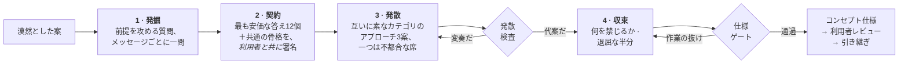

<div align="center">

# Imagination Brainstorming

**ありふれた答えへの収束を拒むアイデア開発スキル。**

よいブレインストーミングの形——一度に一問、本物の代案、文書として残る仕様——はそのままに、<br>すべてを静かに安全な答えへ引き戻す部分だけを差し替えたエージェントスキル。

[](https://github.com/djfksjd/imagination-brainstorming-skill/actions/workflows/tests.yml)
[](#インストール)
[](#インストール)
[](#内部構造)
[](LICENSE)

[English](README.md) · [한국어](README.ko.md) · **日本語** · [简体中文](README.zh-CN.md) · [Español](README.es.md) · [Français](README.fr.md) · [Deutsch](README.de.md) · [Português](README.pt-BR.md)

</div>

---

> ブレインストーミングは早く収束しすぎる。質問が少なかったからではない。本当の問題は、**質問そのものが答えと同じ分布から出てくる**ことだ——*利用者は誰か、制約は何か、成功の基準は何か。* どれも既に持っているアイデアを整えるだけで、ブリーフが何を当然視しているかには触れない。
>
> そして選択肢が三つ提示される——うち二つは、三つ目をまともに見せるために存在する。

## 仕組み



|  | 何をするか | なぜ効くか |
|---|---|---|
| **1** | **前提を攻める質問。** 12の質問ファミリーから配る——語られない前提、あなたが嫌うであろう版、これは*誰のためでないか*、どう終わるか、どの規模で壊れるか、行政的な半分。各ファミリーは「何を聞き取るか」と「避けるべき前提保存型の質問」を併記する。 | 要件は前提の上に載っている。要件を訊けばアイデアは確認され、前提を訊けば試される。最低一つの前提は削除か反転に至らねばならず、一つだけなら他がなぜ持ちこたえたかを仕様に書く。数合わせで反転を捏造するのは、正直な「残った」より悪い。 |
| **2** | **利用者も署名する禁止契約。** モデルが自分の出しやすい答え12個を書き、それらが共有する*骨格*を名指しし、圧縮版を提示する——**提案ではなく除外宣言として。** 利用者は自分の「またそれは要らない」を足す。 | 利用者の除外項目はその場で最も価値ある制約であり、骨格に名前をつければ同じ形の十三番目が忍び込めない。 |
| **3** | **変奏になり得ない代案。** 互いに素な再構成カテゴリから配られた3案、うち一つは**不都合な席**——利用者が退けるであろう案を全力で弁護する。 | スクリプトが検査する：同一カテゴリ、互いの言い換え、同じ原因で死ぬ二つ、著しく記述が薄い一つ——すべて exit 3。意味ではなく構造の検査だが、当て馬が取りうる形はまさにそれらだ。 |
| **4** | **読ませる前にゲート。** コンセプトは何を禁じるかを述べ、最も近い既存物を名指しし、本物の未解決の問いを最低二つ持たねばならない。 | 未解決の問いがない仕様は、分からないことを隠している。何も禁じない設計は願望リストだ。ゲートは良し悪しを判定しない——作業が飛ばされていないことだけを証明する。 |

> [!IMPORTANT]
> **決して実装しない。** コードもスキャフォールドも「では作り始めましょうか」もない。終着点は、利用者が承認した仕様と引き継ぎだけだ。

## インストール

**Claude Code** と **Codex** で動作する。Python 3 標準ライブラリのみ——追加インストール・API キー・ネットワークは不要。

```bash
curl -fsSL https://raw.githubusercontent.com/djfksjd/imagination-brainstorming-skill/main/install.sh | bash
```

<details>
<summary><b>手動インストール</b></summary>

```bash
# Claude Code
claude plugin marketplace add djfksjd/imagination-brainstorming-skill
claude plugin install imagination-brainstorming@djfksjd

# Codex
codex plugin marketplace add djfksjd/imagination-brainstorming-skill
codex plugin add imagination-brainstorming@djfksjd
```

一つのツリーで両ホストに対応する。スキル本体は `skills/imagination-brainstorming/` にあり、`AGENTS.md` が共通コンテキストとして読み込まれる。
</details>

## 使い方

温めている考えをそのまま言えばよい。ブレインストーミングの依頼、あるいは「今の案がどれも同じに見える」という不満で起動する。どの言語でも動き、仕様もその言語で書かれる。

```text
これを一緒に考えて：病棟の勤務交代の引き継ぎのやり方。
```

```text
オンボーディングの案が三つあるけど、全部同じ案に見える。
一つに決める前にちゃんと詰めてほしい。
```

> [!TIP]
> あなた自身の除外項目を持ってきてほしい。「またフォームを作るのは無し」は、どんな励ましより価値がある——出さなければスキルの方から尋ねる。

### セッションが実際にすること

| 段階 | 利用者が見るもの | 強制する仕組み |
|---|---|---|
| 偵察 | 「ここには定石の答えがあり、それが正解かもしれません——それを作りますか、それとも形から疑いますか？」 | ハードルール：無理な奇抜さの禁止 |
| 発掘 | メッセージごとに一問、このブリーフ用に言い換えて | 質問ファミリー12種、各々にアンチパターン |
| 契約 | 除外6項目＋共通の骨格、確認と追加の依頼 | `banlist.py`、偽装なら exit 2 |
| 発散 | 同等の密度の3案、うち一つはたぶん嫌いなもの | `divergence_check.py`、変奏なら exit 3 |
| 収束 | 節ごとの設計、各節を承認してから次へ | 何を禁じるかを最初に書く |
| 仕様 | `docs/concepts/YYYY-MM-DD-<主題>-concept.md` ＋機械可読サイドカー | `spec_gate.py`、作業の抜けは exit 2 |
| 引き継ぎ | この仕様が扱わ*ない*ことと次の一手 | 実装スキルは決して呼ばない |

### デッキ

| デッキ | 内容 |
|---|---|
| **質問ファミリー**（12） | 語られない前提 · あなたが嫌う版 · 定義し直した成功 · 反転した制約 · 誰のためでないか · 不可能なままであるべきもの · 墓場（先行事例の死因） · 何を義務づけるか · 隣接する世界 · どう終わるか · どの規模で壊れるか · 行政的な半分 |
| **フレーム**（10カテゴリ40枚） | 減算 · 反転 · 主体の移動 · 規模の移動 · 時間の移動 · 経済 · 保守 · 媒体の移動 · 儀礼 · 失敗優先 |
| **クリシェ** | ピッチの反射語、空疎な形容詞、そしてコンセプトではなくポジショニングであることを露呈する構造パターン |

## しないこと

> [!IMPORTANT]
> - **何かを作ること。** ハードゲートが二つ：実装は永久に禁止、そして検査を経ないものは利用者に届かない——アプローチは発散検査を、仕様はゲートを通る。
> - **「誰も思いつかなかった」と主張すること。** 検証不能なので禁止。代わりに最も近い既存物を名指しし、差分を書く。
> - **無理に奇抜にすること。** 定石の答えが正解のときは、一文でそう告げて普通に仕事をする義務がある。
> - **仕様化しやすいように依頼を縮めること。** 範囲は公然と分解するだけで、こっそり狭めない。
> - **ゲート通過を良案の証拠にすること。** 作業をした証明であって正しさの証明ではなく、スキル自身がそう明言する。

## 内部構造

| スクリプト | 役割 | 非ゼロ終了コード |
|---|---|---|
| `deal.py` | 質問ファミリーと互いに両立しないフレーム3枚（一つは unsafe 印）を配る | `1` 使い方・デッキの誤り |
| `banlist.py` | 共有禁止契約を構築：直感＋骨格＋利用者の除外項目 | `2` 直感不足・骨格なし |
| `divergence_check.py` | 3案が代案であること（当て馬二つでないこと）を証明 | `3` 発散せず |
| `spec_gate.py` | 仕様・サイドカー・契約をまとめてフェイルクローズド検証 | `2` ゲート不合格 |
| `cliche_lint.py` | セッション中の任意の草稿をリント | `3` 禁止要素 |

**すべて再現可能。** 配りはブリーフのハッシュでシードされるため、同じブリーフは同じ手札になり、どのセッションも再生できる。`--run 2` は互いに素なカテゴリのまま新しいフレームを配り、不都合な席は回転して同じカテゴリが常に嫌な案を担うことはない。

```text
skills/imagination-brainstorming/
├── SKILL.md                    # 権威あるワークフロー
├── references/
│   ├── concept-template.md     # 仕様の構造とセクションマーカー
│   ├── worked-example.md       # 切り捨てた案も含む実セッション1件
│   ├── example-concept.md      # そのセッションが生んだ仕様
│   ├── example-concept.json    # そのサイドカー（両方ゲート通過・フィクスチャ兼用）
│   └── decks/                  # 質問ファミリー · フレーム · クリシェ · 仕様スキーマ
└── scripts/                    # deal · banlist · divergence_check · spec_gate · cliche_lint
```

### 相棒

[**imagination-engine**](https://github.com/djfksjd/imagination-engine-skill) とは独立だが、隣に置く前提で設計されている——あちらは奇妙な対象を一つ、単発で極限まで押し進める生成器だ。コンセプトの中の生物・機構・世界が仕様に収まらなくなったとき、このスキルがそちらへ引き渡す。どちらか一方だけでも成立する。

## テスト

```bash
python3 -m pytest tests/ -q
```

ネットワーク不要。デッキの整合性、配りの決定性とカテゴリの非重複、三つのゲートのあらゆる失敗経路、そして同梱例がそれらを通ることを検証する。

## 貢献

最も手を入れやすいのはデッキだ——本当に別の角度から刺す質問ファミリー、既存カテゴリが覆えないフレーム。すべての項目は使えるものであること。質問ファミリーには「何を聞き取るか」*と*「それが置き換える前提保存型の質問」が、フレームには動作・要求・特有の失敗が必ず付く。PR の前にテストを走らせてほしい。

<div align="center">
<sub>MIT ライセンス · <a href="https://claude.com/claude-code">Claude Code</a> と Codex のために</sub>
</div>
