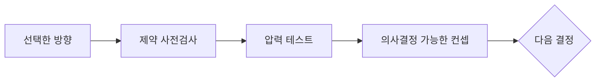

<div align="center">

# ◇ Imagination Brainstorming

**선택한 아이디어를 현실을 견디는 컨셉으로.**

Codex와 Claude Code를 위한 집중형 컨셉 워크숍입니다.

[](https://github.com/djfksjd/imagination-brainstorming-skill/actions/workflows/tests.yml)


[English](README.md) · [한국어](README.ko.md) · [日本語](README.ja.md) · [简体中文](README.zh-CN.md) · [Español](README.es.md) · [Français](README.fr.md) · [Deutsch](README.de.md) · [Português (Brasil)](README.pt-BR.md)

</div>

---

> [!TIP]
> **대부분의 사용자는 통합 [Imagination](https://github.com/djfksjd/imagination)을
> 권장합니다.** Engine이 방향을 만들고 사용자 선택을 기다린 뒤 선택안을
> 이 워크숍으로 연결합니다.

Imagination Brainstorming은 **방향을 고른 뒤** 시작합니다. 구현 전에
아이디어를 목표, 제약, 가장 강한 대안, 반복 운영과 고유한 실패 방식에
대입해 검증합니다.



## 사용해 보기

```text
$imagination-brainstorming을 사용해서 이 선택안을 발전시켜 줘. 첫 실제
사용, 반복 운영 부담, 고유 실패 방식, 반증 조건과 다음 결정을 보여 줘.
```

선택안이 브리프를 은밀히 위반하거나 더 단순한 대안보다 못하면, 그 사실을
숨기고 다듬지 않고 명확히 알립니다.

## 검토하는 항목

| 관점 | 질문 |
|---|---|
| 제약 사전검사 | 제외한 메커니즘이 이름만 바꿔 돌아왔는가? |
| 핵심 전제 | 틀리면 아이디어 전체가 무너지는 믿음은 무엇인가? |
| 일반적 대안 | 추가 복잡성을 감수할 이유가 있는가? |
| 핵심 메커니즘 | 어떤 관찰 가능한 원인이 결과를 바꾸는가? |
| 지루한 절반 | 반복 업무, 대기열, 예외와 유지보수는 누가 맡는가? |
| 고유 실패 | 정의 메커니즘 때문에 어떻게 실패하는가? |
| 반증 조건 | 어떤 결과가 나오면 중단하거나 방향을 바꿔야 하는가? |

결과는 간결한 컨셉 메모이며 코드, 스캐폴딩, 구현 계획은 만들지 않습니다.

## 측정 결과

강한 일반 프롬프트와 새 사전 등록 블라인드 비교 결과입니다.

| 지표 | 스킬 결과 − 일반 프롬프트 |
|---|---:|
| 기획에 가져가고 싶은 결과 | **45 대 5 (90.0%)** |
| 실행 가능성 | **+1.37** |
| 의사결정 적합성 | **+0.95** |
| 인과적 명료성 | **+0.71** |
| 견고성 | **+0.82** |
| 토큰 비용 | `1.14배` |

선호도의 95% Wilson 구간은 78.6–95.7%입니다. 같은 모델 계열의 독립
호출이 심사했으므로 사람 도메인 평가를 대신하지 않습니다. 자세한 내용은
[`evals/README.md`](evals/README.md)와
[고정 결과](evals/results/2026-07-30-gpt-5.4-confirmation-v042.json)를
참조하세요.

## 단독 설치

```bash
curl -fsSL https://raw.githubusercontent.com/djfksjd/imagination-brainstorming-skill/main/install.sh | bash
```

```bash
claude plugin marketplace add djfksjd/imagination-brainstorming-skill
claude plugin install imagination-brainstorming@djfksjd
codex plugin marketplace add djfksjd/imagination-brainstorming-skill
codex plugin add imagination-brainstorming@djfksjd
```

## 사용 범위

선택한 방향, 최종 후보 또는 발전시킬 초기 컨셉이 있을 때 사용합니다. 초기
발산에는 [Imagination Engine](https://github.com/djfksjd/imagination-engine-skill)을
사용하세요. 이 워크숍은 의도적으로 구현 전에 멈춥니다.

## 개발과 이전 버전

```bash
python3 -m pytest tests/ -q
python3 evals/harness.py --help
```

이전 덱·게이트 워크플로는 연구 목적으로만
[`legacy/v0.3.0/`](legacy/v0.3.0/)에 보존되며 런타임에서는 로드되지
않습니다. MIT 라이선스입니다.
