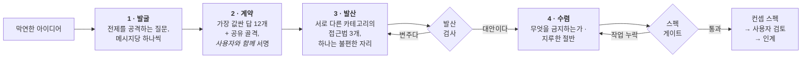

<div align="center">

# Imagination Brainstorming

**뻔한 답으로 수렴하기를 거부하는 아이디어 발전 스킬.**

좋은 브레인스토밍의 형태 — 한 번에 하나씩 묻기, 진짜 대안, 문서로 남는 스펙 — 는 그대로 두고,<br>모든 것을 조용히 안전한 답으로 되돌리는 부분만 갈아 끼운 에이전트 스킬.

[](https://github.com/djfksjd/imagination-brainstorming-skill/actions/workflows/tests.yml)
[](#설치)
[](#설치)
[](#내부-구조)
[](LICENSE)

[English](README.md) · **한국어** · [日本語](README.ja.md) · [简体中文](README.zh-CN.md) · [Español](README.es.md) · [Français](README.fr.md) · [Deutsch](README.de.md) · [Português](README.pt-BR.md)

</div>

---

> 브레인스토밍은 너무 일찍 수렴한다. 질문이 부족해서가 아니다. 진짜 문제는 **질문 자체가 답과 같은 분포에서 나온다**는 것이다 — *사용자가 누구인가, 제약은 무엇인가, 성공 기준은 무엇인가.* 전부 이미 가진 아이디어를 다듬을 뿐, 브리프가 무엇을 당연시하는지는 건드리지 않는다.
>
> 그리고 선택지 3개가 제시된다 — 그중 둘은 세 번째를 합리적으로 보이게 하려고 존재한다.

## 작동 방식



|  | 무엇을 하는가 | 왜 통하는가 |
|---|---|---|
| **1** | **전제를 공격하는 질문.** 12개 질문 가족에서 뽑는다 — 말해지지 않은 전제, 당신이 싫어할 버전, 이건 *누구를 위한 게 아닌지*, 어떻게 끝나는지, 어느 규모에서 깨지는지, 행정적 절반. 각 가족은 무엇을 귀 기울여 들어야 하는지와 **피해야 할 전제 보존형 질문**을 함께 명시한다. | 요구사항은 전제 위에 얹혀 있다. 요구사항을 물으면 아이디어가 확인되고, 전제를 물으면 시험된다. 최소 1개의 전제는 삭제되거나 뒤집혀야 하고, 하나만 무너졌다면 나머지가 왜 버텼는지 스펙에 적어야 한다. 할당량을 채우려 억지 반전을 지어내는 건 정직한 "살아남았다"보다 나쁘다. |
| **2** | **사용자도 서명하는 금지 계약.** 모델이 자기가 가장 낼 법한 답 12개를 적고, 그것들이 공유하는 *골격*을 지목한 뒤, 압축본을 보여준다 — **제안이 아니라 제외 선언으로.** 사용자는 자기만의 "또 그거 말고"를 추가한다. | 사용자의 금지 목록은 그 방에서 가장 값진 제약이고, 골격을 이름 붙이면 같은 형태의 열세 번째 버전이 몰래 통과하지 못한다. |
| **3** | **변주가 될 수 없는 대안들.** 서로 겹치지 않는 재구성 카테고리에서 뽑은 접근법 3개, 그중 하나는 **불편한 자리** — 사용자가 거절할 가능성이 높은 안을 전력으로 변호한다. | 스크립트가 검사한다: 같은 카테고리, 서로를 재진술한 요약, 같은 원인으로 죽는 둘, 유독 부실하게 서술된 하나 — 전부 exit 3. 의미가 아니라 구조를 검사하지만, 들러리가 취할 수 있는 형태가 정확히 그것들이다. |
| **4** | **읽어보라고 내밀기 전에 게이트.** 컨셉은 무엇을 금지하는지 밝히고, 가장 가까운 기존 사례를 지목하고, 진짜 미해결 질문을 최소 2개 담아야 한다. | 미해결 질문이 없는 스펙은 모르는 것을 숨긴 것이다. 아무것도 금지하지 않는 설계는 위시리스트다. 게이트는 컨셉의 좋고 나쁨을 판정하지 못한다 — 작업이 생략되지 않았음을 증명할 뿐이다. |

> [!IMPORTANT]
> **절대 구현하지 않는다.** 코드도, 스캐폴딩도, "이제 만들어볼까요?"도 없다. 종착점은 사용자가 승인한 스펙과 인계뿐이다.

## 설치

**Claude Code**와 **Codex**에서 동작한다. Python 3 표준 라이브러리만 쓴다 — 추가 설치·API 키·네트워크 불필요.

```bash
curl -fsSL https://raw.githubusercontent.com/djfksjd/imagination-brainstorming-skill/main/install.sh | bash
```

<details>
<summary><b>수동 설치</b></summary>

```bash
# Claude Code
claude plugin marketplace add djfksjd/imagination-brainstorming-skill
claude plugin install imagination-brainstorming@djfksjd

# Codex
codex plugin marketplace add djfksjd/imagination-brainstorming-skill
codex plugin add imagination-brainstorming@djfksjd
```

하나의 트리로 두 호스트를 모두 지원한다. 스킬 본문은 `skills/imagination-brainstorming/` 아래에 있고, `AGENTS.md`가 공용 컨텍스트로 로드된다.
</details>

## 사용법

굴리고 있는 생각을 그냥 말하면 된다. 브레인스토밍 요청이나 "지금 나온 안들이 다 똑같아 보인다"는 불평에 걸린다. 어떤 언어로도 되고, 스펙도 그 언어로 쓰인다.

```text
이거 같이 브레인스토밍하자: 병동에서 교대 인계하는 방식.
```

```text
온보딩 플로우 아이디어가 세 개 있는데 다 같은 아이디어 같아.
하나 정하기 전에 제대로 밀어붙여줘.
```

### 세션이 실제로 하는 일

| 단계 | 사용자가 보는 것 | 강제 장치 |
|---|---|---|
| 정찰 | "여기엔 통상적인 답이 있고 그게 맞을 수도 있습니다 — 그걸 원하세요, 아니면 형태부터 의심해볼까요?" | 하드룰: 억지 낯섦 금지 |
| 발굴 | 메시지당 질문 하나, 이 브리프에 맞게 다시 쓴 것 | 질문 가족 12종, 각각 안티패턴 포함 |
| 계약 | 제외 항목 6개 + 공유 골격, 확인·추가 요청 | `banlist.py`, 위조 시 exit 2 |
| 발산 | 동등한 밀도의 접근법 3개, 하나는 아마 싫어할 것 | `divergence_check.py`, 변주면 exit 3 |
| 수렴 | 섹션별 설계, 각 섹션 승인 후 다음으로 | 무엇을 금지하는지 먼저 쓴다 |
| 스펙 | `docs/concepts/YYYY-MM-DD-<주제>-concept.md` + 기계 판독 사이드카 | `spec_gate.py`, 작업 누락 시 exit 2 |
| 인계 | 이 스펙이 다루지 *않는* 것과 다음 단계 | 구현 스킬 호출 절대 금지 |

### 덱

| 덱 | 내용 |
|---|---|
| **질문 가족** (12) | 말해지지 않은 전제 · 당신이 싫어할 버전 · 다시 정의한 성공 · 뒤집은 제약 · 이건 누구를 위한 게 아닌가 · 끝까지 불가능해야 하는 것 · 무덤(선행 실패) · 무엇을 의무지우는가 · 이웃 분야 · 어떻게 끝나는가 · 어느 규모에서 깨지는가 · 행정적 절반 |
| **프레임** (10개 카테고리 40장) | 제거 · 반전 · 행위자 이동 · 규모 이동 · 시간 이동 · 경제 · 유지보수 · 매체 이동 · 의례 · 실패 우선 |
| **클리셰** | 피치 반사어, 공허한 형용사, 그리고 컨셉이 아니라 포지셔닝임을 드러내는 구조적 패턴 |

### 당신이 할 일

이 스킬은 명령이 아니라 대화다. 세션의 값어치를 결정하는 순간이 넷 있고, 넷 다 당신 몫이다.

**1 · 전제 질문에 답하기.** 요구사항 수집처럼 느껴지지 않을 것이다. 실제로 아니기 때문이다. *"쓰기로 선택한 적이 없는데도 이것의 영향을 받는 사람은 누구인가?"*는 이해관계자 질문이 아니다. 쓸모 있는 답은 생각을 좀 해야 나오는 답이고, *"뭐, 당연히…"*로 시작하는 답이 바로 세션이 찾으려는 전제다. 그 뻔한 문장을 그냥 말해달라 — 그게 재료다.

**2 · 금지 계약에 서명하기.** 질문 세 개쯤 뒤에, 답 여섯 개와 그것들이 공유하는 **골격**을 보게 된다. 표현이 아니라 그 밑의 구조 — *장치 하나, 피드, 마켓플레이스, 대시보드*. 이렇게 묻는다:

> "여기서 가장 값싸게 나오는 답들입니다. 테이블에서 치우겠습니다. 이 중에 이미 떠올리고 계셨던 게 있나요? 추가하실 것은요?"

양쪽 다 답해달라. 이미 떠올리고 있던 것을 말하는 데는 아무 비용이 들지 않고, 세션에서 가장 유용한 한 문장이 되는 경우가 많다. 자기 제외 항목은 어떤 형태든 좋다 — *"침상 옆에서 화면 보는 시간을 늘리는 건 전부 안 됨"* 같은 것도 괜찮다. 어떤 스크립트도 이걸 기계적으로 매칭할 수 없어서, 게이트는 이를 수동 확인 항목으로 적어두고 서면 답변이 채워지기 전까지 스펙을 통과시키지 않는다.

**3 · 불편한 자리.** 세 안 중 하나는 당신이 거절할 것으로 예상되는 안이고, 나머지와 같은 밀도로 옹호된다. 틀렸다면 거절하되 *왜*인지 한 문장으로 말해달라. 그 한 문장이 대개 우승안을 고르는 것보다 컨셉을 더 많이 옮긴다.

**4 · 검토 게이트.** 스펙은 파일로 쓰인 뒤 *"읽어보시고 바꿀 지점을 알려달라"*와 함께 넘어온다. 형식적인 절차가 아니다. 게이트는 작업이 수행됐는지를 확인할 뿐, 컨셉이 옳은지는 확인하지 않는다 — 아래 참조.

### 해야 할 세 마디

**모든 안이 똑같이 느껴질 때:**

```text
아직 한 아이디어에 옷만 세 벌 같아. 재생성.
```

새 런으로 다시 뽑고, *직전 라운드의 모든 요소*를 계약에 추가하고, 전제 발굴에서 하나를 더 삭제한 뒤 — 어떤 전제였는지 알려준다. 그 마지막 줄이 요점이다.

**통상적인 답이 실제로 맞을 때:** 그렇게 말해달라. 스킬은 한 문장으로 동의하고, 스킬을 빠져나가서, 밖에서 평범한 작업을 하도록 되어 있다. 로그인 폼에 전제 발굴은 필요 없고, 스킬은 아닌 척하는 것이 금지되어 있다.

**브리프가 너무 클 때:** 정찰 단계에서 잡아야 하지만, 놓쳤다면 — *"이건 시스템 셋이야, 쪼개"* — 각 조각이 자기 세션과 자기 스펙을 갖는다.

### 스크립트 직접 돌리기

Python 3.11, 표준 라이브러리, 설치할 것 없음. 스크립트는 `skills/imagination-brainstorming/scripts/`에 있고, 작업 파일은 반드시 스크래치 디렉터리에 쓴다 — 스킬 폴더 안에 쓰지 않는다.

```bash
# 1 · 질문 계열과 서로 양립 불가능한 프레임 셋을 뽑는다
python3 scripts/deal.py --brief "병동 교대 인수인계 방법" --run 1 --out /tmp/work

# 2 · 계약을 만든다 — 두 번 호출하고, 순서가 중요하다
python3 scripts/banlist.py --brief "<브리프>" --instincts instincts.txt \
    --skeleton "교대 끝에 채워 넣는 체크리스트" --out /tmp/work
#    …사용자에게 보여주고, 답을 받은 다음에야:
python3 scripts/banlist.py --brief "<브리프>" --instincts instincts.txt \
    --skeleton "교대 끝에 채워 넣는 체크리스트" \
    --user exclusions.txt --confirmed --out /tmp/work

# 3 · 세 안이 정말로 셋인지 증명한다
python3 scripts/divergence_check.py --approaches /tmp/work/approaches.json --banlist /tmp/work/banlist.json

# 4 · 스펙과 사이드카와 계약을 함께 게이트에 건다 — 셋 다 필수
python3 scripts/spec_gate.py --concept /tmp/work/concept.json \
    --markdown docs/concepts/2026-07-28-handover-concept.md --banlist /tmp/work/banlist.json
```

`--confirmed`는 이미 일어난 동의의 기록이다. 사용자가 목록을 보기 전에 이 플래그를 세우는 것은 이후 파이프라인 전체가 의존하게 되는 거짓말이고, 게이트는 그걸 탐지할 방법이 없다 — 그래서 플래그 하나가 아니라 두 번 호출이다.

`cliche_lint.py`는 **세션 중간의 초안용**이다. 완성된 스펙에 돌리면 스펙 자신의 금지 목록 섹션을 지적한다. 완성된 스펙을 린트하는 것은 `spec_gate.py`이고, 그쪽은 해당 구간을 먼저 잘라낸다.

### 종료 코드와 대응

| 코드 | 뜻 | 대응 |
|---|---|---|
| `0` | 통과 | — |
| `1` | 사용법 오류, 파일 없음, 덱 손상 | 판정이 아니라 오타다 |
| `2` | **계약이나 스펙이 불완전함** — 직관 부족, 골격 없음, 미서명 계약, 섹션 누락, 서면 답변 없는 수동 확인 항목, 또는 자기 사이드카를 실제로 담고 있지 않은 스펙 | 빠진 작업을 한다 |
| `3` | **세 안이 사실 변주**이거나 금지된 재료가 있음 | 다시 쓰거나, `--run 2`로 다시 뽑아 새로 만든다 |

### 게이트가 확인하지 못하는 것

> [!IMPORTANT]
> 게이트는 바닥이다. 작업이 **수행됐다**는 것만 증명하지, 그것이 **옳았다**는 것은 증명하지 않는다. 이 저장소의 모든 게이트를 통과하는 것이 셋 있다:
>
> - **자기 근거를 뒤집는 정당화** — 전제를 꼼꼼히 읽으면 반대 결론을 지지하는 논증;
> - **자기 논리로 반박 가능한 기제** — 예컨대 계산 순서에 따라 값이 달라지는 숫자를 그 컨셉의 투명성 증거로 내세우는 것;
> - **사실은 하나인 세 개의 안**. 검사는 재진술과 공통 실패 원인을 잡지만, 읽지는 못한다.
>
> 네 번째는 이전에 통과했고 이제는 통과하지 못한다 — 같은 문장을 거부하는 문장 안에 인용한 경우다. 금지 조항, 불가능해지는 것, 첫 접촉 장면, 모든 미해결 질문은 이제 `<!-- bind: … -->`로 표시되어 사이드카와 **정확히** 대조된다. 각각 한 번씩, 자기 섹션 안에서, 인용이 아닌 스펙 자신의 목소리로. 이를 대체한 유사도 점수는 *"X를 금지한다"*와 *"X 금지를 검토했으나 허용한다"*를 구분하지 못했다. 그리고 이 게이트도 발산 검사도 더는 `--allow`를 받지 않는다 — 판정 시점에 부여된 예외는 그 판정의 대상이 부여한 것이다.
>
> 셋 다 이 스킬 자신의 시범 세션에서 실제로 발생했고, 셋 다 스크립트가 아니라 사람이 잡았다. 그래서: 스펙이 당신에게 오기 전에 두 번째 독자에게 공격시켜라 — 다른 모델이든 동료든 — 그리고 **이게 왜 지는지**를 논증하게 하라. 개선점이 아니라. "어떻게 더 좋게 만들까"는 다듬기를 가져오고, "이게 왜 지는가"는 뒤집힌 전제를 가져온다.
>
> 스킬은 스스로에게도 **근거 방향 감사**를 돌린다. 모든 핵심 "왜냐하면"에 대해, 같은 전제가 지지하는 반대 결론을 적고 결정 주체가 실제로 관측 가능한 것이 무엇인지를 밝혀야 한다. *"심사자가 기계다, 따라서 우리 내부 기록이 차별점이다"*를 잡아내는 것이 바로 이 검사다 — 기계 심사자는 내부 기록을 관측할 수 없으므로, 그 전제는 정반대를 논증한다.

## 하지 않는 것

> [!IMPORTANT]
> - **무언가를 만드는 것.** 하드 게이트 둘: 구현은 영원히 금지, 그리고 무엇도 검사 없이 사용자에게 가지 않는다 — 접근법은 발산 검사를, 스펙은 게이트를 통과해야 한다.
> - **"아무도 생각 못 한 것"이라 주장하기.** 검증 불가능하므로 금지된다. 대신 가장 가까운 기존 사례를 지목하고 차이를 쓴다.
> - **억지로 낯설게 만들기.** 통상적인 답이 정답인 경우, 스킬은 한 문장으로 그렇다고 말하고 평범하게 일해야 한다.
> - **스펙 쓰기 쉽게 요청을 줄이기.** 범위는 공개적으로 분해할 뿐, 조용히 축소하지 않는다.
> - **게이트 통과를 좋은 아이디어의 증거로 삼기.** 작업을 했다는 증명일 뿐 옳다는 증명이 아니며, 스킬이 스스로 그렇게 말한다.

## 내부 구조

| 스크립트 | 역할 | 0이 아닌 종료 코드 |
|---|---|---|
| `deal.py` | 질문 가족과 서로 양립 불가능한 프레임 3개(하나는 unsafe 표시)를 나눠준다 | `1` 사용법·덱 오류 |
| `banlist.py` | 공유 금지 계약 생성: 직관 + 골격 + 사용자 제외 항목 | `2` 직관 부족·골격 없음 |
| `divergence_check.py` | 세 안이 대안인지(들러리 둘이 아닌지) 증명 | `3` 발산 실패 |
| `spec_gate.py` | 스펙·사이드카·계약을 함께 fail-closed 검증 | `2` 게이트 실패 |
| `cliche_lint.py` | 세션 중 아무 초안이나 린트 | `3` 금지 요소 |

**모든 것이 재현 가능하다.** 딜은 브리프의 해시로 시드되므로 같은 브리프는 같은 패를 받고 어떤 세션이든 재생할 수 있다. `--run 2`는 여전히 서로 다른 카테고리에서 새 프레임을 뽑고, unsafe 자리는 회전해서 같은 카테고리가 늘 불편한 안을 맡지 않는다.

```text
skills/imagination-brainstorming/
├── SKILL.md                    # 권위 있는 워크플로 문서
├── references/
│   ├── concept-template.md     # 스펙 구조와 섹션 마커
│   ├── worked-example.md       # 잘라낸 것까지 포함한 실제 세션 1건
│   ├── example-concept.md      # 그 세션이 만들어낸 스펙
│   ├── example-concept.json    # 그 사이드카 — 둘 다 게이트 통과·테스트 픽스처 겸용
│   └── decks/                  # 질문 가족 · 프레임 · 클리셰 · 스펙 스키마
└── scripts/                    # deal · banlist · divergence_check · spec_gate · cliche_lint
```

### 짝이 되는 스킬

[**imagination-engine**](https://github.com/djfksjd/imagination-engine-skill)과 독립적이지만 나란히 쓰도록 설계됐다 — 그쪽은 낯선 대상 하나를 단발로 끝까지 밀어붙이는 생성기다. 컨셉 안의 어떤 생물·기제·세계 하나가 스펙이 담을 수 있는 범위를 넘어설 때 이 스킬이 그쪽으로 넘긴다. 둘 중 하나만 설치해도 된다.

## 테스트

```bash
python3 -m pytest tests/ -q
```

네트워크 없이 돌아간다. 덱 무결성, 딜의 결정성과 카테고리 비중복, 세 게이트의 모든 실패 경로, 그리고 동봉 예제가 그것들을 통과하는지 검증한다.

## 기여

가장 쉬운 기여 지점은 덱이다 — 정말로 다른 각도로 찌르는 질문 가족, 기존 카테고리가 못 덮는 프레임. 모든 항목은 쓸 수 있어야 한다. 질문 가족에는 무엇을 들어야 하는지 *그리고* 그것이 대체하는 전제 보존형 질문이, 프레임에는 수행할 동작·요구사항·특유의 실패가 반드시 붙는다. PR 전에 테스트를 돌릴 것.

<div align="center">
<sub>MIT 라이선스 · <a href="https://claude.com/claude-code">Claude Code</a>와 Codex를 위해 만들었다</sub>
</div>
