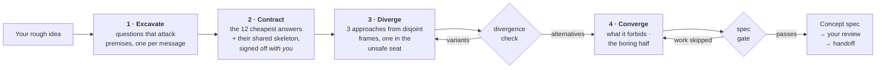

<div align="center">

# Imagination Brainstorming

**Idea development that refuses to converge on the obvious.**

An agent skill that keeps the collaborative shape of good brainstorming — one question at a time, real alternatives,<br>a written spec — and replaces the parts that quietly steer everything back to the safe answer.

[](https://github.com/djfksjd/imagination-brainstorming-skill/actions/workflows/tests.yml)
[](#install)
[](#install)
[](#under-the-hood)
[](LICENSE)

**English** · [한국어](README.ko.md) · [日本語](README.ja.md) · [简体中文](README.zh-CN.md) · [Español](README.es.md) · [Français](README.fr.md) · [Deutsch](README.de.md) · [Português](README.pt-BR.md)

</div>

---

> Brainstorming converges too early, and not because there were too few questions. The failure is that the questions come from the same distribution as the answers: *who is the user, what are the constraints, what does success look like* all refine the idea you already have. None of them touches what the brief takes for granted.
>
> Then three options get proposed — and two of them exist to make the third look reasonable.

## How it works



|  | What happens | Why it works |
|---|---|---|
| **1** | **Questions that attack premises.** Dealt from a deck of twelve families — the unstated premise, the version you would hate, who this is *not* for, how it ends, the scale where it breaks, the administrative half. Each family names what to listen for and the premise-preserving question to avoid. | Requirements sit on top of premises. Asking for requirements confirms the idea; asking for premises tests it. At least one premise must end up deleted or inverted — and if only one falls, the spec must say why the others held. Inventing a second inversion to hit a quota is worse than an honest "it survived". |
| **2** | **A ban contract you sign too.** The model writes the twelve answers it would most likely give, names the *skeleton* they share, and shows you a compressed version — framed as exclusions, never as suggestions. You add your own "not another X". | Your exclusions are the highest-value constraint in the room, and naming the skeleton stops the thirteenth version of the same shape from sneaking through. |
| **3** | **Alternatives that cannot be variants.** Three approaches dealt from disjoint reframing categories, one of them in the **unsafe seat** — the option you will probably reject, argued at full strength. | A script checks it: same category, identical or restated summaries, two that die of the same cause, or one described in far less detail all fail with exit 3. It checks structure, not meaning — but the shapes a decoy has to take are exactly the ones it catches. |
| **4** | **A gate before you are asked to read anything.** The concept must state what it forbids, name its nearest existing neighbours, and carry at least two real open questions. | A spec with no open questions hid its unknowns. A design that forbids nothing is a wish list. The gate cannot judge a concept — it proves the work was not skipped. |

> [!IMPORTANT]
> **It never implements.** No code, no scaffolding, no "shall I start building it?". The terminal state is a spec you approved, plus a handoff.

## Install

Runs in **Claude Code** and **Codex**. Python 3 standard library only: nothing to install, no API key, no network access.

```bash
curl -fsSL https://raw.githubusercontent.com/djfksjd/imagination-brainstorming-skill/main/install.sh | bash
```

<details>
<summary><b>Manual install</b></summary>

```bash
# Claude Code
claude plugin marketplace add djfksjd/imagination-brainstorming-skill
claude plugin install imagination-brainstorming@djfksjd

# Codex
codex plugin marketplace add djfksjd/imagination-brainstorming-skill
codex plugin add imagination-brainstorming@djfksjd
```

One tree serves both hosts: the skill body lives under `skills/imagination-brainstorming/`, and `AGENTS.md` is loaded as shared context.
</details>

## Use it

Just say what you are turning over. It triggers on brainstorming requests, and on the complaint that every option so far feels the same. Works in any language; the spec is written in yours.

```text
Brainstorm this with me: a way for our ward to hand over shifts.
```

```text
I have three ideas for the onboarding flow and they all feel like the same idea.
Push on this properly before I commit to one.
```

> [!TIP]
> Bring your own exclusions. "Not another form" is worth more than any amount of encouragement — and the skill will ask for them if you do not offer.

### What a session actually does

| Stage | You see | Enforced by |
|---|---|---|
| Recon | "There is a conventional answer here and it may be the right one — do you want that, or should we test the shape first?" | Hard rule: no manufactured strangeness |
| Excavation | One question per message, phrased for your brief | 12 question families, each with its anti-pattern |
| Contract | Six exclusions + the skeleton they share, for you to confirm and extend | `banlist.py`, exit 2 if faked |
| Divergence | Three approaches in comparable detail, one you will probably hate | `divergence_check.py`, exit 3 if they are variants |
| Convergence | Section-by-section design, each one approved before the next | What it forbids is written first |
| Spec | `docs/concepts/YYYY-MM-DD-<topic>-concept.md` + a machine-readable sidecar | `spec_gate.py`, exit 2 if work was skipped |
| Handoff | What this spec does *not* cover, and what comes next | Never an implementation skill |

### The decks

| Deck | Contents |
|---|---|
| **Question families** (12) | unstated premise · the version you would hate · success redefined · constraint inverted · who it is not for · what must stay impossible · the graveyard · what it commits people to · adjacent worlds · how it ends · the scale where it breaks · the administrative half |
| **Frames** (40, in 10 categories) | subtraction · inversion · actor-shift · scale-shift · time-shift · economy · maintenance · medium-shift · ritual · failure-first |
| **Clichés** | pitch reflexes, hollow adjectives, and the structural patterns that mark a positioning rather than a concept |

## What it will not do

> [!IMPORTANT]
> - **Build anything.** Two hard gates: no implementation, ever; and nothing reaches you unguarded — approaches wait for the divergence check, the spec waits for the gate.
> - **Claim nobody has thought of this.** Unverifiable, so it is forbidden. The spec names the nearest existing things and states the difference instead.
> - **Manufacture strangeness.** When the conventional answer is the correct answer, the skill is required to say so in one sentence and do the ordinary work.
> - **Shrink your request to make it easier to spec.** Scope gets decomposed openly, never quietly narrowed.
> - **Pretend a passing gate means a good idea.** It proves the work was done, not that the concept is right. The skill says so in its own output.

## Under the hood

| Script | Role | Non-zero exit |
|---|---|---|
| `deal.py` | Deals question families and three mutually incompatible frames, one marked unsafe | `1` usage or deck error |
| `banlist.py` | Builds the shared ban contract: instincts + skeleton + your exclusions | `2` too few instincts, or no skeleton |
| `divergence_check.py` | Proves the approaches are alternatives, not one proposal with two decoys | `3` does not diverge |
| `spec_gate.py` | Validates the written spec, its sidecar and the contract together, fail-closed | `2` gate failed |
| `cliche_lint.py` | Lints any draft mid-session | `3` banned material |

**Everything is reproducible.** The deal is seeded from a hash of the brief, so the same brief deals the same hand and any session can be replayed. `--run 2` deals fresh frames — still from disjoint categories — when a round of divergence is exhausted, and the unsafe seat rotates so the same category never always carries the uncomfortable option.

```text
skills/imagination-brainstorming/
├── SKILL.md                    # the authoritative workflow
├── references/
│   ├── concept-template.md     # the spec structure and its section markers
│   ├── worked-example.md       # one complete session, including what was cut
│   ├── example-concept.md      # the spec that session produced
│   ├── example-concept.json    # its sidecar — both pass the gates, both are test fixtures
│   └── decks/                  # question families · frames · clichés · spec schema
└── scripts/                    # deal · banlist · divergence_check · spec_gate · cliche_lint
```

### Companion

Independent of, but designed to sit next to, [**imagination-engine**](https://github.com/djfksjd/imagination-engine-skill) — the one-shot generator for a single strange object. This skill hands off to it when one creature, mechanism, or world inside a concept needs to be pushed far past what a spec can hold. Neither requires the other.

## Tests

```bash
python3 -m pytest tests/ -q
```

Offline: deck integrity, deal determinism and category disjointness, every failure path of all three gates, and the shipped example passing them.

## Contributing

The decks are the easiest place to help — a question family with a genuinely different angle of attack, or a frame that no existing category covers. Keep every entry usable: a family needs what to listen for *and* the premise-preserving question it replaces; a frame needs a move, a requirement, and its characteristic failure. Run the tests before opening a PR.

<div align="center">
<sub>MIT licensed · built for <a href="https://claude.com/claude-code">Claude Code</a> and Codex</sub>
</div>
