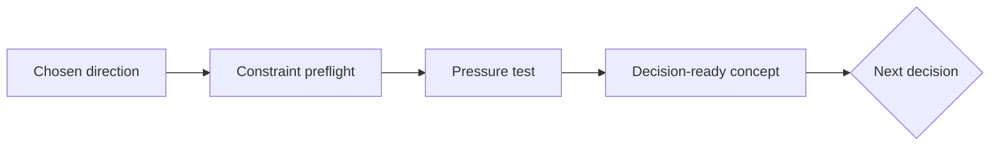

<div align="center">

# ◇ Imagination Brainstorming

**Turn a chosen idea into a concept that can survive reality.**

A focused concept workshop for Codex and Claude Code.

[](https://github.com/djfksjd/imagination-brainstorming-skill/actions/workflows/tests.yml)


[English](README.md) · [한국어](README.ko.md) · [日本語](README.ja.md) · [简体中文](README.zh-CN.md) · [Español](README.es.md) · [Français](README.fr.md) · [Deutsch](README.de.md) · [Português (Brasil)](README.pt-BR.md)

</div>

---

> [!TIP]
> **Most users should install [Imagination](https://github.com/djfksjd/imagination).**
> It generates directions with Imagination Engine, waits for your choice, then
> routes that selection into this workshop.

Imagination Brainstorming starts **after a direction has been chosen**. It
tests the idea against its goal, constraints, strongest alternative, ordinary
operation and native failure mode before implementation begins.



## Try it

```text
Use $imagination-brainstorming to develop this selected direction. Show the
first real use, recurring operational burden, native failure mode, falsifier,
and the next decision we must make.
```

If the selected direction secretly violates the brief—or loses to a simpler
alternative—the workshop says so instead of polishing it.

## What the workshop examines

| Lens | Question |
|---|---|
| Constraint preflight | Is an excluded mechanism returning under another name? |
| Load-bearing assumption | What single belief would collapse the idea if false? |
| Conventional competitor | Why does this earn its added complexity? |
| Core mechanism | What observable cause changes the outcome? |
| Boring half | Who owns recurring work, queues, exceptions and maintenance? |
| Native failure | How does the defining mechanism fail on its own terms? |
| Falsifier | What result should make the team stop or change direction? |

The output is a concise concept memo, not code, scaffolding or an implementation
plan.

## Measured result

In a fresh preregistered blind comparison against a strong plain prompt:

| Metric | Treatment minus control |
|---|---:|
| Planning preference | **25–5 (83.3%)** |
| Actionability | **+1.37** |
| Decision fit | **+0.59** |
| Causal clarity | **+0.59** |
| Robustness | **+0.53** |
| Token cost | `1.15×` |

The 95% Wilson interval for preference was 66.4–92.7%. Judges were independent
calls from the same model family rather than human domain users. See
[`evals/README.md`](evals/README.md) and the
[frozen result](evals/results/2026-07-29-gpt-5.4-confirmation-v2.json).

## Standalone install

```bash
curl -fsSL https://raw.githubusercontent.com/djfksjd/imagination-brainstorming-skill/main/install.sh | bash
```

```bash
claude plugin marketplace add djfksjd/imagination-brainstorming-skill
claude plugin install imagination-brainstorming@djfksjd
codex plugin marketplace add djfksjd/imagination-brainstorming-skill
codex plugin add imagination-brainstorming@djfksjd
```

## Scope

Use this skill when a direction, shortlist winner or rough concept already
exists. For initial divergence, use
[Imagination Engine](https://github.com/djfksjd/imagination-engine-skill).
The workshop deliberately stops before implementation.

## Development and legacy

```bash
python3 -m pytest tests/ -q
python3 evals/harness.py --help
```

The former deck-and-gate workflow is preserved under
[`legacy/v0.3.0/`](legacy/v0.3.0/) for research only and is never loaded at
runtime. MIT licensed.
