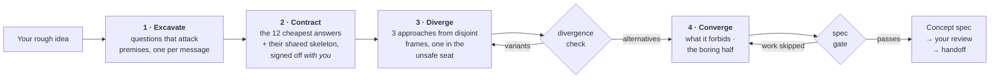

<div align="center">

# Imagination Brainstorming

**Idea development that refuses to converge on the obvious.**

An agent skill that keeps the collaborative shape of good brainstorming — one question at a time, real alternatives,<br>a written spec — and replaces the parts that quietly steer everything back to the safe answer.

[](https://github.com/djfksjd/imagination-brainstorming-skill/actions/workflows/tests.yml)
[](#install)
[](#install)
[](#under-the-hood)
[](LICENSE)

**English** · [한국어](README.ko.md) · [日本語](README.ja.md) · [简体中文](README.zh-CN.md) · [Español](README.es.md) · [Français](README.fr.md) · [Deutsch](README.de.md) · [Português](README.pt-BR.md)

</div>

---

> Brainstorming converges too early, and not because there were too few questions. The failure is that the questions come from the same distribution as the answers: *who is the user, what are the constraints, what does success look like* all refine the idea you already have. None of them touches what the brief takes for granted.
>
> Then three options get proposed — and two of them exist to make the third look reasonable.

## How it works



|  | What happens | Why it works |
|---|---|---|
| **1** | **Questions that attack premises.** Dealt from a deck of twelve families — the unstated premise, the version you would hate, who this is *not* for, how it ends, the scale where it breaks, the administrative half. Each family names what to listen for and the premise-preserving question to avoid. | Requirements sit on top of premises. Asking for requirements confirms the idea; asking for premises tests it. At least one premise must end up deleted or inverted — and if only one falls, the spec must say why the others held. Inventing a second inversion to hit a quota is worse than an honest "it survived". |
| **2** | **A ban contract you sign too.** The model writes the twelve answers it would most likely give, names the *skeleton* they share, and shows you a compressed version — framed as exclusions, never as suggestions. You add your own "not another X". | Your exclusions are the highest-value constraint in the room, and naming the skeleton stops the thirteenth version of the same shape from sneaking through. |
| **3** | **Alternatives that cannot be variants.** Three approaches dealt from disjoint reframing categories, one of them in the **unsafe seat** — the option you will probably reject, argued at full strength. | A script checks it: same category, identical or restated summaries, two that die of the same cause, or one described in far less detail all fail with exit 3. It checks structure, not meaning — but the shapes a decoy has to take are exactly the ones it catches. |
| **4** | **A gate before you are asked to read anything.** The concept must state what it forbids, name its nearest existing neighbours, and carry at least two real open questions. | A spec with no open questions hid its unknowns. A design that forbids nothing is a wish list. The gate cannot judge a concept — it proves the work was not skipped. |

> [!IMPORTANT]
> **It never implements.** No code, no scaffolding, no "shall I start building it?". The terminal state is a spec you approved, plus a handoff.

## Install

Runs in **Claude Code** and **Codex**. Python 3 standard library only: nothing to install, no API key, no network access.

```bash
curl -fsSL https://raw.githubusercontent.com/djfksjd/imagination-brainstorming-skill/main/install.sh | bash
```

<details>
<summary><b>Manual install</b></summary>

```bash
# Claude Code
claude plugin marketplace add djfksjd/imagination-brainstorming-skill
claude plugin install imagination-brainstorming@djfksjd

# Codex
codex plugin marketplace add djfksjd/imagination-brainstorming-skill
codex plugin add imagination-brainstorming@djfksjd
```

One tree serves both hosts: the skill body lives under `skills/imagination-brainstorming/`, and `AGENTS.md` is loaded as shared context.
</details>

## Use it

Just say what you are turning over. It triggers on brainstorming requests, and on the complaint that every option so far feels the same. Works in any language; the spec is written in yours.

```text
Brainstorm this with me: a way for our ward to hand over shifts.
```

```text
I have three ideas for the onboarding flow and they all feel like the same idea.
Push on this properly before I commit to one.
```

### What a session actually does

| Stage | You see | Enforced by |
|---|---|---|
| Recon | "There is a conventional answer here and it may be the right one — do you want that, or should we test the shape first?" | Hard rule: no manufactured strangeness |
| Excavation | One question per message, phrased for your brief | 12 question families, each with its anti-pattern |
| Contract | Six exclusions + the skeleton they share, for you to confirm and extend | `banlist.py`, exit 2 if faked |
| Divergence | Three approaches in comparable detail, one you will probably hate | `divergence_check.py`, exit 3 if they are variants |
| Convergence | Section-by-section design, each one approved before the next | What it forbids is written first |
| Spec | `docs/concepts/YYYY-MM-DD-<topic>-concept.md` + a machine-readable sidecar | `spec_gate.py`, exit 2 if work was skipped |
| Handoff | What this spec does *not* cover, and what comes next | Never an implementation skill |

### The decks

| Deck | Contents |
|---|---|
| **Question families** (12) | unstated premise · the version you would hate · success redefined · constraint inverted · who it is not for · what must stay impossible · the graveyard · what it commits people to · adjacent worlds · how it ends · the scale where it breaks · the administrative half |
| **Frames** (40, in 10 categories) | subtraction · inversion · actor-shift · scale-shift · time-shift · economy · maintenance · medium-shift · ritual · failure-first |
| **Clichés** | pitch reflexes, hollow adjectives, and the structural patterns that mark a positioning rather than a concept |

### Your part in it

This skill is a conversation, not a command. Four moments decide whether the session is worth anything, and all four are yours.

**1 · Answering the premise questions.** They will not feel like requirements gathering, because they are not. *"Who is affected by this without ever choosing to use it?"* is not a stakeholder question. The useful answers are the ones you have to think about; the ones that start *"well, obviously…"* are exactly the premise the session is trying to find. Say the obvious thing anyway — that sentence is the material.

**2 · Signing the ban contract.** After about three questions you are shown roughly six answers plus the **skeleton** they share — the structure underneath, not the wording: *an apparatus, a feed, a marketplace, a dashboard*. You will be asked:

> "These are the answers that come cheapest here, so I'm taking them off the table. Which of them were you already picturing, and what would you add?"

Answer both halves. Naming the one you were already picturing costs nothing and is the single most useful sentence in the session. Add your own exclusions in whatever form they come — *"nothing that adds screen time at the bedside"* is fine even though no script can match it; the gate files it as a manual check and will not pass the spec until it has a written answer.

**3 · The unsafe seat.** One of the three approaches is deliberately the one you are expected to reject, argued in the same detail as the others. Reject it if it is wrong — but say *why*, in one sentence. That sentence usually relocates the concept more than picking the winner does.

**4 · The review gate.** The spec is written to a file and handed back with *"please read it and tell me what to change."* This is not a formality. The gates check that the required work is present, not that the concept is right — see below.

### The three things to say

**When every option feels the same:**

```text
These still feel like one idea in three costumes. Regenerate.
```

It redeals from a fresh run, adds *every element of the previous round* to the contract, and deletes one more premise from the excavation — then tells you which premise that was. That last line is usually the point.

**When the conventional answer is actually right:** say so. The skill is required to agree in one sentence, leave, and do the ordinary work outside itself. A login form does not need a premise excavation, and the skill is forbidden from pretending otherwise.

**When the brief is too big:** it should catch this in recon, but if it does not — *"this is three systems, split it"* — each piece gets its own session and its own spec.

### Running the scripts yourself

Python 3.11, standard library, nothing to install. The skill lives in `skills/imagination-brainstorming/`, and every command below is written to run from inside that directory. Write working files to a scratch directory, never into the skill folder.

```bash
cd skills/imagination-brainstorming
SKELETON="A capture tool that turns a spoken conversation into a structured record, with completeness enforced by a form and a signature at the end."

# 1 · deal the question families and three incompatible frames
python3 scripts/deal.py --brief "a way for our ward to hand over shifts" --run 1 --out /tmp/work

# 2 · build the contract — twice, and the order matters. --instincts is a file
#     you write: one likely answer per line, twelve of them.
python3 scripts/banlist.py --brief "a way for our ward to hand over shifts" \
    --instincts references/example-instincts.txt --skeleton "$SKELETON" --out /tmp/work
#    …show it to the user as exclusions, get their answer, and only then:
python3 scripts/banlist.py --brief "a way for our ward to hand over shifts" \
    --instincts references/example-instincts.txt --user references/example-exclusions.txt \
    --skeleton "$SKELETON" --confirmed --out /tmp/work

# 3 · prove the three approaches are actually three
python3 scripts/divergence_check.py --approaches references/example-approaches.json \
    --banlist references/example-banlist.json

# 4 · gate the spec, its sidecar and the contract together — all three required
python3 scripts/spec_gate.py --concept references/example-concept.json \
    --markdown references/example-concept.md --banlist references/example-banlist.json
```

Every file named there ships in the repo, so the block runs as written and all four steps exit `0`; step 2 reproduces `references/example-banlist.json` exactly. Swap in your own session's files as you go.

**`approaches.json` is written by hand.** `deal.py` deals the frames; you write one approach per dealt frame into an object with an `approaches` key — an `id`, a `frame_id` from the frames deck, a `summary` of at least 86 units, a `failure_mode` of at least 43 that says how *this* one fails in *this* brief, a `frame_fit` of at least 36 saying what in this brief plays the part the frame requires, and `unsafe_seat` set true on exactly one of them. `references/decks/approaches-schema.json` documents every field and every floor the check applies; `references/example-approaches.json` is a passing file to copy the shape from.

Those floors are counted in units, not characters, and they were **measured rather than assumed**. One passage — the thinnest first-use scene worth accepting — was translated into Latin, Korean, Japanese, Chinese, Thai, Devanagari, Hebrew and Arabic and measured under the function that actually runs, alongside the same subject written as a flat description. The scenes came out between 186 and 283 units and the descriptions between 41 and 64, so one number separates them everywhere, and the floor is the highest one that still admits the thinnest legitimate scene in the densest script. What one number cannot do is be equally strict in every script: the same content is worth about a third fewer units in Chinese than in Latin, so this bar is tighter on Latin prose. It is set that way because refusing somebody's legitimate writing in their own language is the worse failure.

`frame_fit` is where a frame the brief cannot hold becomes visible. `designed-for-repair` — *assume it breaks often; include the repair procedure and the spare parts* — was once dealt into the unsafe seat for a one-off closing rite that happens once and has no maker, and the set passed. If nothing in the brief can play the part the frame names, say so and redeal with `--run 2` rather than arguing it. The check requires the claim; it cannot check that the claim is true.

`--confirmed` records consent that has already happened. Setting it before the user has seen the list is a lie the rest of the pipeline then relies on, and the gate has no way to detect it — which is why it is a two-step call rather than one flag.

Swapping the contract is not free, though it is not impossible either — nothing here establishes provenance. The gate rebuilds the contract from what `concept.json` declares and refuses any file missing one of the burned instincts, one of the user's own exclusions, or an entry of the bundled cliché deck; the two files must record the same skeleton and the same brief, string for string; and the ban list's brief has to name a subject rather than a word. That deck is linted against the spec whatever contract arrives, so handing the gate a shorter file can never mean a shorter lint. What all of that establishes is consistency between two files the same author writes — a substituted contract has to be rewritten, not renamed.

`cliche_lint.py` is for **drafts mid-session**. Run it on a finished spec and it will flag the spec's own ban-list section; `spec_gate.py` is the one that lints a finished spec, and it excises that section first.

### Exit codes, and what to do about each

| Code | Meaning | The fix |
|---|---|---|
| `0` | passed | — |
| `1` | usage, missing file, or malformed deck | a typo, not a judgement |
| `2` | **the contract or the spec is incomplete** — too few instincts, no skeleton, an unconfirmed contract, a missing section, a manual check with no written answer, or a spec that does not actually contain its own sidecar | do the missing work |
| `3` | **the approaches are variants**, or banned material is present | rewrite, or redeal with `--run 2` and build again |

### What the gates cannot check

> [!IMPORTANT]
> They are floors. They check that the required work is **present** — not that it was **right**. Three things pass every gate in this repo:
>
> - **a justification that inverts its own evidence** — an argument whose premise, read carefully, supports the opposite conclusion;
> - **a mechanism attackable on its own terms** — for example a number that changes depending on the order it was computed in, presented as the concept's proof of transparency;
> - **three approaches that are genuinely one idea** in three vocabularies. The check catches restatement and shared failure modes; it cannot read.
>
> Two more the gate now insists on, without claiming to judge either: the chosen approach's own stated failure mode has to be **answered** in `chosen.answers_failure_mode` — a concept that declared its own collapse and moved on used to pass first try — and each approach has to say what in the brief occupies its frame. In both cases the gate checks that something was written and prints it for you; it cannot tell you whether the answer is any good.
>
> A fourth used to pass and no longer does: the same words quoted inside a sentence that rejects them. The refusal, what becomes impossible, the first-use scene and every open question are now marked with `<!-- bind: … -->` and compared to the sidecar **exactly** — once each, inside their own section, as plain prose. The similarity score they replaced could not tell *"we forbid X"* from *"we considered forbidding X but allow it"*. And neither this gate nor the divergence check takes `--allow` any more: an exception granted at verdict time is granted by the party the verdict is about.
>
> All three occurred during this skill's own trial run and all three were caught by a person, not a script. So: before the spec reaches you, have a second reader attack it — another model, a colleague — and ask them to argue that **it loses**, not that it could be improved. "How would you make this better" gets you polish. "Why does this lose" gets you the inverted premise.
>
> The skill also runs a **direction-of-evidence audit** on itself: for every load-bearing *because*, it has to write down the opposite conclusion the same premise would support, and name what the deciding party can actually observe. That is the check that catches *"the judge is a machine, therefore our internal record is the differentiator"* — a machine judge cannot observe the internal record, so the premise argues for the opposite.
>
> A hand-edited ban list can add its own `structural_patterns[].regex`, and a pattern shaped like `(a+)+` makes Python's own matcher take exponentially long on some inputs — a gate that never returns is, to whatever is waiting on it, the same as a gate that passed. Such a pattern is now refused by id before it ever runs. The check is a deterministic scan for the classic nested-repetition shape, so it narrows this risk rather than eliminating it — an unrecognised catastrophic shape can still be slow — and on macOS and Linux a wall-clock backstop catches what the scan misses; that backstop is unavailable on Windows.

### Briefs that are not products

The process, the question families, the frames and the spec contract apply to any subject — a story world, a game mechanic, a ritual, a campaign, a format. Two parts of the machinery are narrower than that, and it is better to know which:

- **The cliché phrase list is pitch-and-product vocabulary** — one-stop shop, KPI dashboard, Uber for X, gamification. On a story or ritual brief almost none of it will ever fire, which means the machine-checkable half of the contract is doing little and the session's own instincts and skeleton are carrying the weight. The hollow adjectives and the forbidden moves still apply everywhere.
- **A banned adjective can be ordinary vocabulary.** In fiction *magical* and *delightful* denote rather than claim, and *"the region is not magical"* was once refused for saying so. Mark that span in place — `<!-- mention: hollow-magical -->the region is not magical<!-- /mention -->` — and the release covers that span and that rule only. It cannot verify that the word is mentioned rather than used; it makes the claim explicit and reviewable instead of leaving a blanket release as the only escape. The marker is bounded: one rule id per marker, one paragraph per span (200 units), a denial or a double-quoted phrase inside it, and at most five in a document — and a first instinct or one of your own exclusions can never be released this way, by this route or any other. One marker naming every id once released the whole contract.

Two things to expect rather than discover: more of your first instincts will be clauses than noun phrases, so more of them land in the manual checks — those are a reread, not notes you have to write, and only *your own* exclusions require a written answer — and a dealt frame is more likely to be one the brief cannot hold, which is what `frame_fit` and a redeal are for.

`references/example-ritual-concept.md` is a complete worked example of exactly this shape: a closing rite for a bakery that has traded on one street for ninety years, shipped with its contract, its approaches and its sidecar, gated by the same two commands.

## What it will not do

> [!IMPORTANT]
> - **Build anything.** Two hard gates: no implementation, ever; and nothing reaches you unguarded — approaches wait for the divergence check, the spec waits for the gate.
> - **Claim nobody has thought of this.** Unverifiable, so it is forbidden. The spec names the nearest existing things and states the difference instead.
> - **Manufacture strangeness.** When the conventional answer is the correct answer, the skill is required to say so in one sentence and do the ordinary work.
> - **Shrink your request to make it easier to spec.** Scope gets decomposed openly, never quietly narrowed.
> - **Pretend a passing gate means a good idea.** It checks that the required assertions and artefacts are present, not that the concept is right. The skill says so in its own output.

## Under the hood

| Script | Role | Non-zero exit |
|---|---|---|
| `deal.py` | Deals question families and three mutually incompatible frames, one marked unsafe | `1` usage or deck error |
| `banlist.py` | Builds the shared ban contract: instincts + skeleton + your exclusions | `2` too few instincts, or no skeleton |
| `divergence_check.py` | Proves the approaches are alternatives, not one proposal with two decoys | `3` does not diverge |
| `spec_gate.py` | Validates the written spec, its sidecar and the contract together, fail-closed | `2` gate failed |
| `cliche_lint.py` | Lints any draft mid-session | `3` banned material |

**Everything is reproducible.** The deal is seeded from a hash of the brief, so the same brief deals the same hand and any session can be replayed. `--run 2` deals fresh frames — still from disjoint categories — when a round of divergence is exhausted, and the unsafe seat rotates so the same category never always carries the uncomfortable option.

```text
skills/imagination-brainstorming/
├── SKILL.md                    # the authoritative workflow
├── references/
│   ├── concept-template.md     # the spec structure and its section markers
│   ├── worked-example.md       # one complete session, including what was cut
│   ├── example-concept.md      # the spec that session produced
│   ├── example-concept.json    # its sidecar — both pass the gates, both are test fixtures
│   ├── example-approaches.json # stage 3 input, in the shape divergence_check.py reads
│   ├── example-banlist.json    # the contract all of the above were gated against
│   ├── example-ritual-*.{md,json,txt}  # a second worked example that is not a product
│   ├── example-instincts.txt   # the twelve instincts it was built from
│   ├── example-exclusions.txt  # and the user's own three
│   └── decks/                  # question families · frames · clichés · spec schema · approaches schema
└── scripts/                    # deal · banlist · divergence_check · spec_gate · cliche_lint
```

### Companion

Independent of, but designed to sit next to, [**imagination-engine**](https://github.com/djfksjd/imagination-engine-skill) — the one-shot generator for a single strange object. This skill hands off to it when one creature, mechanism, or world inside a concept needs to be pushed far past what a spec can hold. Neither requires the other.

## Tests

```bash
python3 -m pytest tests/ -q
```

Offline: deck integrity, deal determinism and category disjointness, every failure path of all three gates, and the shipped example passing them.

## Contributing

The decks are the easiest place to help — a question family with a genuinely different angle of attack, or a frame that no existing category covers. Keep every entry usable: a family needs what to listen for *and* the premise-preserving question it replaces; a frame needs a move, a requirement, and its characteristic failure. Run the tests before opening a PR.

<div align="center">
<sub>MIT licensed · built for <a href="https://claude.com/claude-code">Claude Code</a> and Codex</sub>
</div>
