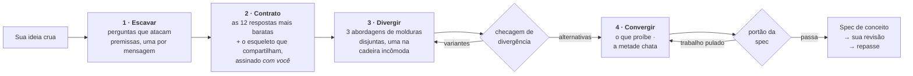

<div align="center">

# Imagination Brainstorming

**Desenvolvimento de ideias que se recusa a convergir para o óbvio.**

Uma skill de agente que mantém o formato de um bom brainstorming — uma pergunta por vez, alternativas de verdade,<br>uma especificação escrita — e substitui as partes que puxam tudo, em silêncio, de volta para a resposta segura.

[](https://github.com/djfksjd/imagination-brainstorming-skill/actions/workflows/tests.yml)
[](#instalação)
[](#instalação)
[](#por-dentro)
[](LICENSE)

[English](README.md) · [한국어](README.ko.md) · [日本語](README.ja.md) · [简体中文](README.zh-CN.md) · [Español](README.es.md) · [Français](README.fr.md) · [Deutsch](README.de.md) · **Português**

</div>

---

> O brainstorming converge cedo demais — e não por falta de perguntas. A falha é que as perguntas saem da mesma distribuição das respostas: *quem é o usuário, quais são as restrições, como é o sucesso* apenas lapidam a ideia que você já tem. Nenhuma delas toca no que o briefing dá como certo.
>
> Aí surgem três opções — duas das quais existem para fazer a terceira parecer razoável.

## Como funciona



|  | O que acontece | Por que funciona |
|---|---|---|
| **1** | **Perguntas que atacam premissas.** Distribuídas de um baralho de doze famílias — a premissa não dita, a versão que você odiaria, para quem isto *não* é, como termina, em que escala quebra, a metade administrativa. Cada família diz o que escutar e qual pergunta preservadora de premissas evitar. | Requisitos se apoiam em premissas. Perguntar requisitos confirma a ideia; perguntar premissas a testa. Ao menos uma premissa precisa acabar apagada ou invertida — e se só uma cair, a spec tem de dizer por que as outras seguraram. Inventar uma segunda inversão para bater uma cota é pior do que um honesto "ela sobreviveu". |
| **2** | **Um contrato de vetos que você também assina.** O modelo escreve as doze respostas que mais provavelmente daria, nomeia o *esqueleto* que elas compartilham e te mostra uma versão comprimida — como exclusões, nunca como sugestões. Você acrescenta o seu "outro X não". | Suas exclusões são a restrição mais valiosa da sala, e nomear o esqueleto impede que a décima terceira versão do mesmo formato passe despercebida. |
| **3** | **Alternativas que não podem ser variantes.** Três abordagens tiradas de categorias de reenquadramento disjuntas, uma delas na **cadeira incômoda** — a opção que você provavelmente vai recusar, defendida com força total. | Um script confere: mesma categoria, resumos idênticos ou que se repetem, duas que morrem da mesma causa, ou uma descrita com bem menos detalhe — tudo falha com exit 3. Ele confere estrutura, não sentido — mas os formatos que um figurante precisa assumir são exatamente esses. |
| **4** | **Um portão antes de te pedirem para ler qualquer coisa.** O conceito precisa dizer o que proíbe, nomear seus vizinhos existentes mais próximos e carregar ao menos duas perguntas em aberto de verdade. | Uma spec sem perguntas em aberto escondeu suas incógnitas. Um design que não proíbe nada é uma lista de desejos. O portão não julga um conceito — ele prova que o trabalho não foi pulado. |

> [!IMPORTANT]
> **Nunca implementa.** Sem código, sem scaffolding, sem "começo a construir?". O estado final é uma spec aprovada por você, mais um repasse.

## Instalação

Roda no **Claude Code** e no **Codex**. Apenas biblioteca padrão do Python 3: nada a instalar, sem chave de API, sem acesso à rede.

```bash
curl -fsSL https://raw.githubusercontent.com/djfksjd/imagination-brainstorming-skill/main/install.sh | bash
```

<details>
<summary><b>Instalação manual</b></summary>

```bash
# Claude Code
claude plugin marketplace add djfksjd/imagination-brainstorming-skill
claude plugin install imagination-brainstorming@djfksjd

# Codex
codex plugin marketplace add djfksjd/imagination-brainstorming-skill
codex plugin add imagination-brainstorming@djfksjd
```

Uma única árvore serve os dois hosts: o corpo da skill fica em `skills/imagination-brainstorming/`, e `AGENTS.md` é carregado como contexto compartilhado.
</details>

## Como usar

Diga o que está remoendo. Ela dispara em pedidos de brainstorming e na reclamação de que todas as opções até agora parecem iguais. Funciona em qualquer idioma; a spec é escrita no seu.

```text
Pensa isso comigo: um jeito de fazer a passagem de plantão na ala.
```

```text
Tenho três ideias para o onboarding e todas parecem a mesma ideia.
Aperta de verdade antes de eu decidir.
```

### O que uma sessão realmente faz

| Etapa | O que você vê | O que impõe |
|---|---|---|
| Reconhecimento | "Existe uma resposta convencional aqui e ela pode ser a certa — você quer essa, ou testamos o formato inteiro primeiro?" | Regra dura: nada de estranheza fabricada |
| Escavação | Uma pergunta por mensagem, reescrita para o seu briefing | 12 famílias de perguntas, cada uma com seu antipadrão |
| Contrato | Seis exclusões + o esqueleto que compartilham, para confirmar e ampliar | `banlist.py`, exit 2 se for fingido |
| Divergência | Três abordagens no mesmo nível de detalhe, uma que você provavelmente odeia | `divergence_check.py`, exit 3 se forem variantes |
| Convergência | Projeto seção a seção, cada uma aprovada antes da seguinte | O que proíbe é escrito primeiro |
| Spec | `docs/concepts/AAAA-MM-DD-<tema>-concept.md` + um sidecar legível por máquina | `spec_gate.py`, exit 2 se pularam trabalho |
| Repasse | O que esta spec *não* cobre e o que vem depois | Nunca uma skill de implementação |

### Os baralhos

| Baralho | Conteúdo |
|---|---|
| **Famílias de perguntas** (12) | premissa não dita · a versão que você odiaria · o sucesso redefinido · a restrição invertida · para quem não é · o que precisa continuar impossível · o cemitério · a que obriga · mundos vizinhos · como termina · a escala em que quebra · a metade administrativa |
| **Molduras** (40, em 10 categorias) | subtração · inversão · troca de ator · troca de escala · troca de tempo · economia · manutenção · troca de meio · ritual · falha primeiro |
| **Clichês** | reflexos de pitch, adjetivos ocos e os padrões estruturais que denunciam um posicionamento em vez de um conceito |

### A sua parte nisso

Esta habilidade é uma conversa, não um comando. Quatro momentos decidem se a sessão vale alguma coisa, e os quatro são seus.

**1 · Responder às perguntas de premissa.** Não vão parecer levantamento de requisitos, porque não são. *"Quem é afetado por isto sem nunca ter escolhido usá-lo?"* não é uma pergunta sobre partes interessadas. As respostas úteis são aquelas em que você precisa pensar; as que começam com *"bem, obviamente…"* são exatamente a premissa que a sessão procura. Diga essa frase óbvia mesmo assim — é ela o material.

**2 · Assinar o contrato de proibições.** Depois de umas três perguntas, você vê cerca de seis respostas e o **esqueleto** que elas compartilham: a estrutura embaixo, não a redação — *um aparelho, um feed, um marketplace, um painel*. E então:

> "Estas são as respostas mais baratas aqui, então vou tirá-las da mesa. Quais delas você já estava imaginando, e o que acrescentaria?"

Responda às duas metades. Nomear a que você já tinha na cabeça não custa nada e costuma ser a frase mais útil da sessão. Acrescente suas exclusões no formato que vier — *"nada que aumente o tempo de tela ao lado do leito"* serve, mesmo que nenhum script consiga casar isso: o portão registra como verificação manual e não libera a especificação enquanto não houver resposta escrita.

**3 · A cadeira desconfortável.** Uma das três abordagens é deliberadamente a que se espera que você rejeite, e é defendida com o mesmo cuidado que as outras. Rejeite se estiver errada — mas diga *por quê*, em uma frase. Essa frase costuma deslocar o conceito mais do que escolher o vencedor.

**4 · O portão de revisão.** A especificação é escrita num arquivo e devolvida com um *"leia e me diga o que mudar"*. Não é formalidade. Os portões verificam se o trabalho foi feito, não se o conceito está certo — veja abaixo.

### As três coisas a dizer

**Quando todas as opções parecem iguais:**

```text
Continua sendo uma ideia com três fantasias. Regenere.
```

Ela redistribui a partir de uma rodada nova, acrescenta *todos os elementos da rodada anterior* ao contrato e apaga mais uma premissa da escavação — e diz qual foi. Essa última linha é o ponto.

**Quando a resposta convencional é de fato a certa:** diga isso. A habilidade é obrigada a concordar em uma frase, sair de si mesma e fazer o trabalho comum do lado de fora. Um formulário de login não precisa de escavação de premissas, e a habilidade está proibida de fingir o contrário.

**Quando o briefing é grande demais:** o reconhecimento deveria pegar isso, mas se não pegar — *"isto são três sistemas, separe"* — cada pedaço ganha a própria sessão e a própria especificação.

### Rodando os scripts à mão

Python 3.11, biblioteca padrão, nada a instalar. A habilidade fica em `skills/imagination-brainstorming/`, e todos os comandos abaixo foram escritos para rodar de dentro desse diretório. Escreva os arquivos de trabalho num diretório temporário, nunca dentro da pasta da habilidade.

```bash
cd skills/imagination-brainstorming
SKELETON="A capture tool that turns a spoken conversation into a structured record, with completeness enforced by a form and a signature at the end."

# 1 · distribua as famílias de perguntas e três enquadramentos incompatíveis
python3 scripts/deal.py --brief "a way for our ward to hand over shifts" --run 1 --out /tmp/work

# 2 · construa o contrato — duas vezes, e a ordem importa. --instincts é um arquivo
#     que você escreve: uma resposta provável por linha, doze delas.
python3 scripts/banlist.py --brief "a way for our ward to hand over shifts" \
    --instincts references/example-instincts.txt --skeleton "$SKELETON" --out /tmp/work
#    …mostre ao usuário como lista de exclusões, colha a resposta, e só então:
python3 scripts/banlist.py --brief "a way for our ward to hand over shifts" \
    --instincts references/example-instincts.txt --user references/example-exclusions.txt \
    --skeleton "$SKELETON" --confirmed --out /tmp/work

# 3 · prove que as três abordagens são mesmo três
python3 scripts/divergence_check.py --approaches references/example-approaches.json \
    --banlist references/example-banlist.json

# 4 · leve especificação, sidecar e contrato juntos ao portão — os três são obrigatórios
python3 scripts/spec_gate.py --concept references/example-concept.json \
    --markdown references/example-concept.md --banlist references/example-banlist.json
```

Todos os arquivos citados aí acompanham o repositório, então o bloco roda como está e os quatro passos terminam em `0`; o passo 2 reproduz `references/example-banlist.json` exatamente. Vá trocando pelos arquivos da sua própria sessão conforme avança.

**`approaches.json` é escrito à mão.** O `deal.py` distribui os enquadramentos; você escreve uma abordagem por enquadramento distribuído dentro de um objeto com a chave `approaches` — um `id`, um `frame_id` do baralho de enquadramentos, um `summary` de pelo menos 86 unidades, um `failure_mode` de pelo menos 43 dizendo como *esta* abordagem falha *neste* briefing, um `frame_fit` de pelo menos 36 dizendo o que neste briefing ocupa o lugar que o enquadramento exige, e `unsafe_seat` verdadeiro em exatamente uma delas. O `references/decks/approaches-schema.json` documenta cada campo e cada piso que a checagem aplica; `references/example-approaches.json` é um arquivo que passa e de onde copiar o formato.

Esses pisos são contados em unidades, não em caracteres, e foram **medidos, não supostos**. Uma mesma passagem — a cena de primeiro contato mais magra que valha a pena aceitar — foi traduzida para latino, coreano, japonês, chinês, tailandês, devanágari, hebraico e árabe e medida com a função que de fato roda, ao lado do mesmo assunto escrito como descrição chapada. As cenas ficaram entre 186 e 283 unidades e as descrições entre 41 e 64, então um único número separa as duas em toda parte, e o piso é o mais alto que ainda admite a cena legítima mais magra na escrita mais densa. O que um único número não consegue é ser igualmente rigoroso em todas: o mesmo conteúdo vale cerca de um terço a menos de unidades em chinês do que em latino, então esta régua aperta mais a prosa latina. Está assim porque recusar o texto legítimo de alguém na própria língua é a pior das duas falhas.

O `frame_fit` é onde um enquadramento que o briefing não sustenta fica visível. O `designed-for-repair` — *suponha que quebra com frequência; inclua o procedimento de reparo e as peças de reposição* — já caiu na cadeira desconfortável de um rito de encerramento que acontece uma única vez, sem fabricante e sem peças, e o conjunto passou assim mesmo. Se nada no briefing puder ocupar o lugar que o enquadramento nomeia, diga isso e redistribua com `--run 2` em vez de defendê-lo. A checagem exige a afirmação; não consegue verificar se ela é verdadeira.

`--confirmed` registra um consentimento que já aconteceu. Ligá-lo antes de o usuário ter visto a lista é uma mentira da qual todo o resto do pipeline passa a depender, e o portão não tem como detectá-la — por isso são duas chamadas, e não um único sinalizador.

Trocar o contrato não sai de graça — mas também não é impossível: nada aqui estabelece procedência. O portão o reconstrói a partir do que o `concept.json` declara e recusa qualquer arquivo a que falte um dos instintos queimados, uma das exclusões do próprio usuário ou uma entrada do baralho de clichês embutido; os dois arquivos precisam registrar o mesmo esqueleto e o mesmo briefing, caractere por caractere, e o briefing da lista de banimentos precisa nomear um assunto, não uma palavra. Esse baralho é aplicado à especificação venha o contrato que vier, então entregar um arquivo mais curto nunca significa um lint mais curto. O que tudo isso estabelece é a coerência entre dois arquivos escritos pela mesma mão: substituir um contrato exige reescrevê-lo, não rebatizá-lo. Além disso, os instintos queimados e as suas próprias exclusões são recalculados **por conteúdo** — como a união de todos os lugares em que qualquer um dos dois arquivos os registra — e conferidos em uma passagem separada que não lê id algum, nem camada, nem o campo `allowed`, e que não honra liberação nenhuma. Renomear um id, fazê-lo colidir com um id do baralho de clichês, rebaixar uma entrada, mover um enunciado entre campos ou entre os dois arquivos, duplicá-lo ou apagar uma de suas linhas: nada disso muda se ele dispara, e cada um desses caminhos já esteve aberto. O que isso não estabelece: aqui não há cópia alguma das suas exclusões que a sessão não tenha escrito, então um enunciado apagado de todos os campos dos dois arquivos simplesmente sumiu.

`cliche_lint.py` é para **rascunhos no meio da sessão**. Rodado sobre uma especificação pronta, ele aponta a própria seção de proibições do documento; quem revisa a especificação pronta é o `spec_gate.py`, que recorta esse trecho antes.

### Códigos de saída, e o que fazer com cada um

| Código | Significado | O conserto |
|---|---|---|
| `0` | passou | — |
| `1` | uso, arquivo ausente ou baralho malformado | é erro de digitação, não julgamento |
| `2` | **o contrato ou a especificação está incompleto** — poucos impulsos, sem esqueleto, contrato não assinado, seção faltando, verificação manual sem resposta escrita, ou uma especificação que não contém de verdade o próprio sidecar | faça o trabalho que falta |
| `3` | **as abordagens são variantes**, ou há material proibido | reescreva, ou redistribua com `--run 2` e construa de novo |

### O que os portões não conseguem verificar

> [!IMPORTANT]
> Eles são pisos. Verificam que o trabalho exigido **está ali**, não que estava **certo**. Três coisas passam por todos os portões deste repositório:
>
> - **uma justificativa que inverte a própria evidência** — um argumento cuja premissa, lida com cuidado, sustenta a conclusão oposta;
> - **um mecanismo atacável nos próprios termos** — por exemplo, um número que muda conforme a ordem em que foi calculado, apresentado como a prova de transparência do conceito;
> - **três abordagens que na verdade são uma ideia** em três vocabulários. A checagem pega reformulação e causas de morte compartilhadas; ela não sabe ler.
>
> Agora o portão exige mais duas, sem pretender julgar nenhuma delas: o modo de falha que a própria abordagem escolhida deixou escrito precisa ser **respondido** em `chosen.answers_failure_mode` — um conceito que declarava o próprio colapso e seguia em frente passava de primeira — e cada abordagem precisa dizer o que, no briefing, ocupa o seu enquadramento. Nos dois casos o portão confere que algo foi escrito e põe isso na sua frente; ele não sabe dizer se a resposta presta.
>
> Uma quarta passava e não passa mais: as mesmas palavras citadas dentro de uma frase que as rejeita. A proibição, o que se torna impossível, a cena de primeiro uso e cada pergunta em aberto agora são marcadas com `<!-- bind: … -->` e comparadas ao sidecar **exatamente** — uma vez cada, dentro da própria seção, como prosa simples. O escore de similaridade que substituíram não distinguia *"proibimos X"* de *"consideramos proibir X mas permitimos"*. E nem este portão nem a checagem de divergência aceitam mais `--allow`: uma exceção concedida na hora do veredicto é concedida pela parte de que o veredicto trata.
>
> As três aconteceram durante a própria sessão de teste desta habilidade e as três foram pegas por uma pessoa, não por um script. Então: antes que a especificação chegue até você, peça a um segundo leitor que a ataque — outro modelo, um colega — e que argumente que **ela perde**, não que poderia melhorar. "Como deixar isso melhor" traz polimento. "Por que isso perde" traz a premissa invertida.
>
> A habilidade também roda em si mesma uma **auditoria da direção da evidência**: para cada *porque* que sustenta algo, ela precisa escrever a conclusão oposta que a mesma premissa sustentaria, e nomear o que a parte que decide consegue de fato observar. É esse passo que pega *"o avaliador é uma máquina, portanto nosso registro interno é o diferencial"* — uma máquina não consegue observar o registro interno, então essa premissa argumenta pelo contrário.
>
> Uma lista de banimento editada manualmente pode acrescentar seu próprio `structural_patterns[].regex`, e um padrão no formato `(a+)+` faz o próprio mecanismo de correspondência do Python levar um tempo exponencial em certas entradas — um portão que nunca responde é, para quem espera por ele, indistinguível de um portão que passou. Esse tipo de padrão agora é recusado pelo id antes mesmo de rodar. A checagem é uma varredura determinística que procura a forma clássica de repetição aninhada, então ela reduz esse risco em vez de eliminá-lo — uma forma catastrófica que ela não reconhece ainda pode ser lenta — e no macOS e no Linux há também uma segunda rede de segurança, baseada em tempo real, que pega o que a varredura deixa passar; essa rede não está disponível no Windows. Uma linha longa é percorrida inteira em janelas sobrepostas de 4000 caracteres, em vez de truncada em 4000 — a primeira versão truncava, de modo que um banimento estrutural parava de disparar em silêncio a partir dali, o que é pior do que o travamento que ele substituía. Se o orçamento de tempo da linha acabar, o padrão é nomeado e recusado; uma ocorrência mais longa que os 512 caracteres de sobreposição e apoiada na borda de uma janela ainda pode passar.
>
> **A `imagination-engine` decide esse ponto ao contrário, e diz isso abertamente.** O portão dela se recusa a compilar qualquer `structural_patterns[].regex` fornecido pelo usuário, ponto final, imprimindo uma recusa que nomeia o padrão em vez de executá-lo — porque aquele portão já recusa toda outra política fornecida em tempo de execução (não há `--rubric`, nem `--min-mean`, nem um `--allow` respeitado ali), e porque uma defesa baseada em temporizador faz o que de fato foi lintado depender da velocidade da máquina hospedeira, um veredito que não deveria variar de máquina para máquina. Este portão aceita o custo em vez da recusa: a varredura estrutural e o teto de caracteres acima valem nos dois casos, mas o temporizador `SIGALRM` que pega o que a varredura deixa passar é exclusivo de POSIX, então no Windows só a varredura e o teto de caracteres defendem o portão, e mesmo no macOS ou no Linux um padrão que trava numa máquina lenta e passa numa rápida é exatamente o veredito dependente de máquina que a recusa da engine existe para evitar. Ao transitar entre as duas skills, espere que um padrão compilado em silêncio aqui seja recusado pelo nome lá.

### Briefings que não são produtos

O processo, as famílias de perguntas, os enquadramentos e o contrato da especificação valem para qualquer assunto — um mundo narrativo, uma mecânica de jogo, um rito, uma campanha, um formato. Duas peças da maquinaria são mais estreitas do que isso, e é melhor saber quais:

- **A lista de frases clichê é vocabulário de pitch e de produto** — one-stop shop, painel de KPIs, o Uber de X, gamificação. Num briefing narrativo ou ritual, quase nenhuma delas chegará a disparar. Ou seja: a metade do contrato que a máquina consegue checar faz pouco, e quem carrega o peso são os instintos e o esqueleto da própria sessão. Os adjetivos ocos e os movimentos proibidos continuam valendo em todo lugar.
- **Um adjetivo banido pode ser vocabulário comum.** Na ficção, *magical* e *delightful* designam em vez de afirmar, e *"a região não é magical"* chegou a ser recusada por dizer isso. Marque o trecho no lugar — `<!-- mention: hollow-magical -->a região não é magical<!-- /mention -->` — e a liberação cobre aquele trecho e aquela regra, nada mais. Ela não verifica se a palavra está sendo mencionada em vez de usada; o que faz é deixar a afirmação explícita e revisável, em vez de deixar como única saída suspender a regra inteira. A marca é limitada: um id de regra por marca, um parágrafo por trecho (200 unidades), dentro dele uma negação ou a palavra entre aspas duplas, e no máximo cinco por documento — e um primeiro instinto ou uma exclusão sua nunca é liberada assim, nem por esta via nem por qualquer outra. Uma única marca nomeando todos os ids já liberou o contrato inteiro. A liberação cobre exatamente os caracteres marcados: o trecho marcado é esvaziado no lugar e conferido à parte, então uma frase idêntica em outro ponto do documento é outro trecho e continua sendo pega — antes, uma única marca liberava todas as linhas do arquivo idênticas à marcada. As marcas também precisam ficar em limites de palavra.

Duas coisas para esperar em vez de descobrir: mais dos seus primeiros instintos serão orações do que sintagmas nominais, então mais deles vão parar nas checagens manuais — que são uma releitura, não anotações que você precise escrever, e só *as suas próprias* exclusões exigem resposta por escrito — e é mais provável que caia um enquadramento que o briefing não sustenta, que é exatamente para isso que existem o `frame_fit` e uma nova distribuição.

O `references/example-ritual-concept.md` é um exemplo completo exatamente com esse formato: o rito de encerramento de uma padaria que trabalha na mesma rua há noventa anos, com seu contrato, suas abordagens e seu sidecar, checado pelos mesmos dois comandos.

## O que ela não vai fazer

> [!IMPORTANT]
> - **Construir qualquer coisa.** Dois portões duros: nunca implementa; e nada chega até você sem checagem — as abordagens esperam a checagem de divergência, a spec espera o portão dela.
> - **Afirmar que ninguém jamais pensou nisso.** Inverificável, então é proibido. Ela nomeia as coisas existentes mais próximas e declara a diferença.
> - **Fabricar estranheza.** Quando a resposta convencional é a correta, a skill precisa dizer isso em uma frase, sair de si mesma e fazer o trabalho comum fora dela.
> - **Encolher seu pedido para facilitar a spec.** O escopo é decomposto abertamente, nunca estreitado em silêncio.
> - **Fingir que passar no portão significa boa ideia.** Ele confere que as afirmações e os artefatos exigidos estão presentes, não que o conceito está certo. A habilidade diz isso na própria saída.

## Por dentro

| Script | Papel | Saída ≠ 0 |
|---|---|---|
| `deal.py` | Distribui famílias de perguntas e três molduras incompatíveis, uma marcada como incômoda | `1` erro de uso ou de baralho |
| `banlist.py` | Constrói o contrato de vetos: instintos + esqueleto + suas exclusões | `2` poucos instintos, ou sem esqueleto |
| `divergence_check.py` | Prova que as abordagens são alternativas, não uma proposta com dois figurantes | `3` não diverge |
| `spec_gate.py` | Valida a spec escrita, seu sidecar e o contrato juntos, fail-closed | `2` portão reprovado |
| `cliche_lint.py` | Confere qualquer rascunho no meio da sessão | `3` material proibido |

**Tudo é reproduzível.** A distribuição é semeada por um hash do briefing, então o mesmo briefing dá a mesma mão e qualquer sessão pode ser reproduzida. `--run 2` distribui molduras novas — ainda de categorias disjuntas — quando uma rodada de divergência se esgota, e a cadeira incômoda gira para que não seja sempre a mesma categoria a carregá-la.

```text
skills/imagination-brainstorming/
├── SKILL.md                    # o fluxo de trabalho autoritativo
├── references/
│   ├── concept-template.md     # a estrutura da spec e seus marcadores de seção
│   ├── worked-example.md       # uma sessão completa, inclusive o que foi cortado
│   ├── example-concept.md      # a spec que essa sessão produziu
│   ├── example-concept.json    # o sidecar dela — ambos passam nos portões e servem de fixture
│   ├── example-approaches.json # entrada da etapa 3, no formato que o divergence_check.py lê
│   ├── example-banlist.json    # o contrato contra o qual tudo acima foi checado
│   ├── example-ritual-*.{md,json,txt}  # um segundo exemplo completo que não é produto nem serviço
│   ├── example-instincts.txt   # os doze instintos que o originaram
│   ├── example-exclusions.txt  # e as três exclusões do próprio usuário
│   └── decks/                  # famílias de perguntas · molduras · clichês · esquema da spec · esquema de abordagens
└── scripts/                    # deal · banlist · divergence_check · spec_gate · cliche_lint
```

### Companheira

Independente de [**imagination-engine**](https://github.com/djfksjd/imagination-engine-skill), mas feita para ficar ao lado dela: aquela é o gerador de um único objeto estranho, em uma passada só. Esta repassa para lá quando uma criatura, um mecanismo ou um mundo dentro do conceito precisa ir muito além do que uma spec comporta. Nenhuma exige a outra.

## Testes

```bash
python3 -m pytest tests/ -q
```

Offline: integridade dos baralhos, determinismo da distribuição e disjunção de categorias, todos os caminhos de falha dos três portões, e o exemplo incluído passando por eles.

## Contribuindo

Os baralhos são o ponto mais fácil para ajudar — uma família de perguntas com um ângulo de ataque realmente diferente, ou uma moldura que nenhuma categoria existente cobre. Toda entrada precisa ser utilizável: uma família precisa do que escutar *e* da pergunta preservadora de premissas que ela substitui; uma moldura precisa de um movimento, um requisito e sua falha característica. Rode os testes antes de abrir um PR.

<div align="center">
<sub>Licença MIT · construído para <a href="https://claude.com/claude-code">Claude Code</a> e Codex</sub>
</div>
