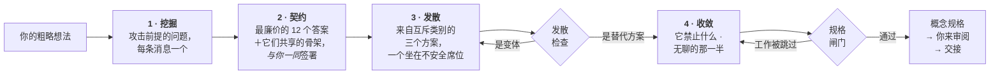

<div align="center">

# Imagination Brainstorming

**拒绝收敛到显而易见答案的想法开发技能。**

保留好的头脑风暴该有的形状——一次一个问题、真正的替代方案、落到文档的概念规格——<br>只替换掉那些悄悄把一切拽回安全答案的部分。

[](https://github.com/djfksjd/imagination-brainstorming-skill/actions/workflows/tests.yml)
[](#安装)
[](#安装)
[](#内部构造)
[](LICENSE)

[English](README.md) · [한국어](README.ko.md) · [日本語](README.ja.md) · **简体中文** · [Español](README.es.md) · [Français](README.fr.md) · [Deutsch](README.de.md) · [Português](README.pt-BR.md)

</div>

---

> 头脑风暴收敛得太早，原因不是问题问得太少。真正的毛病在于**问题本身来自与答案相同的分布**：*用户是谁、约束是什么、成功长什么样*——它们都只是在打磨你已经有的那个想法，从不触碰这份简报默认为真的东西。
>
> 然后三个选项被端上来——其中两个的存在，只是为了让第三个显得合理。

## 工作方式



|  | 做什么 | 为什么有效 |
|---|---|---|
| **1** | **攻击前提的提问。** 从十二个问题族中发牌——未言明的前提、你会讨厌的那个版本、这**不**是为谁做的、它如何终结、在哪个规模上崩掉、行政性的那一半。每个族都写明"要听什么"以及**应避免的、保全前提的问法**。 | 需求坐在前提之上。问需求是确认想法，问前提才是检验它。至少一条前提必须被删除或反转；若只有一条被推翻，规格必须写明其余为何站得住——为凑数编造反转，比诚实地说“它挺住了”更糟。 |
| **2** | **一份你也签字的禁用契约。** 模型先写下自己最可能给出的十二个答案，点名它们共享的*骨架*，再把压缩版摆到你面前——**作为排除项，而非建议。** 你补上自己的"别再来一个 X"。 | 你的排除项是全场最有价值的约束；给骨架命名，能挡住同一形状的第十三个版本混进来。 |
| **3** | **不可能沦为变体的替代方案。** 三个方案分别取自互不相交的重构类别，其中一个坐在**不安全席位**——你多半会否决的那个，必须被全力辩护。 | 脚本会检查：同类别、互相复述的摘要、死于同一原因的两个、描述明显更单薄的一个——一律 exit 3。它检查的是结构而非语义——但陪衬项只能长成这几种形状。 |
| **4** | **在请你阅读之前先过闸。** 概念必须说明它禁止什么、点名最接近的既有事物，并带上至少两个真实的开放问题。 | 没有开放问题的规格，是把未知藏了起来。什么都不禁止的设计是许愿单。闸门无法判断概念好坏——它只证明该做的工作没有被跳过。 |

> [!IMPORTANT]
> **它绝不实现。** 没有代码、没有脚手架、没有"那我开始搭了？"。终点是你批准的规格，加上一次交接。

## 安装

支持 **Claude Code** 与 **Codex**。仅用 Python 3 标准库——无需额外依赖、无需 API 密钥、无需联网。

```bash
curl -fsSL https://raw.githubusercontent.com/djfksjd/imagination-brainstorming-skill/main/install.sh | bash
```

<details>
<summary><b>手动安装</b></summary>

```bash
# Claude Code
claude plugin marketplace add djfksjd/imagination-brainstorming-skill
claude plugin install imagination-brainstorming@djfksjd

# Codex
codex plugin marketplace add djfksjd/imagination-brainstorming-skill
codex plugin add imagination-brainstorming@djfksjd
```

同一套目录服务两个宿主：技能本体位于 `skills/imagination-brainstorming/`，`AGENTS.md` 会作为共享上下文加载。
</details>

## 用法

把你正在琢磨的事直接说出来。它在你请求头脑风暴、或抱怨"现在这些方案看起来都一样"时触发。任何语言都可以，规格也用你的语言写。

```text
陪我把这个想清楚：病房交接班的方式。
```

```text
我有三个入职流程的想法，但感觉它们是同一个想法。
在我定下来之前，帮我认真推一推。
```

### 一次会话实际做的事

| 阶段 | 你会看到 | 由什么强制 |
|---|---|---|
| 侦察 | "这里有一个常规答案，而且它可能就是对的——你要那个，还是我们先怀疑整个形状？" | 硬规则：不制造为奇而奇 |
| 挖掘 | 每条消息一个问题，按你的简报重新措辞 | 12 个问题族，各自附带反模式 |
| 契约 | 六条排除项＋它们共享的骨架，请你确认并补充 | `banlist.py`，敷衍则 exit 2 |
| 发散 | 三个同等详尽的方案，其中一个你多半讨厌 | `divergence_check.py`，是变体则 exit 3 |
| 收敛 | 逐节设计，每节获批后才进入下一节 | 先写清楚它禁止什么 |
| 规格 | `docs/concepts/YYYY-MM-DD-<主题>-concept.md` ＋机器可读的伴随文件 | `spec_gate.py`，工作被跳过则 exit 2 |
| 交接 | 这份规格**不**涵盖什么，以及下一步 | 绝不调用实现类技能 |

### 牌堆

| 牌堆 | 内容 |
|---|---|
| **问题族**（12） | 未言明的前提 · 你会讨厌的版本 · 重新定义的成功 · 被反转的约束 · 这不是为谁做的 · 必须保持不可能的事 · 墓地（前人因何而死） · 它让人背上什么义务 · 邻近领域 · 它如何终结 · 在哪个规模崩掉 · 行政性的那一半 |
| **框架**（10 类共 40 张） | 减法 · 反转 · 行动者转移 · 尺度转移 · 时间转移 · 经济 · 维护 · 媒介转移 · 仪式 · 失败优先 |
| **陈词滥调** | 路演反射词、空洞形容词，以及暴露"这是定位而非概念"的结构性句式 |

### 你要做的部分

这是一场对话，不是一条命令。决定这次会话有没有价值的有四个时刻，四个都在你这边。

**1 · 回答前提问题。** 它们不会像需求调研，因为它们本来就不是。*"谁从未选择使用它，却被它影响？"* 不是一个干系人问题。有用的答案是你得想一想才说得出的那些；而以*"呃，这不是显然……"*开头的答案，正是这次会话要找的前提。请把那句显而易见的话说出来 —— 那就是素材。

**2 · 在禁用契约上签字。** 大约三个问题之后，你会看到六个左右的答案，以及它们共有的**骨架** —— 不是措辞，是底下的结构：*一台装置、一条信息流、一个市场、一块仪表盘*。然后它会问：

> "这些是这里最廉价的答案，我把它们从桌上撤下来。其中哪些是你本来就在想的？你还要加什么？"

请两半都回答。说出你本来就在想的那个不花任何代价，而它常常是整场会话里最有用的一句话。你自己的排除项什么形式都行 —— *"任何增加床边屏幕时间的都不要"* 也完全可以。没有脚本能机械匹配这种话，所以网关会把它记成人工核查项，在写下书面回答之前不会放行这份规格。

**3 · 那个不安全的位子。** 三个方案里有一个是刻意让你拒绝的，而它会被以同样的密度论证。如果它确实不对就拒绝 —— 但请用一句话说明*为什么*。那一句话对概念的挪动，往往比选出赢家更大。

**4 · 审阅关卡。** 规格会被写入文件，连同*"请读一读，告诉我要改什么"*一起交回。这不是走过场。网关只检查功课有没有做，不检查概念对不对 —— 见下。

### 该说的三句话

**当每个选项都一个味道时：**

```text
还是一个想法穿了三套衣服。重新生成。
```

它会以新的一轮重新发牌，把*上一轮的每个元素*加入契约，再从前提发掘中多删掉一条前提，然后告诉你删的是哪条。那最后一句才是重点。

**当常规答案其实就是对的时：** 直接说出来。技能被要求用一句话表示同意，退出技能，在外面把普通的活干完。登录表单不需要前提发掘，而技能被禁止假装它需要。

**当简报太大时：** 侦察阶段本该抓到，若没抓到 —— *"这是三个系统，拆开"* —— 每一块各有自己的会话和规格。

### 自己跑这些脚本

Python 3.11，只用标准库，无需安装。脚本在 `skills/imagination-brainstorming/scripts/`。工作文件一律写进临时目录，绝不要写进技能文件夹。

```bash
# 1 · 发出问题族与三个互不相容的取景框
python3 scripts/deal.py --brief "病区交接班的方式" --run 1 --out /tmp/work

# 2 · 建立契约 —— 调用两次，顺序很重要
python3 scripts/banlist.py --brief "<简报>" --instincts instincts.txt \
    --skeleton "在一班结束时填写的检查表" --out /tmp/work
#    …给用户看，拿到回答之后，才可以：
python3 scripts/banlist.py --brief "<简报>" --instincts instincts.txt \
    --skeleton "在一班结束时填写的检查表" \
    --user exclusions.txt --confirmed --out /tmp/work

# 3 · 证明这三个方案确实是三个
python3 scripts/divergence_check.py --approaches /tmp/work/approaches.json --banlist /tmp/work/banlist.json

# 4 · 把规格、边车与契约一起送进网关 —— 三个都必需
python3 scripts/spec_gate.py --concept /tmp/work/concept.json \
    --markdown docs/concepts/2026-07-28-handover-concept.md --banlist /tmp/work/banlist.json
```

`--confirmed` 记录的是已经发生过的同意。在用户看到清单之前就打上它，是一个后续整条流水线都会依赖的谎言，而网关无从察觉 —— 所以它被设计成两次调用，而不是一个开关。

`cliche_lint.py` 是给**会话中途的草稿**用的。拿它去跑一份成稿规格，它会标出规格自己的禁用清单章节；负责检查成稿的是 `spec_gate.py`，它会先把那一段切掉。

### 退出码与对应处理

| 码 | 含义 | 怎么办 |
|---|---|---|
| `0` | 通过 | — |
| `1` | 用法错误、文件缺失或牌堆损坏 | 是笔误，不是判决 |
| `2` | **契约或规格不完整** —— 直觉太少、没有骨架、契约未签署、章节缺失、人工核查项没有书面回答，或规格并未真正包含它自己的边车 | 把缺的功课补上 |
| `3` | **三个方案其实是变体**，或存在被禁材料 | 重写，或用 `--run 2` 重新发牌再做一次 |

### 网关查不出来的东西

> [!IMPORTANT]
> 网关是地板。它证明功课**做过了**，不证明它**做对了**。有三样东西能通过本仓库的每一道网关：
>
> - **推翻自己证据的论证** —— 仔细读它的前提，反而支持相反的结论；
> - **能用自身逻辑反驳的机制** —— 例如把一个随计算顺序变化的数字，当作这个概念透明性的证据端出来；
> - **其实是同一个想法的三个方案**。检查能抓住换词复述和共同的失败原因，但它不会阅读。
>
> 三样都在本技能自己的试跑中真实发生过，三样都是人抓到的，不是脚本。所以：在规格送到你手上之前，让第二位读者攻击它 —— 另一个模型，或者一位同事 —— 并要求他们论证**它为什么会输**，而不是它还能怎么改进。"怎样能更好"换来的是打磨，"为什么会输"换来的是那条被颠倒的前提。
>
> 技能也会对自己跑一遍**证据方向审计**：对每一个承重的"因为"，它必须写下同一前提所支持的相反结论，并指明做决定的一方实际能观察到什么。抓住*"评审是机器，所以我们的内部记录才是差异点"*的正是这一步 —— 机器评审看不到内部记录，因此那个前提论证的恰恰是反面。

## 它不会做的事

> [!IMPORTANT]
> - **动手做任何东西。** 两道硬闸：永不实现；以及任何东西都不会未经检查就送到你面前——方案要过发散检查，规格要过闸门。
> - **宣称"从没有人想到过"。** 无法验证，因此被禁止。它改为点名最接近的既有事物并说明差别。
> - **硬造陌生感。** 当常规答案就是正确答案时，技能有义务用一句话说明，然后正常干活。
> - **为了好写规格而悄悄缩小你的请求。** 范围只会被公开拆解，不会被暗中收窄。
> - **把过闸当成好点子的证据。** 那只证明工作做过了，不证明它是对的——技能自己会这么说。

## 内部构造

| 脚本 | 作用 | 非零退出码 |
|---|---|---|
| `deal.py` | 发出问题族与三个互不相容的框架（其一标记为不安全席位） | `1` 用法或牌堆错误 |
| `banlist.py` | 构建共享禁用契约：直觉＋骨架＋你的排除项 | `2` 直觉太少或没有骨架 |
| `divergence_check.py` | 证明这三个是替代方案，而非一个提案配两个陪衬 | `3` 未发散 |
| `spec_gate.py` | 以失败即拦的方式一并校验规格、伴随文件与契约 | `2` 未过闸 |
| `cliche_lint.py` | 会话中随时检查任意草稿 | `3` 存在禁用内容 |

**一切可复现。** 发牌以简报的哈希播种，同样的简报得到同样的一手牌，任何会话都能重放。`--run 2` 会发出新的框架——仍然来自互不相交的类别——而不安全席位会轮转，避免同一类别永远承担那个讨人嫌的方案。

```text
skills/imagination-brainstorming/
├── SKILL.md                    # 权威工作流
├── references/
│   ├── concept-template.md     # 规格结构与其分节标记
│   ├── worked-example.md       # 一次完整会话，含被砍掉的方案
│   ├── example-concept.md      # 那次会话产出的规格
│   ├── example-concept.json    # 它的伴随文件——两者都过闸、都是测试夹具
│   └── decks/                  # 问题族 · 框架 · 陈词滥调 · 规格模式
└── scripts/                    # deal · banlist · divergence_check · spec_gate · cliche_lint
```

### 搭档

与 [**imagination-engine**](https://github.com/djfksjd/imagination-engine-skill) 相互独立，但被设计成并肩使用——那一个是把单个陌生对象一次性推到极限的生成器。当概念里的某个生物、机制或世界超出规格所能承载时，本技能会把它交过去。两者装其一即可。

## 测试

```bash
python3 -m pytest tests/ -q
```

完全离线：牌堆完整性、发牌的确定性与类别互斥、三道闸门的全部失败路径，以及随附示例能否通过它们。

## 参与贡献

最容易入手的是牌堆——一个真正从别的角度下手的问题族，或一个现有类别覆盖不到的框架。每一条都必须可用：问题族要写明"听什么"*以及*它所替代的、保全前提的问法；框架要有动作、要求，以及它特有的失败方式。提 PR 前请先跑测试。

<div align="center">
<sub>MIT 许可 · 为 <a href="https://claude.com/claude-code">Claude Code</a> 与 Codex 打造</sub>
</div>
