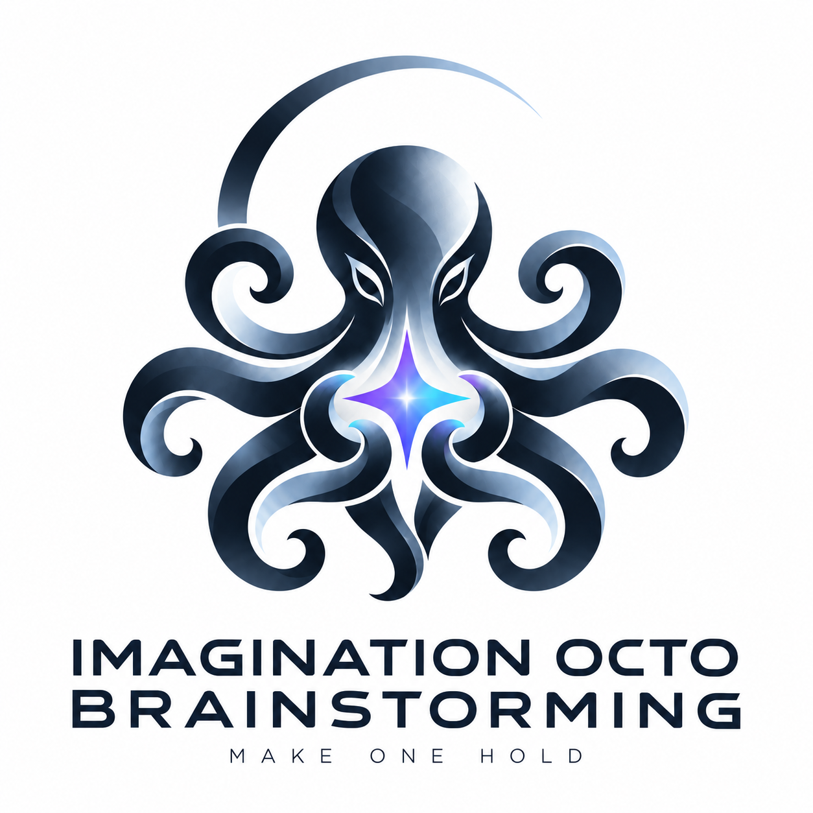

<div align="center">

<picture>
  <source media="(prefers-color-scheme: dark)" srcset="assets/brand/imagination-octo-brainstorming-logo-dark.png" />
  
</picture>

# IMAGINATION OCTO BRAINSTORMING

**MAKE ONE HOLD**

### Imagination Octo 的收敛阶段 —<br/>把选定的一个方向做压力测试，变成可以带进规划的概念

[English](README.md) · [한국어](README.ko.md) · [日本語](README.ja.md) · [简体中文](README.zh-CN.md) · [Español](README.es.md) · [Français](README.fr.md) · [Deutsch](README.de.md) · [Português (Brasil)](README.pt-BR.md)

[](https://github.com/djfksjd/imagination-octo-brainstorming/actions/workflows/tests.yml)
[](LICENSE)

[](https://github.com/djfksjd/imagination-octo)


</div>

Imagination Octo Brainstorming 在方向选定之后才开始。它用目标、约束、最强的常规替代方案、日常运作以及这个想法自身的失败方式来检验它，然后给出一份简短的概念备忘录。如果选定的方向违反了简报，或者输给更简单的方案，它会直接说明，而不是把它打磨得更好看。

> [!TIP]
> **大多数用户建议安装 [Imagination Octo](https://github.com/djfksjd/imagination-octo)。** 它用引擎生成方向，等待你的选择，再把这个选择交给本工作坊。

**当前为 `v0.4.3`，是以 v0.4.2 评估的运行时的仅改名版本。** 下列测量来自一次由 AI 评审的小规模比较，并不表示每个概念都会变好。隐式调用保持关闭，请用技能名称调用。

## 功能

| | |
|---|---|
| **约束预检** | 被排除的机制是否换了名称、负责人、地点或规模又回来了？ |
| **承重假设** | 哪一个信念一旦不成立，整个想法就会垮掉？ |
| **常规竞争者** | 与普通答案相比，它凭什么值得多出来的复杂度？ |
| **核心机制** | 是哪个可观察的原因改变了结果？ |
| **枯燥的那一半** | 重复性工作、排队、例外情况和维护由谁负责？ |
| **固有失败** | 定义这个想法的机制，会以怎样的方式自行失败？ |
| **证伪条件** | 出现什么结果时，团队应当停止或改变方向？ |

## 工作原理

```text
 your chosen direction ──► ┌─────────────── constraint preflight ───────────────┐
                           │ is an excluded mechanism back under another name?  │
                           └──────────────────────────┬─────────────────────────┘
                                                      ▼
                           ┌────────────────── pressure test ───────────────────┐
                           │ load-bearing assumption · conventional competitor  │
                           │      boring half · native failure · falsifier      │
                           └──────────────────────────┬─────────────────────────┘
                                                      ▼
                                         decision-ready concept memo
                                                      ▼
                                           ◆ YOUR NEXT DECISION ◆        nothing is implemented
```

- 预检与问题的大小相称。小的违规只配上最小的修补并保持暂定，而不是重写这个想法。
- 不做任何实现。产出是一份概念备忘录，不是代码、脚手架或实施计划。
- 运行时只加载一个 Markdown 文件：没有发牌框架、禁用契约、JSON 附属文件或质量闸门。

## 试一试

```text
使用 $imagination-octo-brainstorming 来发展这个已选定的方向。请说明
第一次真实使用的场景、反复出现的运营负担、固有的失败方式、证伪条件，
以及我们接下来必须做出的决定。
```

回复是一份以下一个决定收尾的概念备忘录，然后停下。

## 测量结果

v0.4.2 与强普通提示的预注册盲测比较：10 份已选定方向的全新英文和韩文简报，每份运行 5 次，5 名评审（2026-07-30）。

| 指标 | 工作坊 − 普通提示 |
|---|---:|
| 更愿意带进规划的一方 | **45–5 (90%)** |
| 可执行性 | **+1.37** |
| 决策契合度 | **+0.95** |
| 稳健性 | **+0.82** |
| 因果清晰度 | **+0.71** |
| 令牌 | `1.14×` |

请如实解读：

- **生成和评审都只有一个模型。** 仅 `gpt-5.4`，评审也来自同一系列。偏好的 95% Wilson 区间为 78.6–95.7%，下限并不能证明 90% 这一比例。
- **它会输。** 9 份简报一致选择了工作坊，1 份简报一致选择了普通提示。
- **没有在 Claude 上测量，也没有由人评审。** Octo 仓库中的跨模型实验（[A](https://github.com/djfksjd/imagination-octo/blob/main/evals/results/2026-10-06-experiment-a.md)、[B](https://github.com/djfksjd/imagination-octo/blob/main/evals/results/2026-10-06-experiment-b.md)）只测试了引擎。这里无法说明工作坊在其他模型上的表现。
- **更早的设计已被替换。** 使用发牌框架、禁用契约和机械质量闸门的牌组与闸门工作流（v0.3.0）作为记录保留在 [`legacy/v0.3.0/`](legacy/v0.3.0/)，运行时从不加载。

协议、判定规则与冻结的结果：[`evals/`](evals/README.md)。

## 何时使用，何时不用

**适合使用：** 已经有一个方向、候选中的首选或粗略概念，并且需要在进入规划前知道它是否站得住。

**请改用其他方式：** 最初的发想或实现。最初的发想请使用 [Imagination Octo Engine](https://github.com/djfksjd/imagination-octo-engine)。工作坊有意在实现之前停下。

## 由 `imagination-brainstorming` 更名而来

在 v0.4.2 之前，本仓库名为 `imagination-brainstorming-skill`，技能名为 `$imagination-brainstorming`。GitHub 会重定向旧地址，但插件名、市场 ID 和命令已更改：请安装 `imagination-octo-brainstorming@imagination-octo-brainstorming`，并使用 `$imagination-octo-brainstorming` 调用。除此之外运行时指令没有变化。

## 单独安装

```bash
curl -fsSL https://raw.githubusercontent.com/djfksjd/imagination-octo-brainstorming/main/install.sh | bash
```

更新时再次运行同一条命令即可。如果提示存在以前单独安装的技能副本，请把命令结尾改为 `| bash -s -- --clean-legacy` 再运行；它只会把这些副本移走，不会删除。

```bash
# Claude Code
claude plugin marketplace add djfksjd/imagination-octo-brainstorming
claude plugin install imagination-octo-brainstorming@imagination-octo-brainstorming

# Codex
codex plugin marketplace add djfksjd/imagination-octo-brainstorming
codex plugin add imagination-octo-brainstorming@imagination-octo-brainstorming
```

## 开发

```bash
python3 -m pytest tests/ -q
python3 evals/harness.py --help
bash -n install.sh
```

## 许可证

[MIT](LICENSE).
